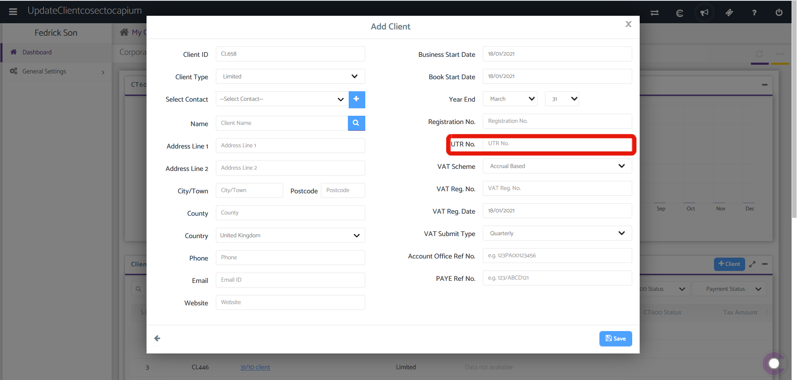
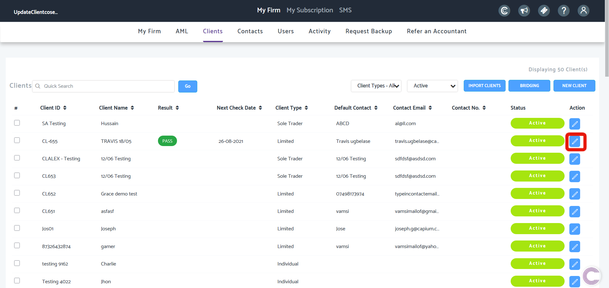
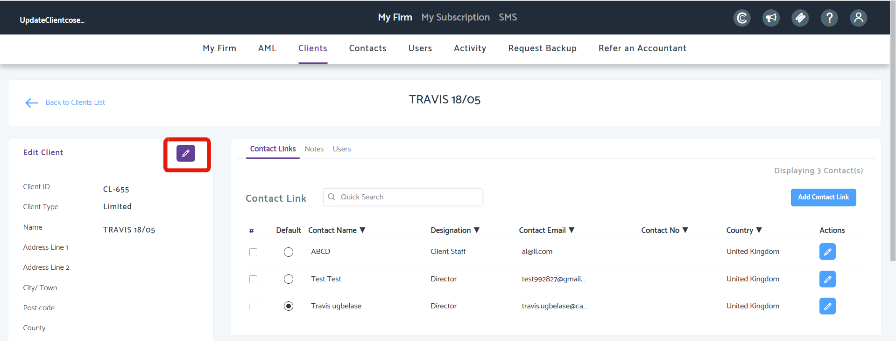
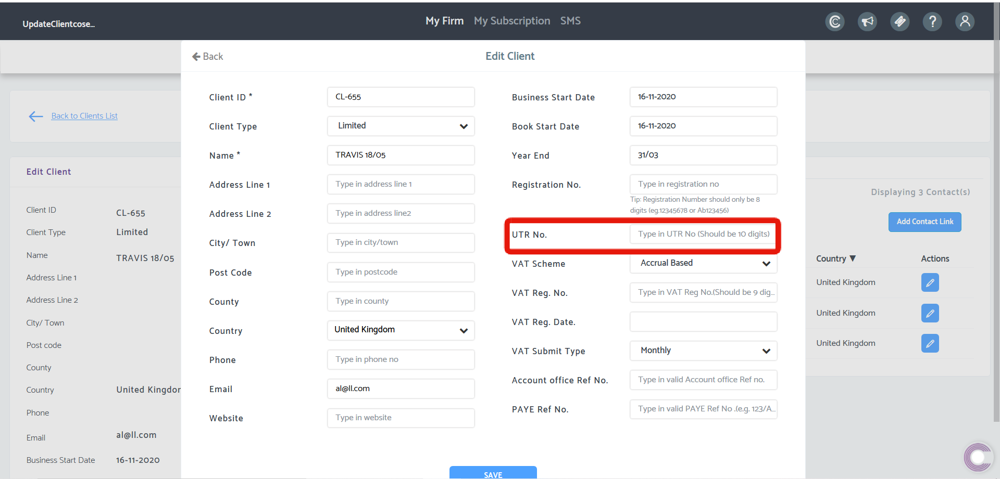

# Where do I enter the office reference for corporation tax
	 	
			
			Print

- **Category:** Corporation Tax
- **Folder:** Corporation Tax FAQs
- **Source URL:** [https://capium.freshdesk.com/support/solutions/articles/9000166989-where-do-i-enter-the-office-reference-for-corporation-tax](https://capium.freshdesk.com/support/solutions/articles/9000166989-where-do-i-enter-the-office-reference-for-corporation-tax)
- **Article ID:** 9000166989

## Content

Solution home 
		Corporation Tax
		Corporation Tax FAQs

### Where do I enter the office reference for corporation tax

			Print

	Modified on: Mon, 18 Jan, 2021 at  4:55 PM

		You can enter your Corporation Tax Office Reference Number when setting up a client. You can set up a client in any module dashboard or in the Admin Panel

If you have already added the client but without the UTR, head to My Admin > Clients and search for the client and click the edit button shown below;

Click the edit button again

Enter UTR number in field highlighted below;

										Did you find it helpful?
								Yes
								No

Send feedback	Sorry we couldn't be helpful. Help us improve this article with your feedback.

## Screenshots & Diagrams (4)

