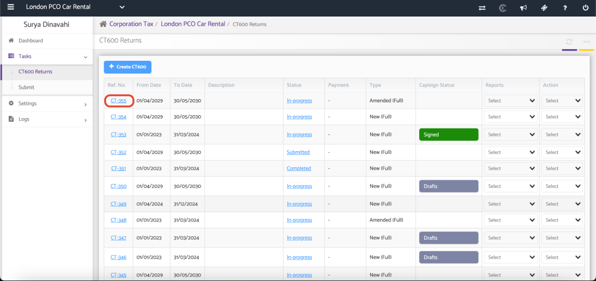
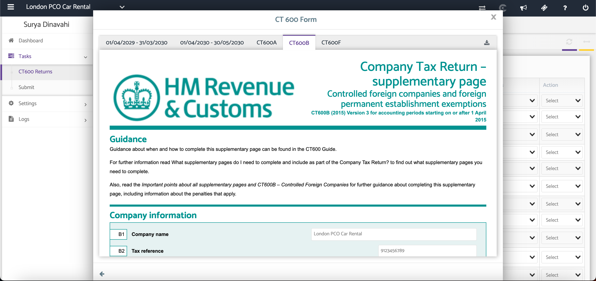

# Download Individual Supplementary Pages
	 	
			
			Print

- **Category:** Corporation Tax
- **Folder:** Corporation Tax Help Guide
- **Source URL:** [https://capium.freshdesk.com/support/solutions/articles/9000188494-download-individual-supplementary-pages](https://capium.freshdesk.com/support/solutions/articles/9000188494-download-individual-supplementary-pages)
- **Article ID:** 9000188494

## Content

Solution home 
		Corporation Tax
		Corporation Tax Help Guide

### Download Individual Supplementary Pages

			Print

	Modified on: Tue, 30 Jun, 2026 at  4:50 PM

### Overview

The Download Individual Supplementary Pages feature allows you to download a specific supplementary form from an existing CT600 return. 

### Navigation

Corporate Tax > Client Specific > Tasks > CT600 Returns > Click on a REF. NO.

### 

### Open a CT600 Return and Select the Supplementary Page

Navigate to CT600 Returns and select the required return by clicking its Reference Number. Once the CT600 return opens, navigate to the supplementary page you wish to download.

Click the Download button in the top-right corner of the screen to download the selected supplementary page.

### Additional Help

### Need Help?

If you need assistance or guidance, please contact your onboarding manager or email Support@capium.com, or call us on 020 3322 5578.

### Related Articles

CT600 Requirements 

CT600 Returns - Calculators

Creating a New CT600 Returns

										Did you find it helpful?
								Yes
								No

Send feedback	Sorry we couldn't be helpful. Help us improve this article with your feedback.

## Screenshots & Diagrams (2)

