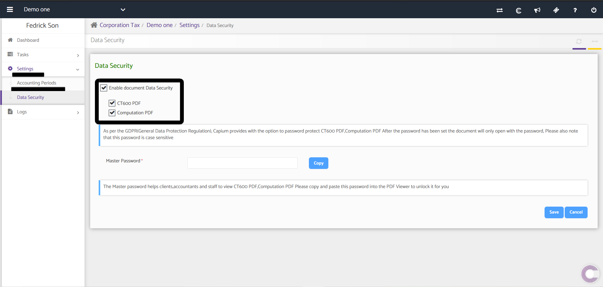

# Document Password Protection - Corporation Tax
	 	
			
			Print

- **Category:** Corporation Tax
- **Folder:** Corporation Tax Help Guide
- **Source URL:** [https://capium.freshdesk.com/support/solutions/articles/9000191276-document-password-protection-corporation-tax](https://capium.freshdesk.com/support/solutions/articles/9000191276-document-password-protection-corporation-tax)
- **Article ID:** 9000191276

## Content

Solution home 
		Corporation Tax
		Corporation Tax Help Guide

### Document Password Protection - Corporation Tax

			Print

	Modified on: Tue, 4 Aug, 2020 at  5:27 PM

		Corporation Tax > Select Client > Settings > Data Security 

Quick Navigation

Help Guide

Password Protection has been added to Documents within the Corporation Tax module and can be enabled by heading to the Navigation above 

Once there click the edit button which will allow you to Enable the document protection for the first time. Once enabled, you can then enable password protection for the following reports; CT600 PDF & Computation PDF.

Once enabled, use the Master Password section to setup the password which is unique for each client.

										Did you find it helpful?
								Yes
								No

Send feedback	Sorry we couldn't be helpful. Help us improve this article with your feedback.

## Screenshots & Diagrams (1)

