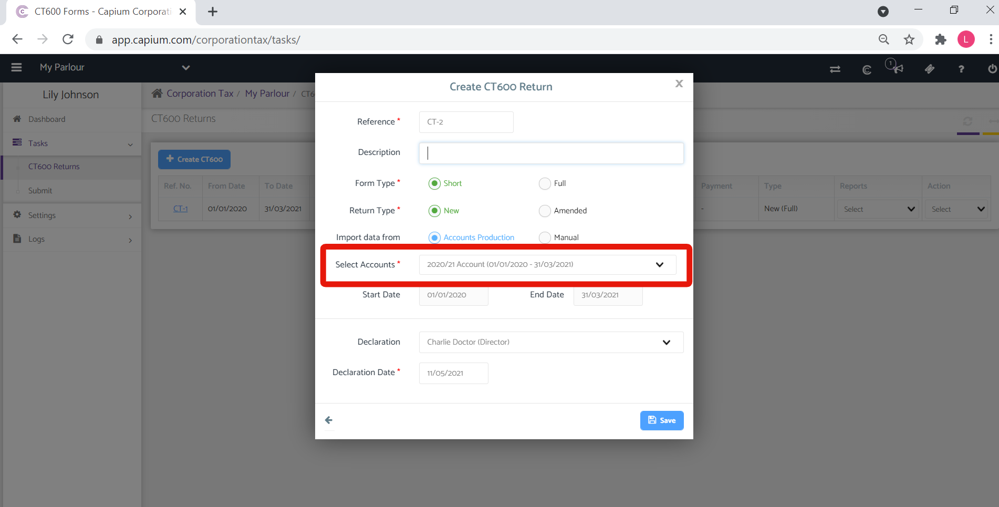
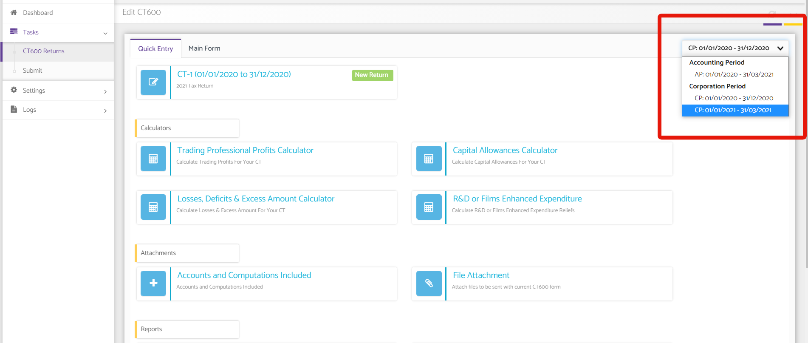
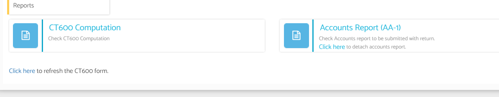

# How to create two CT600s when the accounting period is over one year?
	 	
			
			Print

- **Category:** Corporation Tax
- **Folder:** Corporation Tax FAQs
- **Source URL:** [https://capium.freshdesk.com/support/solutions/articles/9000202129-how-to-create-two-ct600s-when-the-accounting-period-is-over-one-year-](https://capium.freshdesk.com/support/solutions/articles/9000202129-how-to-create-two-ct600s-when-the-accounting-period-is-over-one-year-)
- **Article ID:** 9000202129

## Content

Solution home 
		Corporation Tax
		Corporation Tax FAQs

### How to create two CT600s when the accounting period is over one year?

			Print

	Modified on: Tue, 11 May, 2021 at  5:04 PM

		Please click here to watch how Corporation Tax creates two CT600s

Navigation: Corporation Tax > Clients > Tasks > CT600

Help/Guide

If your annual accounts for a client are over one year two CT600s are required to go to HMRC. This can be created automatically in Corporation Tax. 

Please click the blue button +CT600

When filling out the pop up form please select the accounts for which the accounting period is over one year. Please then click save.

The quick entry form will appear. The two CT600s have been automatically created.

You can select between the two CT600s by using the drop down box highlighted below

Your account information brought across will be split out accordingly across the two CT600 periods.

The full annual accounts will be attached automatically under Reports

When submitting to HMRC from Capium, both CT600's will be sent across to HMRC along with the full accounts.

										Did you find it helpful?
								Yes
								No

Send feedback	Sorry we couldn't be helpful. Help us improve this article with your feedback.

## Screenshots & Diagrams (3)

