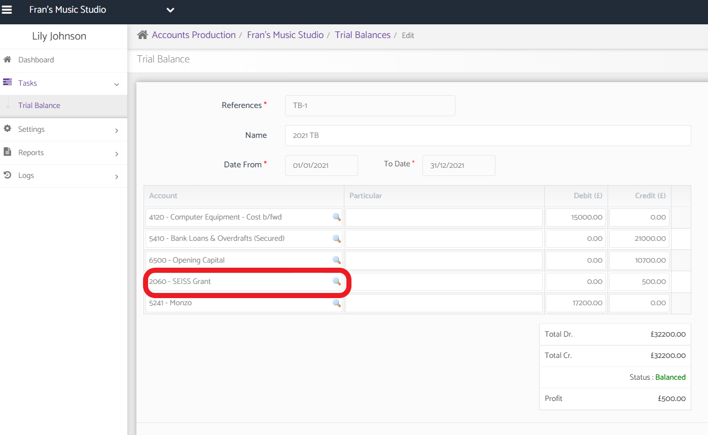
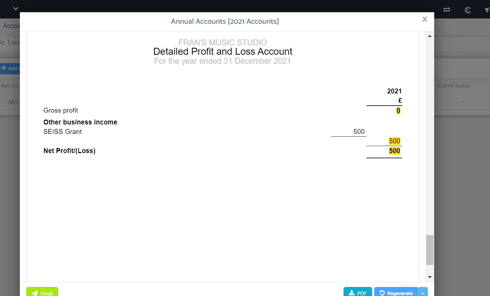
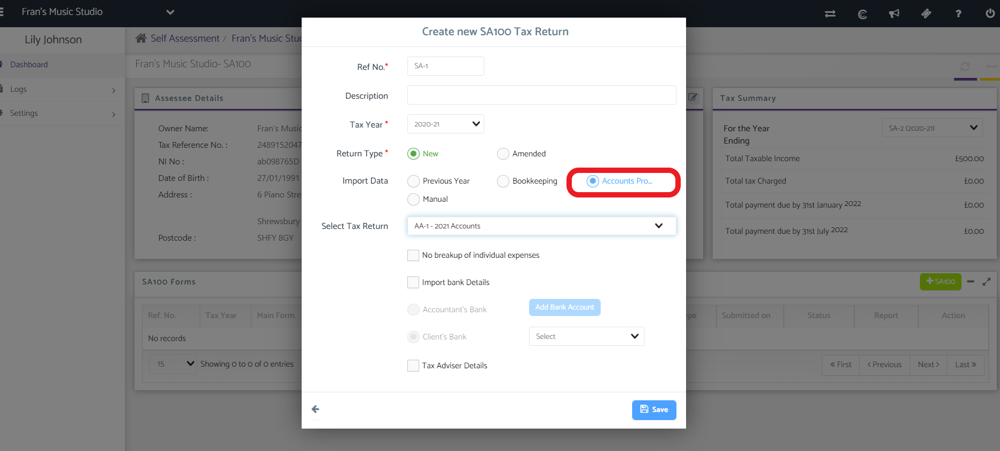
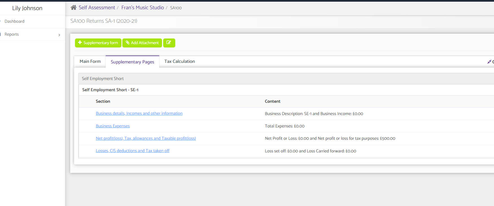
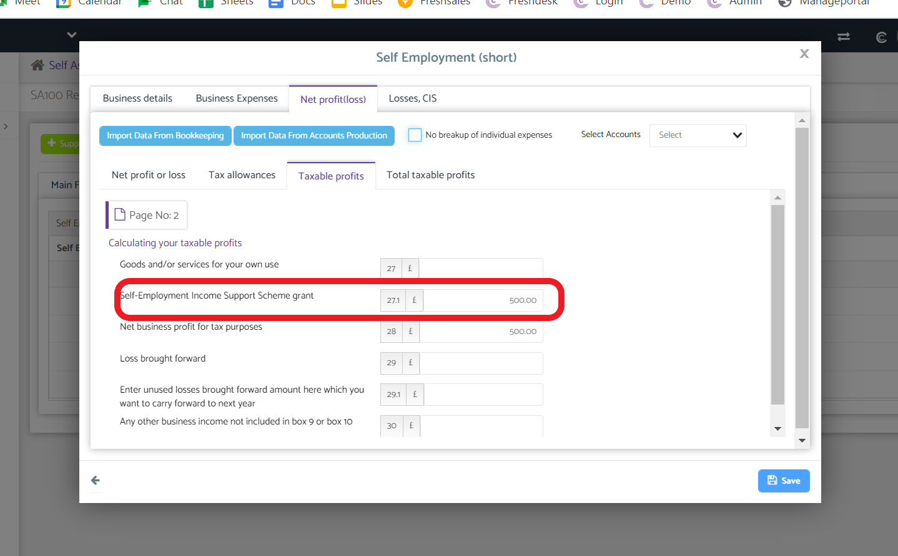
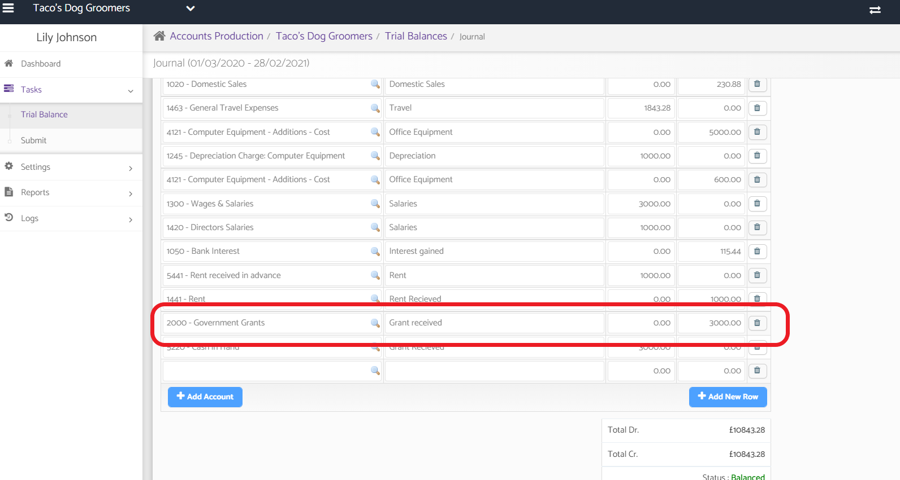
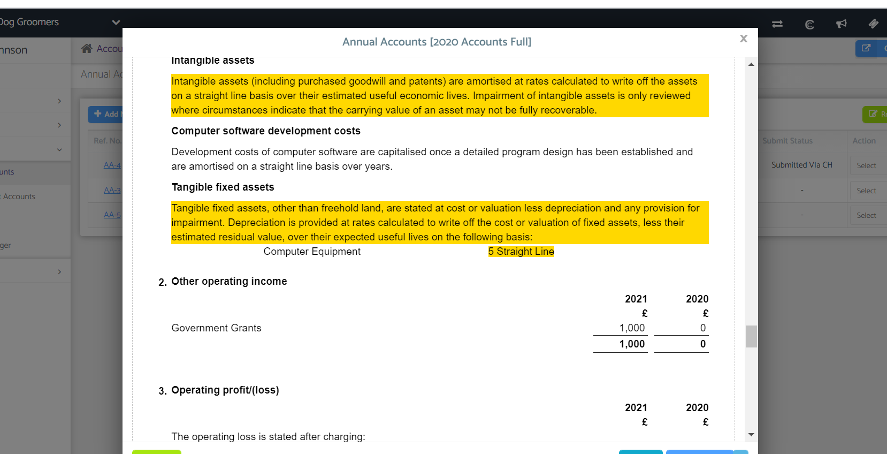
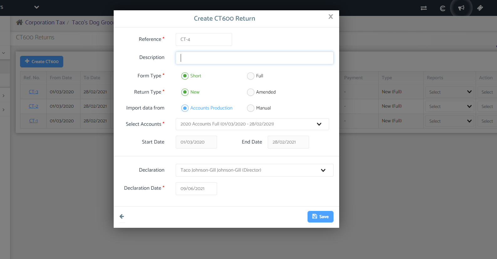
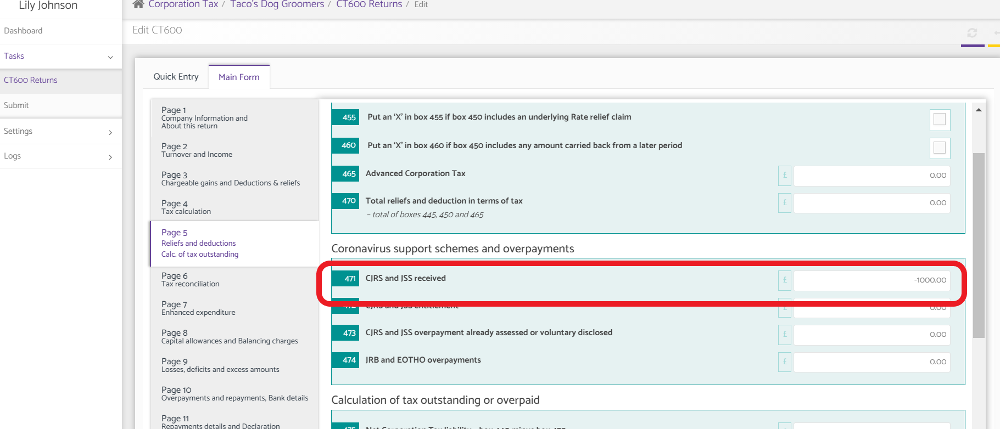

# Government and SEISS Grants in the accounts and tax return
	 	
			
			Print

- **Category:** Corporation Tax
- **Folder:** Corporation Tax Help Guide
- **Source URL:** [https://capium.freshdesk.com/support/solutions/articles/9000203077-government-and-seiss-grants-in-the-accounts-and-tax-return](https://capium.freshdesk.com/support/solutions/articles/9000203077-government-and-seiss-grants-in-the-accounts-and-tax-return)
- **Article ID:** 9000203077

## Content

Solution home 
		Corporation Tax
		Corporation Tax Help Guide

### Government and SEISS Grants in the accounts and tax return

			Print

	Modified on: Wed, 10 Nov, 2021 at  4:18 PM

		The UK government brought in Covid Relief grants in 2020 to help with the hardships of the Coronavirus Pandemic on small businesses.

This guide will help you in the process of adding this relief to your clients tax returns

Grants and payments from schemes to support businesses during coronavirus (COVID-19) should be included as income when calculating your taxable profits in line with the relevant accounting standards.

If you are completing a company tax return on your client’s behalf, you will need to check the coronavirus grants they received; this is particularly important if another agent made a CJRS claim on their behalf, or they claimed a grant themselves from a local authority or another public body.

Please click here to watch how to use SEISS and Government Grants in Self Assessment and CT600

Sole Trader Accounts Production

Navigation: Accounts Production> Select Sole Trader > Tasks > Trial Balance

Help/Guide: 

When creating a Trial Balance either in Bookkeeping or Accounts production please use the code 2060 for SEISS Grant

Please then proceed Preparing a set of Accounts

The Grant will appear in the Annual Accounts Profit and Loss under Other Business Income

Sole Trader SA100

Navigation: Self Assessment> Select Sole Trader > +SA100 

Help/Guide: 

Please click to add a new SA100 on the green button

A pop up will appear, please fill out the relevant information and select Import Data from Accounts Production

This will take you the Self Assessment Return 

Please click here to read how to create a Self Assessment Return

In the Supplementary Page tab Self Employment short or long will be auto selected

In Self Employment Short box 27.1 under Net profit (loss) > Taxable Profits will be auto filled out

In Self Employment (Long) this will be found in box 70.1. This is found under Net profit (loss), Taxable Profits or Loss

Limited Company Accounts Production

Navigation: Accounts Production> Select Limited Company > Tasks > Trial Balance

Help/Guide: 

When creating a Trial Balance either in Bookkeeping or Accounts production please use the code 2000 for Government Grant.

Please then proceed Preparing a set of Accounts

The Grant will appear in the Annual account Profit and Loss under Other Operating Income. Any related notes will be automatically created.

Corporation Tax CT600

Navigation: Corporation Tax> Select Limited Company > Tasks > CT600

Help/Guide: 

Please click on to create a new return

A pop up will appear, please fill out the relevant information and select Import Data from Accounts Production

Please click here to read how to create a CT600

The Government Grant will be auto filled out in box 471

										Did you find it helpful?
								Yes
								No

Send feedback	Sorry we couldn't be helpful. Help us improve this article with your feedback.

## Screenshots & Diagrams (10)

