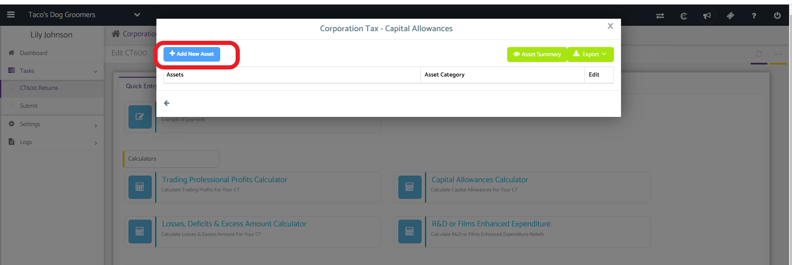
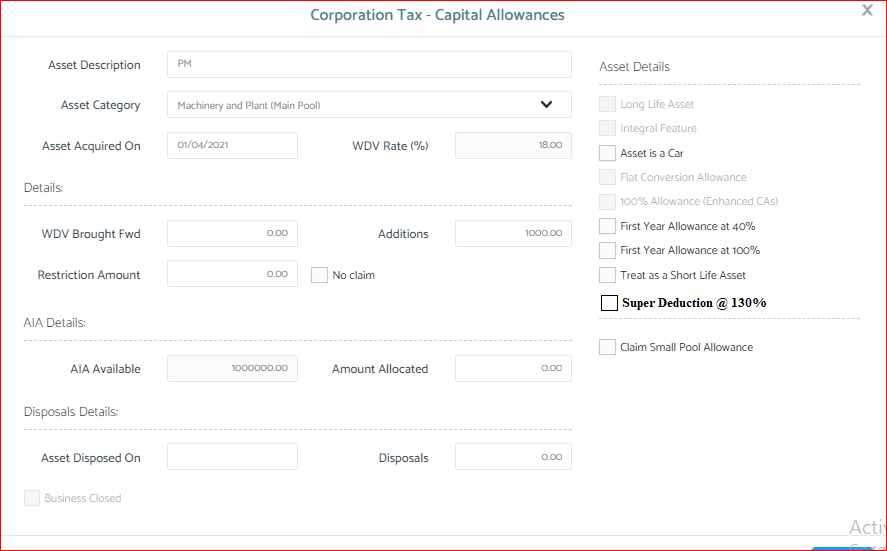
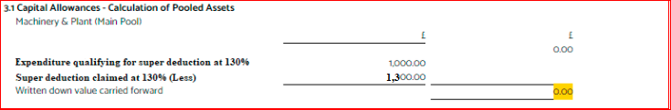
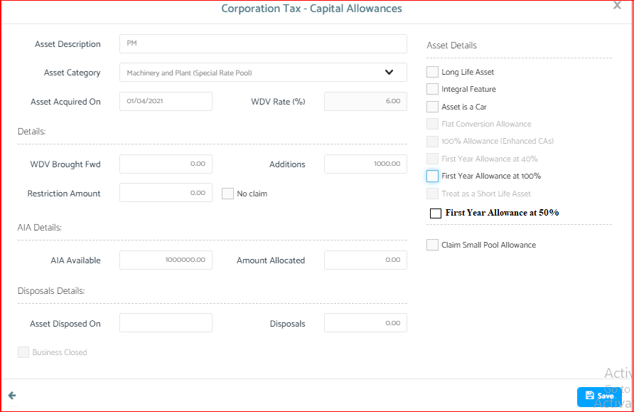
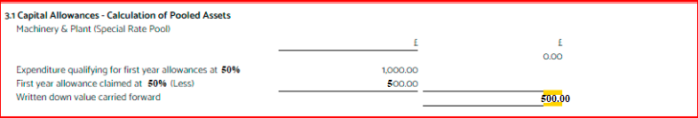

# Super deduction @ 130% and First year allowance @ 50%
	 	
			
			Print

- **Category:** Corporation Tax
- **Folder:** Corporation Tax Help Guide
- **Source URL:** [https://capium.freshdesk.com/support/solutions/articles/9000203687-super-deduction-130-and-first-year-allowance-50-](https://capium.freshdesk.com/support/solutions/articles/9000203687-super-deduction-130-and-first-year-allowance-50-)
- **Article ID:** 9000203687

## Content

Solution home 
		Corporation Tax
		Corporation Tax Help Guide

### Super deduction @ 130% and First year allowance @ 50%

			Print

	Modified on: Fri, 25 Jun, 2021 at 11:22 AM

		It is now confirmed from the HM Treasury that for expenditure incurred from 1 April 2021 until the end of March 2023, companies can claim 130% capital allowances on qualifying plant and machinery investments.

Please follow this link for further information 

Super-deduction – which offers 130% first-year relief on qualifying main rate plant

and machinery investments from 1st April 2021 until 31st March 2023 for companies.

Special Rate Pool - The 50% first-year allowance (FYA) for special rate (including long life) assets from 1st April 2021 until 31st March 2023 for companies.

Navigation: Corporation Tax > Select Client > Tasks > Create CT600 > Capital Allowances Calculator

Help Guide: 

Please click on create CT600 and enter in the details required by the pop up, then the quick entry form will show

Please click on the capital allowance calculator

Please click to add a new asset on the blue button shown below

A new pop up will appear titled Corporation Tax- Capital Allowances where you will be able to add in information.

Machinery and Plant (Main Pool):

If the asset category selected under the dropdown 'asset category' is Machinery and Plant (Main Pool) and asset acquisition date is on or after 01/04/2021, then a new tick box should appear " Super deduction at 130%" as shown in the below screenshot.

Once the user selects the new tick box “Super deduction at 130%” in the above screenshot: the WDV rate should be changed to 130% and the capital allowance should be calculated at 130% of the Additions value. 

This will be shown in the CT main form box-705 & 760,  as well as the asset summary page and computation page. This is similar to first year allowance at 100%.

Machinery and Plant (Special Rate Pool):

If the asset category selected under the dropdown 'asset category' is Machinery and Plant (Special Rate Pool) and asset acquisition date is on or after 01/04/2021, then a new tick box should appear "First Year Allowance at 50%" as shown in the below screenshot.

Once the user selects the new tick box “First Year Allowance at 50%” in the above screenshot, the WDV rate should be changed to 50% and the capital allowance should be calculated at 50%

This will be shown in the CT main form box-695&760. As well as the asset summary page and computation page, similar to first year allowance at 40%.

The remaining amount after claiming the First year allowance at 50% should be carried forward to the next year.

For example: If the asset value is 1000 and the first year allowance is claimed at 50%, the first year allowance is 500 and the remaining 500 should be carried forward as WDV to the next year for claiming WDA at 6%.

Extract of Computation page

										Did you find it helpful?
								Yes
								No

Send feedback	Sorry we couldn't be helpful. Help us improve this article with your feedback.

## Screenshots & Diagrams (6)

