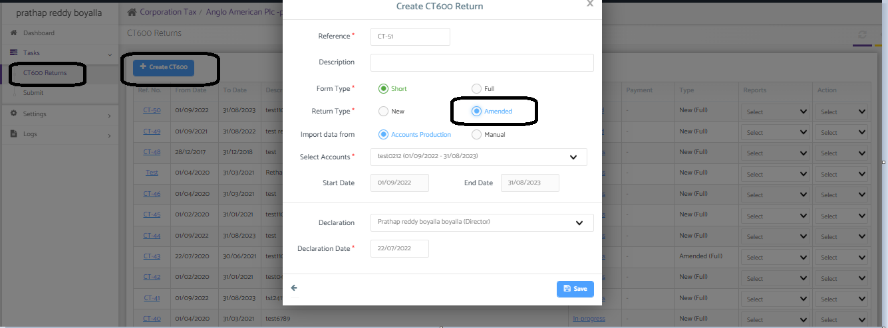
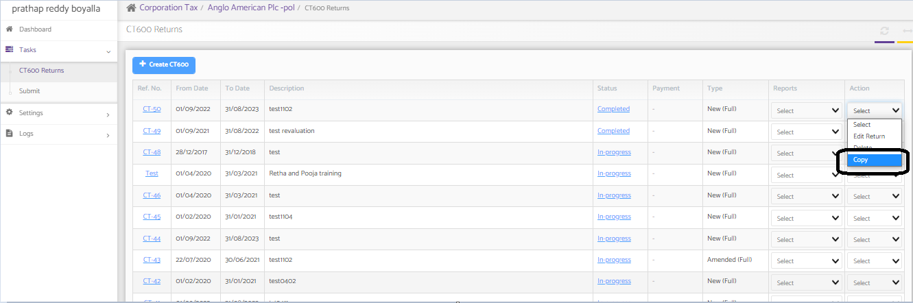
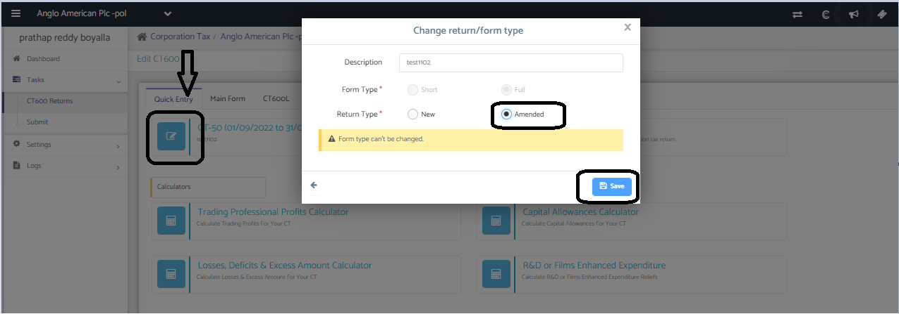

# How to Amend the CT600
	 	
			
			Print

- **Category:** Corporation Tax
- **Folder:** Corporation Tax Help Guide
- **Source URL:** [https://capium.freshdesk.com/support/solutions/articles/9000220713-how-to-amend-the-ct600](https://capium.freshdesk.com/support/solutions/articles/9000220713-how-to-amend-the-ct600)
- **Article ID:** 9000220713

## Content

Solution home 
		Corporation Tax
		Corporation Tax Help Guide

### How to Amend the CT600

			Print

	Modified on: Tue, 31 Jan, 2023 at 10:27 AM

		There are two scenarios in creating the CT600 amended returns:

If you have prepared and sent the Original CT600 return from another software and need to file the amended CT600 return from Capium or you wish to create a fresh amended return even though you submitted original return from Capium.

You have already sent the original CT600 return from Capium and you want to create the amended return with the original data intact.

Please navigate to Corporation Tax >> Select Client >> Tasks >> CT600 Returns >> + Create CT600. Here you may select the type of return as amended and proceed to create the return.

If you have already submitted the CT600 original return in Capium, you can copy the same return and make the few changes that need to go in the amended return. You can copy the return as shown below:

Once you copy the return, the system will prepare the new CT600 return on the dashboard. We need to edit the return and update the type as “amended”. Refer to the below image. Once you change the return type and make the necessary changes, you can then submit the return to HMRC.

										Did you find it helpful?
								Yes
								No

Send feedback	Sorry we couldn't be helpful. Help us improve this article with your feedback.

## Screenshots & Diagrams (3)

