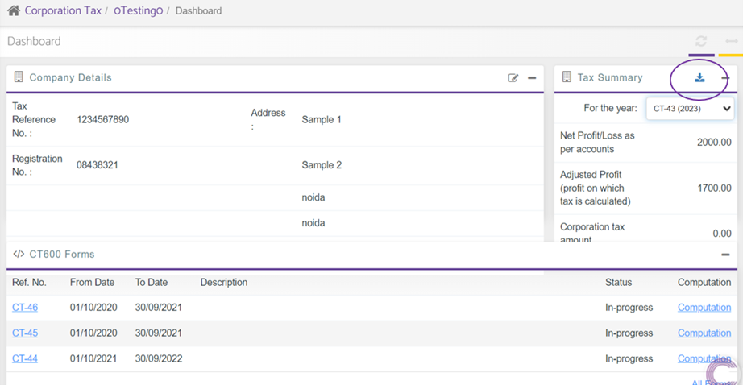
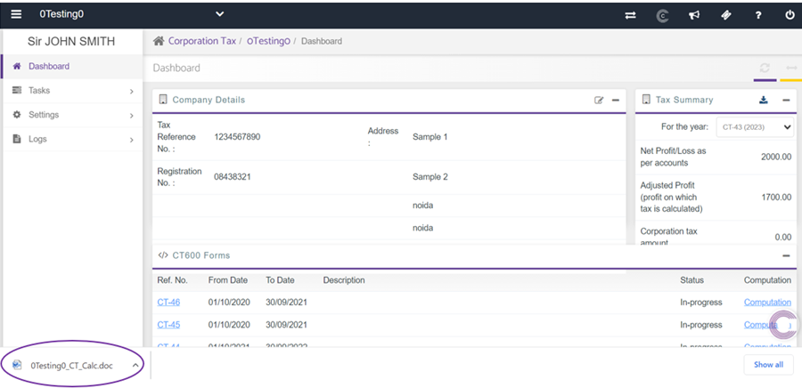

# Tax Summary Download/Export
	 	
			
			Print

- **Category:** Corporation Tax
- **Folder:** Corporation Tax FAQs
- **Source URL:** [https://capium.freshdesk.com/support/solutions/articles/9000225815-tax-summary-download-export](https://capium.freshdesk.com/support/solutions/articles/9000225815-tax-summary-download-export)
- **Article ID:** 9000225815

## Content

Solution home 
		Corporation Tax
		Corporation Tax FAQs

### Tax Summary Download/Export

			Print

	Modified on: Thu, 30 Mar, 2023 at 10:05 AM

		To download a summary of the client’s CT600 return. 

Navigation: Corporation Tax > Selected client > Tax Summary Dashboard 

Following the navigation process, a user is able to download a summary of the CT600 return for a selected client by clicking the highlighted button above. 

Once performed, a user is able to export the file directly to a device used to perform the action.

										Did you find it helpful?
								Yes
								No

Send feedback	Sorry we couldn't be helpful. Help us improve this article with your feedback.

## Screenshots & Diagrams (2)

