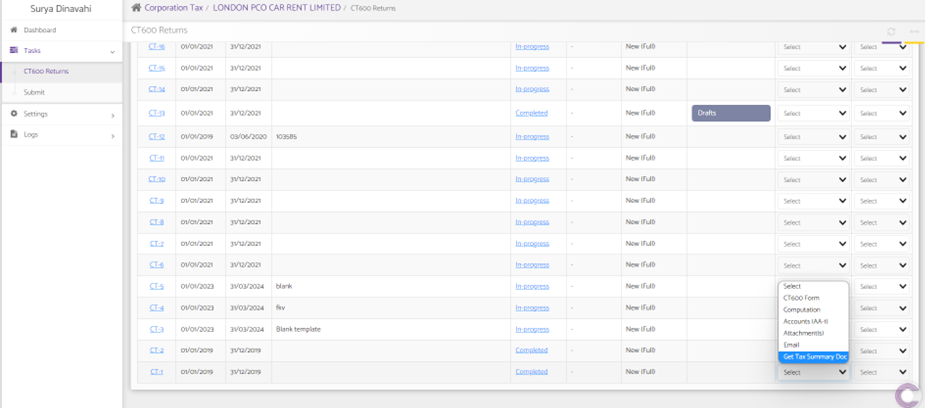
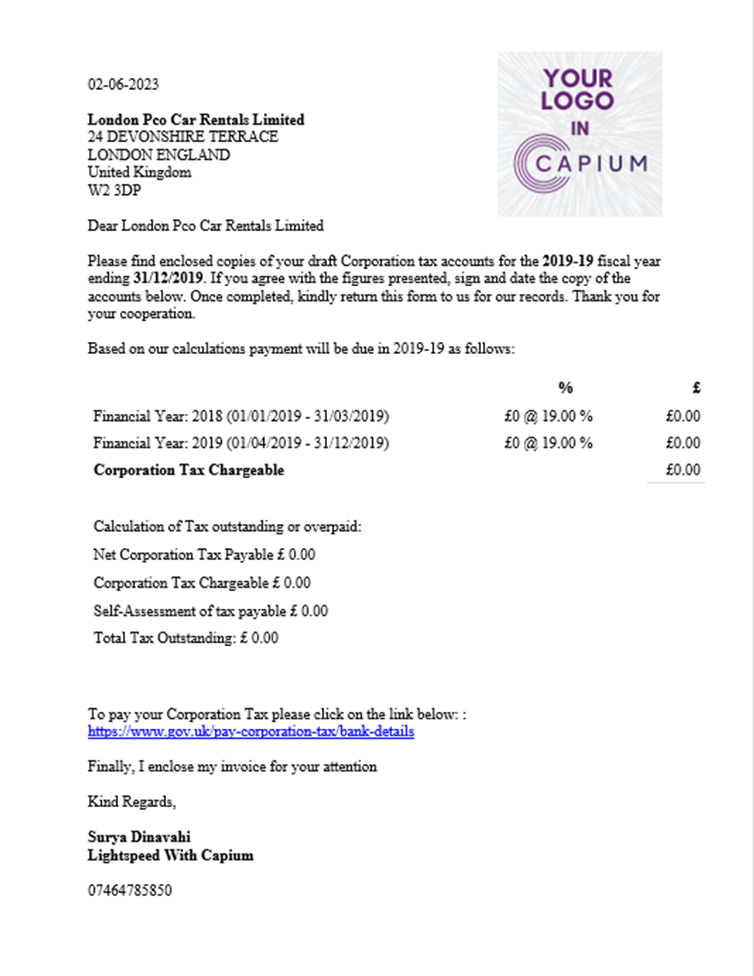

# How to get CT600 tax due document
	 	
			
			Print

- **Category:** Corporation Tax
- **Folder:** Corporation Tax Help Guide
- **Source URL:** [https://capium.freshdesk.com/support/solutions/articles/9000228291-how-to-get-ct600-tax-due-document](https://capium.freshdesk.com/support/solutions/articles/9000228291-how-to-get-ct600-tax-due-document)
- **Article ID:** 9000228291

## Content

Solution home 
		Corporation Tax
		Corporation Tax Help Guide

### How to get CT600 tax due document

			Print

	Modified on: Fri, 2 Jun, 2023 at  2:48 PM

		To get a CT600 tax due document and send it across to a client. 

Navigation: Corporation Tax > Selected client > Tasks > CT600 

Following the navigation process, a user is able to download a summary of the tax-due document.

Once it has been done, a user is able to verify the document and send it across to a client. 

There is a video guide available on the link below: 

https://www.loom.com/share/6b0e744c06cc4ffb979eef1a4c28cde0

										Did you find it helpful?
								Yes
								No

Send feedback	Sorry we couldn't be helpful. Help us improve this article with your feedback.

## Screenshots & Diagrams (2)

