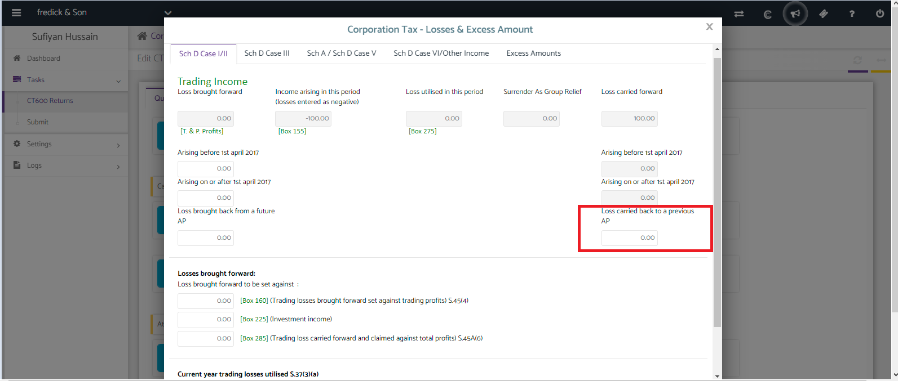
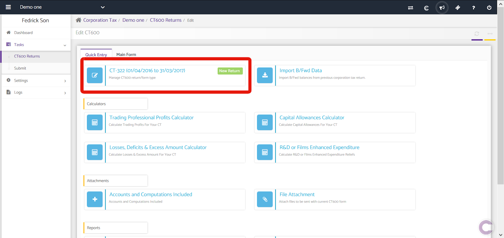
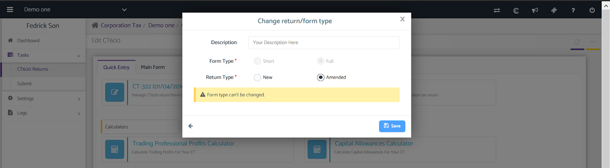
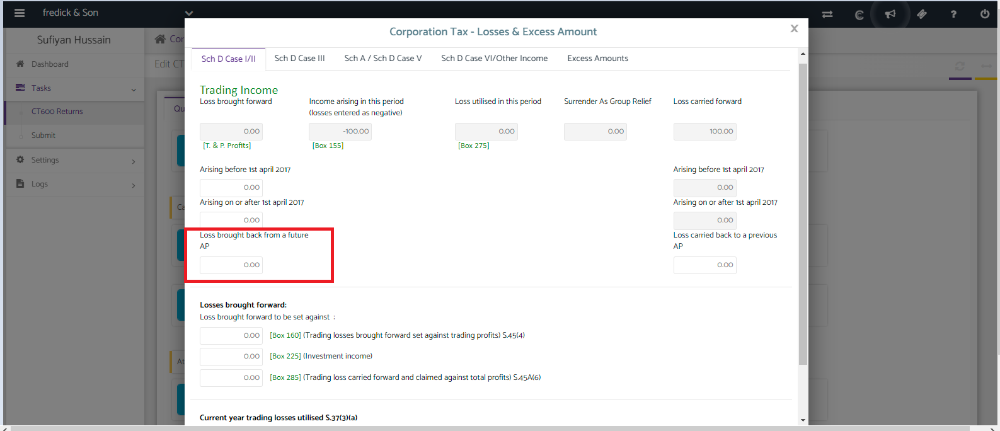
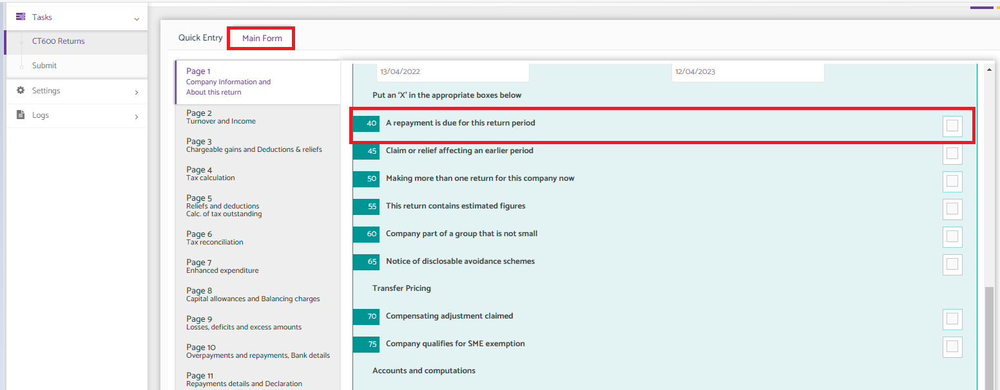

# How to carry back the losses from current year to prior within the CT600 return?
	 	
			
			Print

- **Category:** Corporation Tax
- **Folder:** Corporation Tax FAQs
- **Source URL:** [https://capium.freshdesk.com/support/solutions/articles/9000236761-how-to-carry-back-the-losses-from-current-year-to-prior-within-the-ct600-return-](https://capium.freshdesk.com/support/solutions/articles/9000236761-how-to-carry-back-the-losses-from-current-year-to-prior-within-the-ct600-return-)
- **Article ID:** 9000236761

## Content

Solution home 
		Corporation Tax
		Corporation Tax FAQs

### How to carry back the losses from current year to prior within the CT600 return?

			Print

	Modified on: Fri, 8 Mar, 2024 at 10:53 AM

Navigation: Corporation Tax >> Select Client >> Tasks>> CT600 Returns>>Action-Edit Return/Create Return >> Quick Entry >> Losses, Deficits & Excess Amount Calculator.

Step 1

To carry back losses to a prior Accounting Period, use the "Losses, Deficits & Excess Amount Calculator" within the Quick Entry section of the CT return as shown below;

Simply enter the loss amount to be carried back in the highlighted box and click save once the value has been inputted.

Step 2

After carrying back the losses you will need to prepare an amended return based on the period you've just carried back the losses to, to add the Brought Forward figure.

To do this, head to the previous period return and click on "Manage CT600 Return" as shown below, this will give you the option to create an amended return based on that return.

Change Return Type

Once the Amended Return has been created, head back to the "Losses, Deficits & Excess Amount Calculator" and input the Carried Back figure into the section highlighted below, and select box-40 in the main form then Save & Close.

										Did you find it helpful?
								Yes
								No

Send feedback	Sorry we couldn't be helpful. Help us improve this article with your feedback.

## Screenshots & Diagrams (5)

