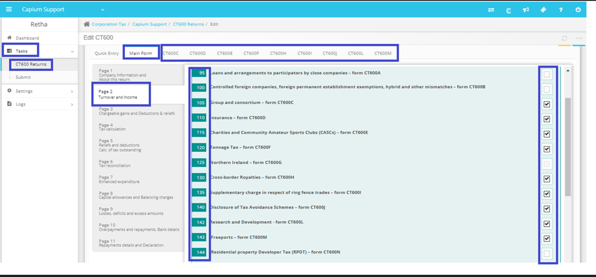

# How to add supplementary pages in CT600 return?
	 	
			
			Print

- **Category:** Corporation Tax
- **Folder:** Corporation Tax FAQs
- **Source URL:** [https://capium.freshdesk.com/support/solutions/articles/9000237008-how-to-add-supplementary-pages-in-ct600-return-](https://capium.freshdesk.com/support/solutions/articles/9000237008-how-to-add-supplementary-pages-in-ct600-return-)
- **Article ID:** 9000237008

## Content

Solution home 
		Corporation Tax
		Corporation Tax FAQs

### How to add supplementary pages in CT600 return?

			Print

	Modified on: Thu, 21 Mar, 2024 at 11:55 AM

		Navigation: CT600 >> Client Specific >> Tasks >> CT600 returns >> Action >> Edit Return >> Main Form >> Page 2 >> From Box 95 – Box 144. 

Once done, you will be able to see the CT600 forms added to the right of the Main form. 

Please refer to the screenshot below.

										Did you find it helpful?
								Yes
								No

Send feedback	Sorry we couldn't be helpful. Help us improve this article with your feedback.

## Screenshots & Diagrams (1)

