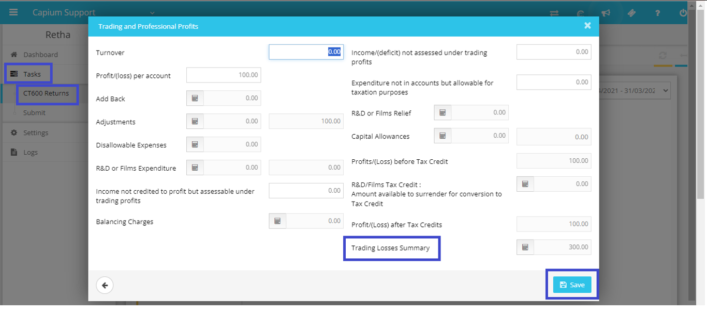
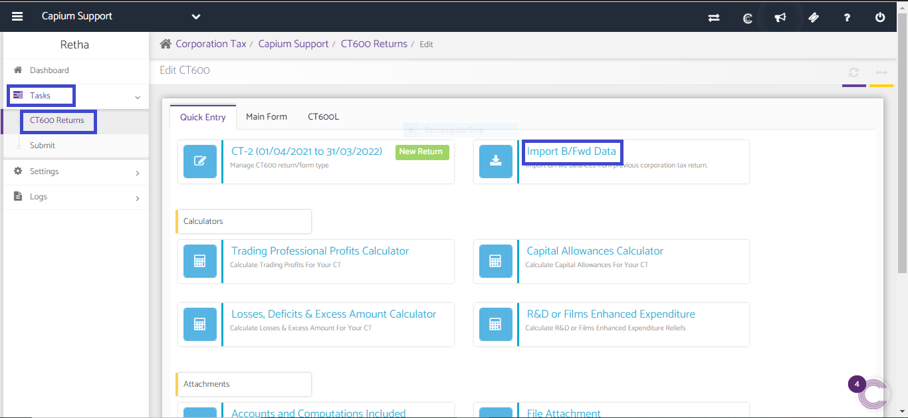

# How to set off brought forward losses with current year profit
	 	
			
			Print

- **Category:** Corporation Tax
- **Folder:** Corporation Tax FAQs
- **Source URL:** [https://capium.freshdesk.com/support/solutions/articles/9000237009-how-to-set-off-brought-forward-losses-with-current-year-profit](https://capium.freshdesk.com/support/solutions/articles/9000237009-how-to-set-off-brought-forward-losses-with-current-year-profit)
- **Article ID:** 9000237009

## Content

Solution home 
		Corporation Tax
		Corporation Tax FAQs

### How to set off brought forward losses with current year profit

			Print

	Modified on: Thu, 21 Mar, 2024 at 12:10 PM

		1.First year in Capium:

Navigation: CT600 >> Client Specific >> Tasks >> CT600 Returns >> Action >> Edit Return >> Quick Entry >> Trading Professional Profits calculator >> Trading Losses summary. 

2.Subsequent years in Capium:

Navigation: ‘Import B/Fwd Data’ option to pull the previous year losses to the current year.

To set off with current year profit:

You may set off the losses to the extent of current year profit.

Navigation: Losses Deficits and Excess Amounts Calculator >> Schedule D Case I/II >> enter the loss amount to the extent of current year profit in the box 'Arising before 1st April 2017' or 'Arising on or after 1st April 2017' and also in 'Box 285' (belong to after 2017) or 160 (belong to before 2017) and >> Save. 

										Did you find it helpful?
								Yes
								No

Send feedback	Sorry we couldn't be helpful. Help us improve this article with your feedback.

## Screenshots & Diagrams (2)

