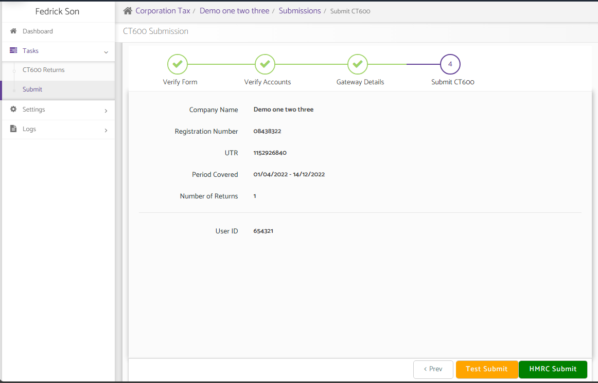
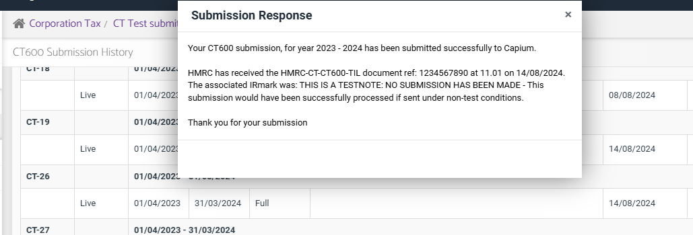
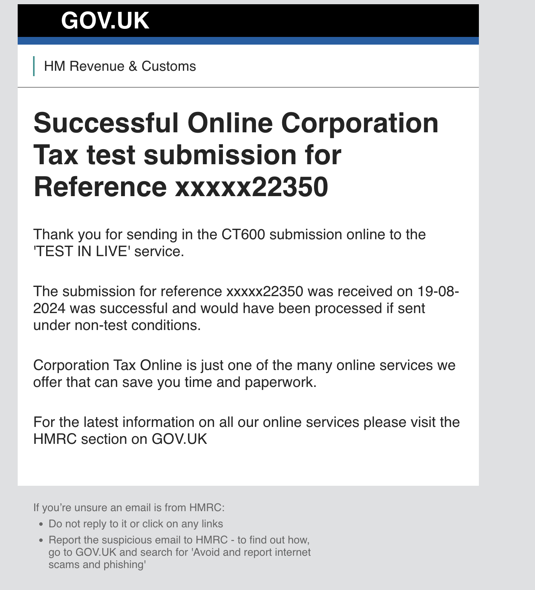

# Corporation Tax - Test Submissions
	 	
			
			Print

- **Category:** Corporation Tax
- **Folder:** Corporation Tax FAQs
- **Source URL:** [https://capium.freshdesk.com/support/solutions/articles/9000240391-corporation-tax-test-submissions](https://capium.freshdesk.com/support/solutions/articles/9000240391-corporation-tax-test-submissions)
- **Article ID:** 9000240391

## Content

Solution home 
		Corporation Tax
		Corporation Tax FAQs

### Corporation Tax - Test Submissions

			Print

	Modified on: Mon, 19 Aug, 2024 at 10:31 AM

		You can now make a test Corporation Tax submission within Capium.

This will enable you to check whether the Corporation Tax filing will be successfully submitted to HMRC.

Therefore you can get the approval from the client, once you have done the test submission, thereby avoiding any back and forth with the client, to gain there approval again

Also, if you switch on submission notifications, https://capium.freshdesk.com/a/solutions/articles/9000235057/, you will also receive updates on the status of the test submission as well from HMRC:

### 

										Did you find it helpful?
								Yes
								No

Send feedback	Sorry we couldn't be helpful. Help us improve this article with your feedback.

## Screenshots & Diagrams (3)

