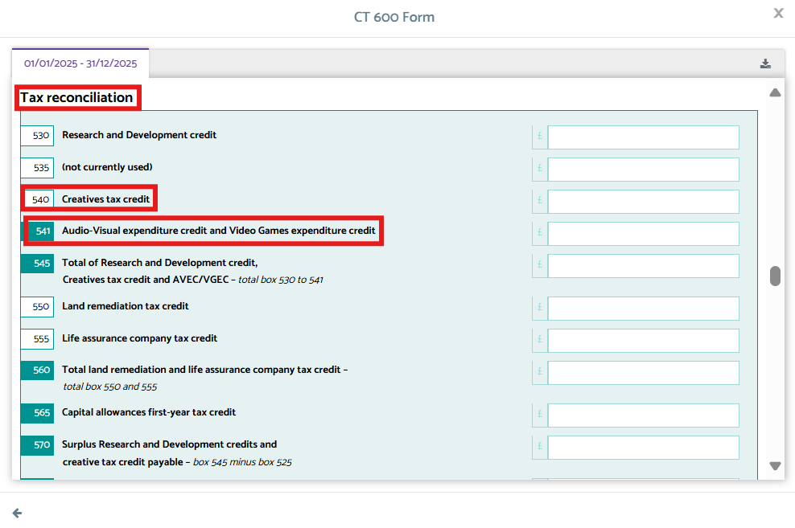
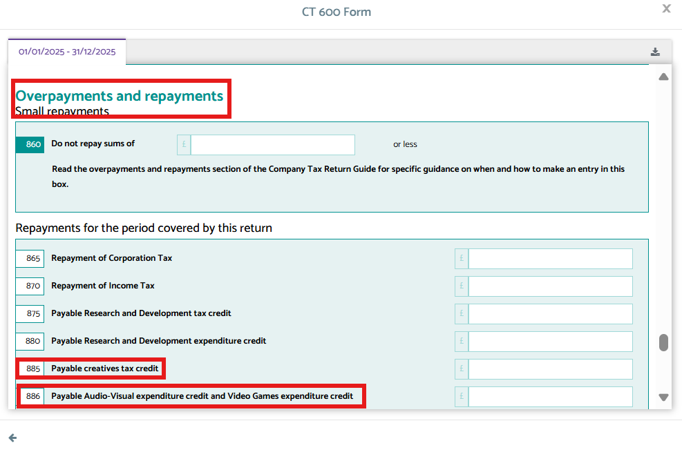
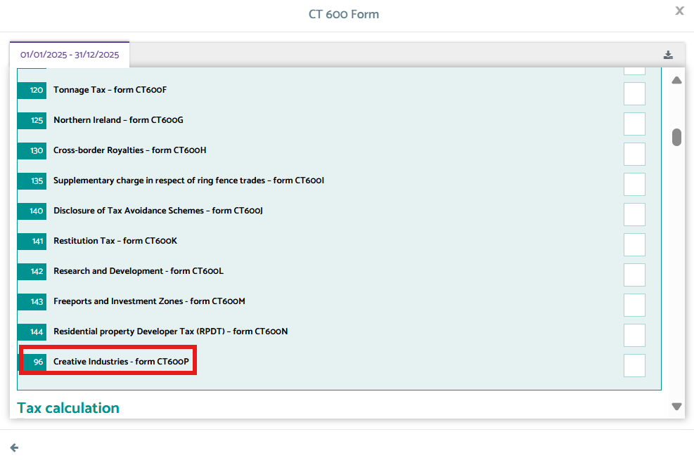

# Corporation Tax CT600P
	 	
			
			Print

- **Category:** Corporation Tax
- **Folder:** Corporation Tax Help Guide
- **Source URL:** [https://capium.freshdesk.com/support/solutions/articles/9000267558-corporation-tax-ct600p](https://capium.freshdesk.com/support/solutions/articles/9000267558-corporation-tax-ct600p)
- **Article ID:** 9000267558

## Content

Solution home 
		Corporation Tax
		Corporation Tax Help Guide

### Corporation Tax CT600P

			Print

	Modified on: Tue, 22 Apr, 2025 at  4:49 PM

		HMRC has announced a delay in the requirement for the CT600P supplementary form. Initially expected from April 2025, this has now been postponed until April 2026 at the earliest. 

This change affects companies claiming creative industry tax reliefs. While the CT600P will eventually be required, it is not mandatory at this stage due to ongoing technical limitations with HMRC’s Corporation Tax online service. 

What You Need to Know (Tax Year 2025-26) 

If you're preparing Corporation Tax returns that include claims for creative industry tax reliefs, here are the current steps to follow: 

CT600 Filing: Continue filing CT600 returns as usual. Use the relevant boxes: 

Box 540 for the gross amount of the relief. 
Box 885 for any payable tax credit. 
 - For AVEC or VGEC claims, use Box 541 and Box 886 please use add and use the CT600L form and it will auto populate into the above boxes. 

Navigation > Corporation Tax > Task > CT 600 returns 

Additional Information Form: This must still be submitted alongside the CT600 return when claiming creative reliefs. 

CT600P in Capium 

Although HMRC has delayed enforcement, the CT600P calculation page is already available in Capium. This means users can: 

Access and complete CT600P-related calculations in preparation for the 2026 mandate. 

Familiarise themselves with the structure and workflow well in advance. 

Ensure consistency in their Corporation Tax submissions, particularly when managing relief claims across multiple clients. 

Please note that this page can only be used in this tax year for the purposes of calculation and will not be sent to HMRC as they are not accepting this page until financial year 2026-27.

										Did you find it helpful?
								Yes
								No

Send feedback	Sorry we couldn't be helpful. Help us improve this article with your feedback.

## Screenshots & Diagrams (3)

