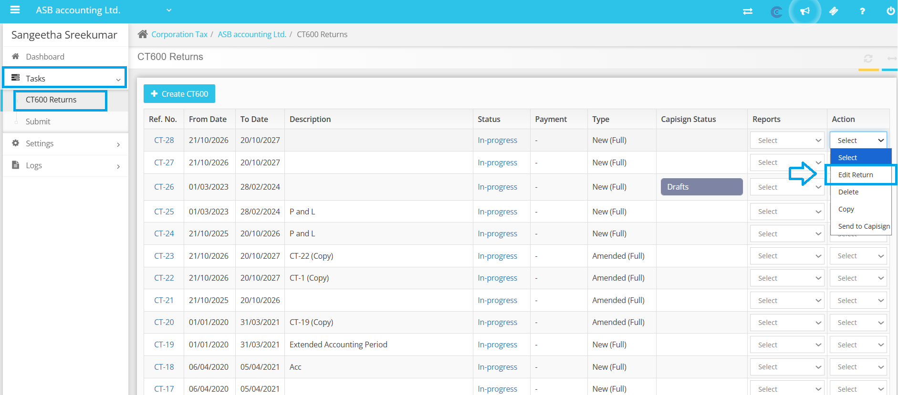
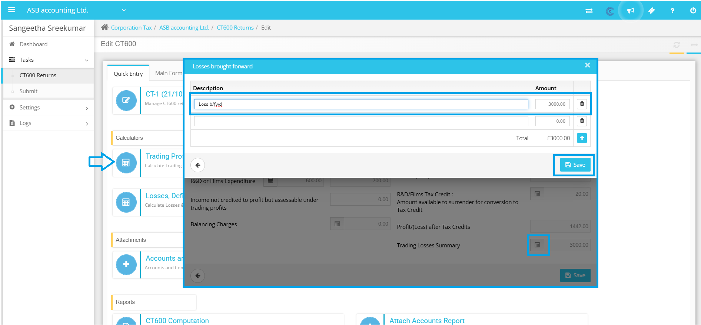
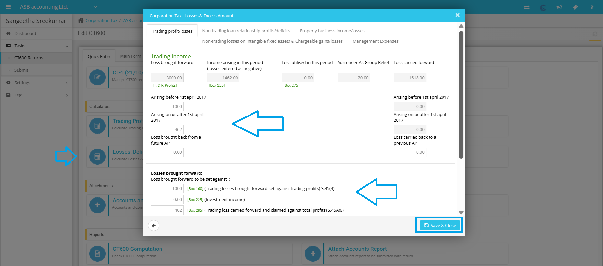

# Carry forward and set off losses
	 	
			
			Print

- **Category:** Corporation Tax
- **Folder:** Corporation Tax Help Guide
- **Source URL:** [https://capium.freshdesk.com/support/solutions/articles/9000271519-carry-forward-and-set-off-losses](https://capium.freshdesk.com/support/solutions/articles/9000271519-carry-forward-and-set-off-losses)
- **Article ID:** 9000271519

## Content

Solution home 
		Corporation Tax
		Corporation Tax Help Guide

### Carry forward and set off losses

			Print

	Modified on: Fri, 14 Nov, 2025 at  3:34 PM

		Please follow the process outlined below for carrying forward and setting off losses. 

To assist you with this process, we have provided a step-by-step guide to help you navigate through our system and make the necessary updates.

To manually update the brought forward losses, simply follow these steps:

1. Navigate to the Corporation Tax module

2. Select the client for whom you need to update the losses

3. Go to Tasks, then CT 600 returns, and click Edit

4. Select Quick entry, followed by Trading Professional Profit Calculator

5. Under Trading Losses Summary, add the losses and save your changes

If you have previously prepared a tax return in Capium, you also have the option to import brought forward details from the previous return.

To offset the losses against the current year's profit, follow these steps:

1. Access the Losses Deficits and Excess Amounts Calculator

2. Go to Schedule D Case I/II

3. Enter the loss amount corresponding to the current year's profit in the designated boxes - enter the loss amount to the extent of current year profit in the box 'Arising before 1st April 2017' or 'Arising on or after 1st April 2017' and also in 'Box 285'(belong to after 2017) or 160 (belong to before 2017). 

4. Save your changes

If you encounter any challenges during this process, please do not hesitate to reach out to us for assistance. Additionally, you can refer to the help document linked here for further guidance: 

										Did you find it helpful?
								Yes
								No

Send feedback	Sorry we couldn't be helpful. Help us improve this article with your feedback.

## Screenshots & Diagrams (3)

