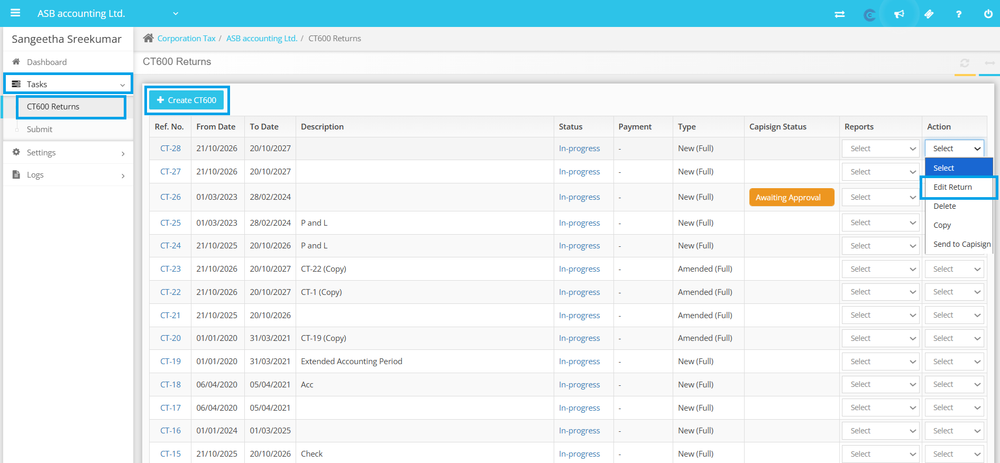
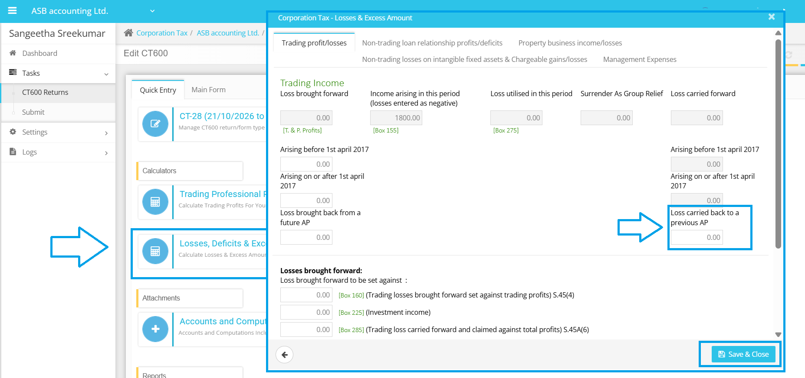
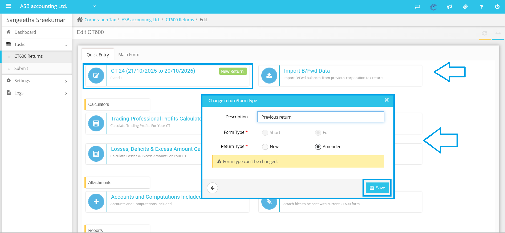
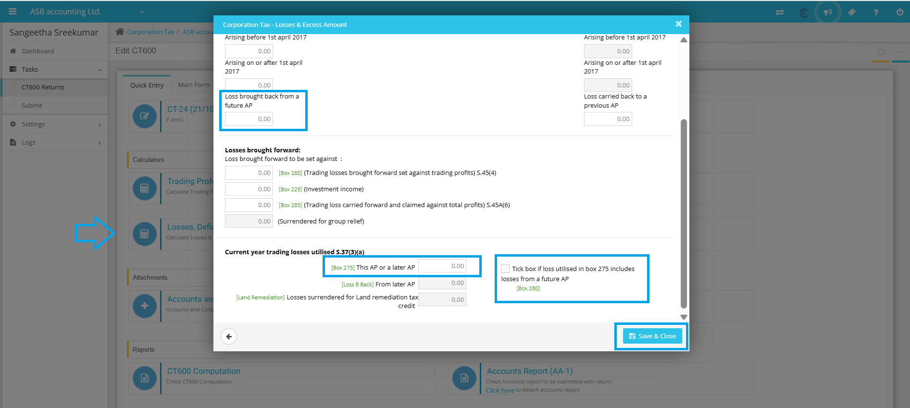
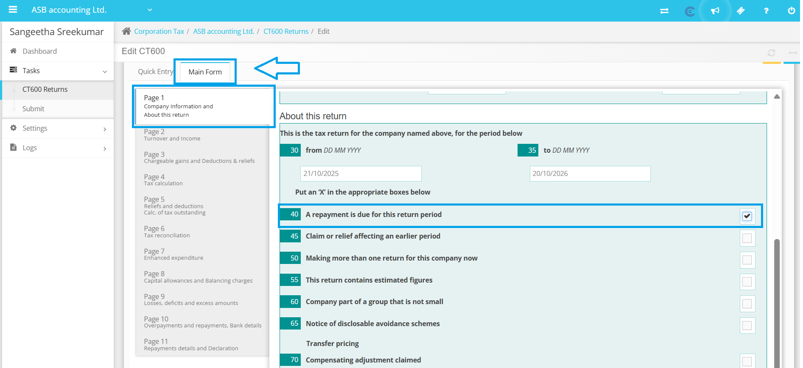

# How to carry back the losses from current year to prior AP?
	 	
			
			Print

- **Category:** Corporation Tax
- **Folder:** Corporation Tax Help Guide
- **Source URL:** [https://capium.freshdesk.com/support/solutions/articles/9000271554-how-to-carry-back-the-losses-from-current-year-to-prior-ap-](https://capium.freshdesk.com/support/solutions/articles/9000271554-how-to-carry-back-the-losses-from-current-year-to-prior-ap-)
- **Article ID:** 9000271554

## Content

Solution home 
		Corporation Tax
		Corporation Tax Help Guide

### How to carry back the losses from current year to prior AP?

			Print

	Modified on: Mon, 29 Jun, 2026 at  2:05 PM

		If you have trading losses in the current accounting period, you may be able to carry back those losses to a previous tax year. Here’s how you can do it:

Step 1: Update the Current Return

- Make sure to update the box labeled ‘Losses carried back to a previous AP’ with the relevant loss amount in the current period’s return by Corporation Tax > Select Client > Edit Return/Create Return > Quick Entry > Losses, Deficits & Excess Amount Calculator

Step 2: Amend the Previous Return

- Create an amended return for the previous accounting period and update the box labeled ‘Loss brought back from a future AP’ with the corresponding value of the loss.

- Ensure that Box 40 is selected in the main form of the amended return to indicate that you are making this claim.

- Enter the carried-back loss amount in Box 275 and tick Box 280 to confirm that you have made this adjustment correctly.

Step 1: Update the Current Return

Step 2: Amend the Previous Return

Please review the CT600 computation to confirm the figures, and do not hesitate to inform us if you encounter any issues.

										Did you find it helpful?
								Yes
								No

Send feedback	Sorry we couldn't be helpful. Help us improve this article with your feedback.

## Screenshots & Diagrams (5)

