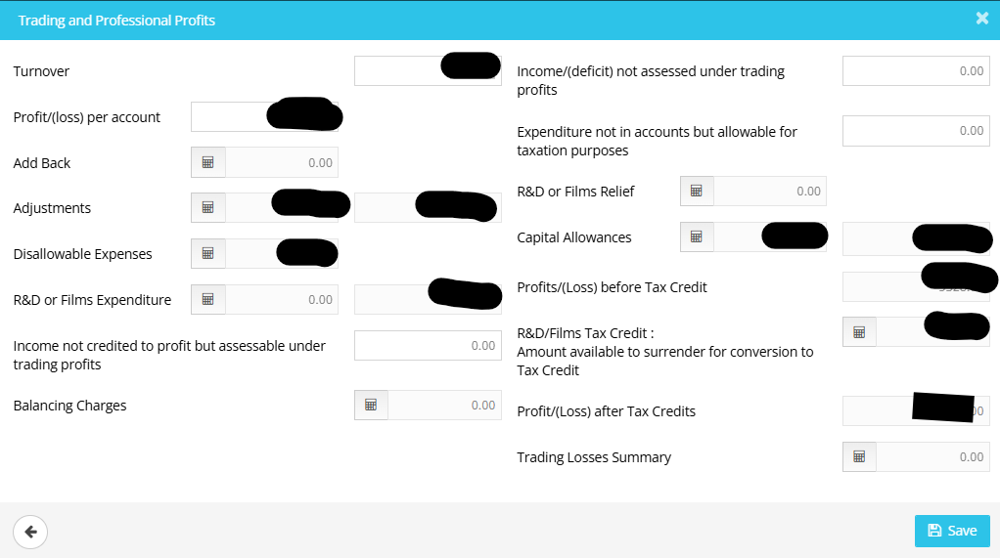
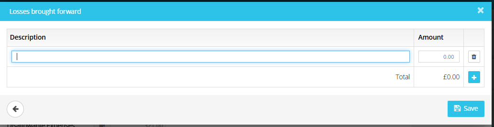

# How to show deduction allowance claim in ct600
	 	
			
			Print

- **Category:** Corporation Tax
- **Folder:** Corporation Tax Help Guide
- **Source URL:** [https://capium.freshdesk.com/support/solutions/articles/9000275459-how-to-show-deduction-allowance-claim-in-ct600](https://capium.freshdesk.com/support/solutions/articles/9000275459-how-to-show-deduction-allowance-claim-in-ct600)
- **Article ID:** 9000275459

## Content

Solution home 
		Corporation Tax
		Corporation Tax Help Guide

### How to show deduction allowance claim in ct600

			Print

	Modified on: Thu, 26 Mar, 2026 at  3:38 PM

		How to record the deduction allowance claim in the CT600

There is no dedicated box labelled ‘deduction allowance’ showing the impact of applying the £5m deduction allowance and the 50% restriction and therefore this should be reflected in Box 155 (losses carried forward set against profits’ 

If you navigate to the main form, click on box 155 calculator

This opens up this screen:

Click on the trading losses summary

You can then enter the losses brought forward with detail restricting this to:

               Total profits before losses

               Deductions Allowance Used

               Restricted losses calculation

               Amount of losses actually used

Whilst the allowance itself does not have a specific box, the resulting relief figures are entered into the standard boxes in the deduction and relief section:

There should also be an ability to attach a CT computation, not just complete this box to show how it has been worked out, this should also include a statement that the company specifies that its deductions allowance for this period is £5,000,000 under Section 269ZZ CTA 2010

										Did you find it helpful?
								Yes
								No

Send feedback	Sorry we couldn't be helpful. Help us improve this article with your feedback.

## Screenshots & Diagrams (3)

