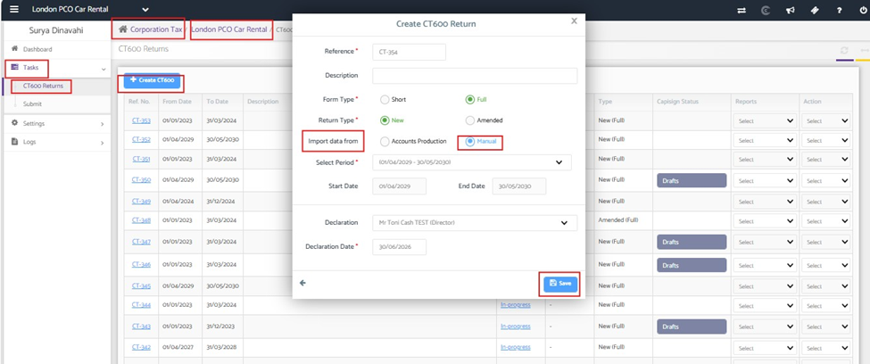
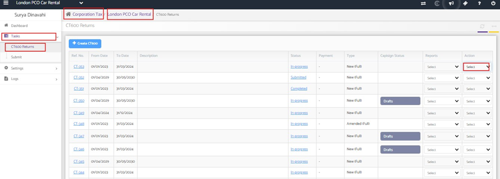
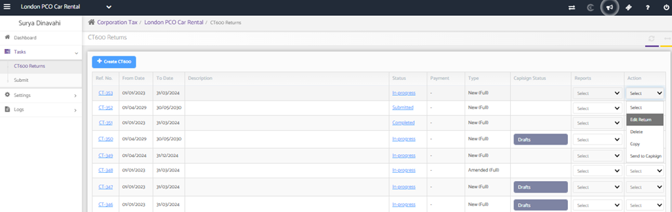
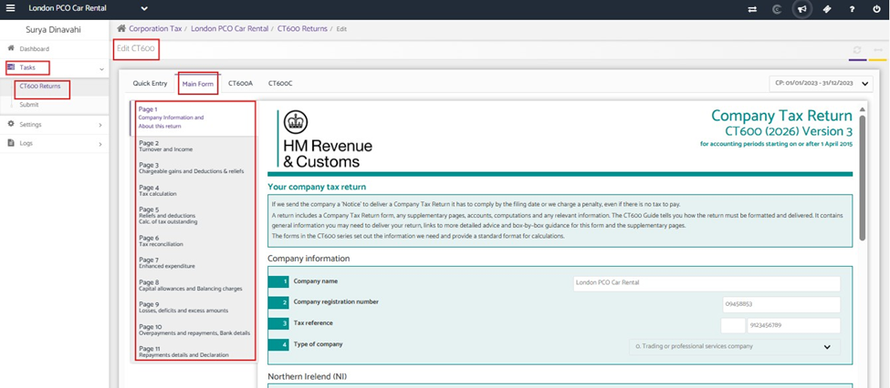

# How to manually submit CT600 for iXBRL accounts.
	 	
			
			Print

- **Category:** Corporation Tax
- **Folder:** Corporation Tax Help Guide
- **Source URL:** [https://capium.freshdesk.com/support/solutions/articles/9000277519-how-to-manually-submit-ct600-for-ixbrl-accounts-](https://capium.freshdesk.com/support/solutions/articles/9000277519-how-to-manually-submit-ct600-for-ixbrl-accounts-)
- **Article ID:** 9000277519

## Content

Solution home 
		Corporation Tax
		Corporation Tax Help Guide

### How to manually submit CT600 for iXBRL accounts.

			Print

	Modified on: Tue, 30 Jun, 2026 at 11:53 AM

This guide explains how to manually prepare and submit a CT600 Corporation Tax Return using your iXBRL annual accounts.

Step 1: Prepare the Annual Accounts

Generate your annual accounts in iXBRL format and ensure the accounts are finalized before creating the CT600 return.

Step 2: Create the CT600 Return

Create a new CT600 return and manually import the relevant financial information from your accounts.

Navigation: Corporation Tax > Client Specific > Tasks > Create CT600 

Complete the required company and accounting period details, then manually import the financial information into the return.

Step 3: Add the Required Supplementary Pages

You can add any supplementary pages that are applicable to the return like loans, charities, or other additional schedules

Navigation: Corporation tax > Client Specific > Tasks > CT600 returns >Edit the CT600 Return > Main form > Supplementary Pages 

Add the forms relevant to your company.

Step 4: Attach the iXBRL Accounts

Attach the iXBRL accounts file to the CT600 return before submission

Step 5: Review and Submit

You can review all information entered in the CT600 return, ensuring that the accounting period, figures and attachments are correct

Note : You can attach only one iXBRL accounts file which matches with CT period and the computation will be automatically sent by the system along with submission. 

										Did you find it helpful?
								Yes
								No

Send feedback	Sorry we couldn't be helpful. Help us improve this article with your feedback.

## Screenshots & Diagrams (5)

