# General Module - Knowledge Base & Feature Index

> Total Articles: **39** | Module Directory: `d:/sansuite/General`

## Articles List & Local Assets

### 1. Quick Guide: Getting Started with My Admin
- **Folder:** Quick Guides: Getting Started with Capium
- **Article ID:** `9000231133` | **Slug:** `quick-guide-getting-started-with-my-admin`
- **Markdown File:** [raw_articles/9000231133_quick-guide-getting-started-with-my-admin.md](../raw_articles/9000231133_quick-guide-getting-started-with-my-admin.md)
- **Images Count:** 20
- **Screenshots:**
  - 
  - 
  - 
  - 
  - 
  - 
  - 
  - 
  - 
  - 
  - 
  - 
  - 
  - 
  - 
  - 
  - 
  - 
  - 
  - 

---

### 2. Quick Guide: Getting Started with Bookkeeping
- **Folder:** Quick Guides: Getting Started with Capium
- **Article ID:** `9000231141` | **Slug:** `quick-guide-getting-started-with-bookkeeping`
- **Markdown File:** [raw_articles/9000231141_quick-guide-getting-started-with-bookkeeping.md](../raw_articles/9000231141_quick-guide-getting-started-with-bookkeeping.md)
- **Images Count:** 7
- **Screenshots:**
  - 
  - 
  - 
  - 
  - 
  - 
  - 

---

### 3. Quick Guide: Getting Started with Payroll
- **Folder:** Quick Guides: Getting Started with Capium
- **Article ID:** `9000231143` | **Slug:** `quick-guide-getting-started-with-payroll`
- **Markdown File:** [raw_articles/9000231143_quick-guide-getting-started-with-payroll.md](../raw_articles/9000231143_quick-guide-getting-started-with-payroll.md)
- **Images Count:** 13
- **Screenshots:**
  - 
  - 
  - 
  - 
  - 
  - 
  - 
  - 
  - 
  - 
  - 
  - 
  - 

---

### 4. Quick Guide: Getting Started with Practice Management
- **Folder:** Quick Guides: Getting Started with Capium
- **Article ID:** `9000231144` | **Slug:** `quick-guide-getting-started-with-practice-management`
- **Markdown File:** [raw_articles/9000231144_quick-guide-getting-started-with-practice-management.md](../raw_articles/9000231144_quick-guide-getting-started-with-practice-management.md)
- **Images Count:** 5
- **Screenshots:**
  - 
  - 
  - 
  - 
  - 

---

### 5. Quick Guide: Getting Started with Accounts Production
- **Folder:** Quick Guides: Getting Started with Capium
- **Article ID:** `9000231145` | **Slug:** `quick-guide-getting-started-with-accounts-production`
- **Markdown File:** [raw_articles/9000231145_quick-guide-getting-started-with-accounts-production.md](../raw_articles/9000231145_quick-guide-getting-started-with-accounts-production.md)
- **Images Count:** 6
- **Screenshots:**
  - 
  - 
  - 
  - 
  - 
  - 

---

### 6. Quick Guide: Getting Started with Self Assessment
- **Folder:** Quick Guides: Getting Started with Capium
- **Article ID:** `9000231146` | **Slug:** `quick-guide-getting-started-with-self-assessment`
- **Markdown File:** [raw_articles/9000231146_quick-guide-getting-started-with-self-assessment.md](../raw_articles/9000231146_quick-guide-getting-started-with-self-assessment.md)
- **Images Count:** 19
- **Screenshots:**
  - 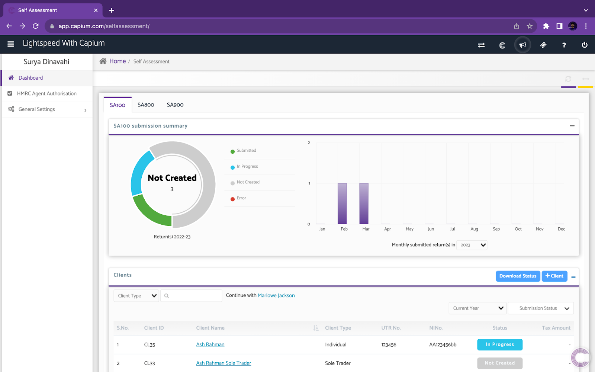
  - 
  - 
  - 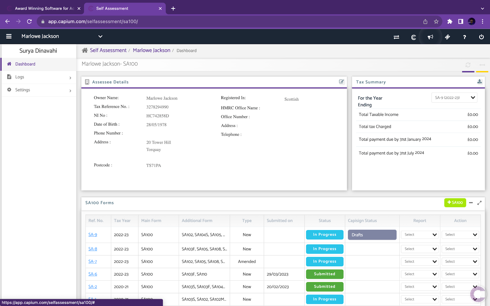
  - 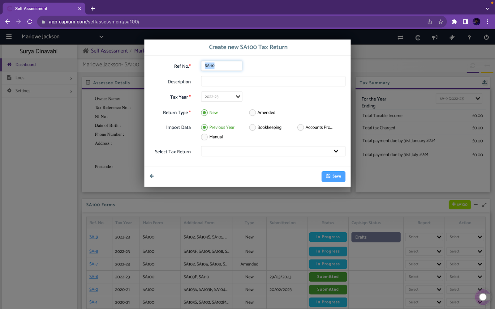
  - 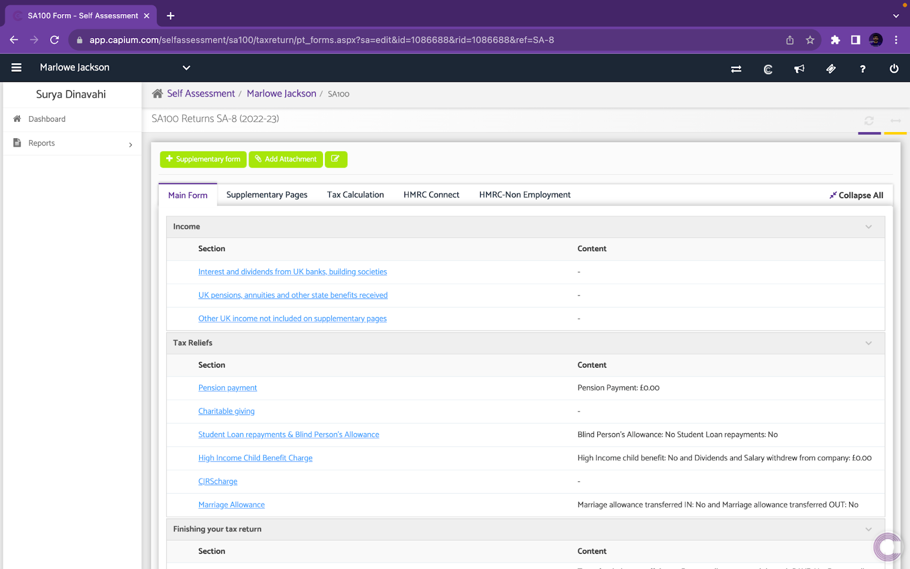
  - 
  - 
  - 
  - 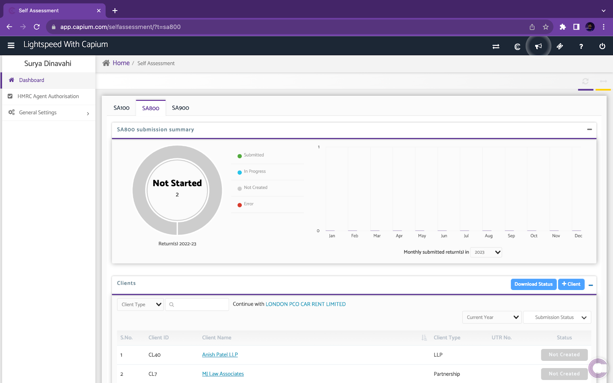
  - 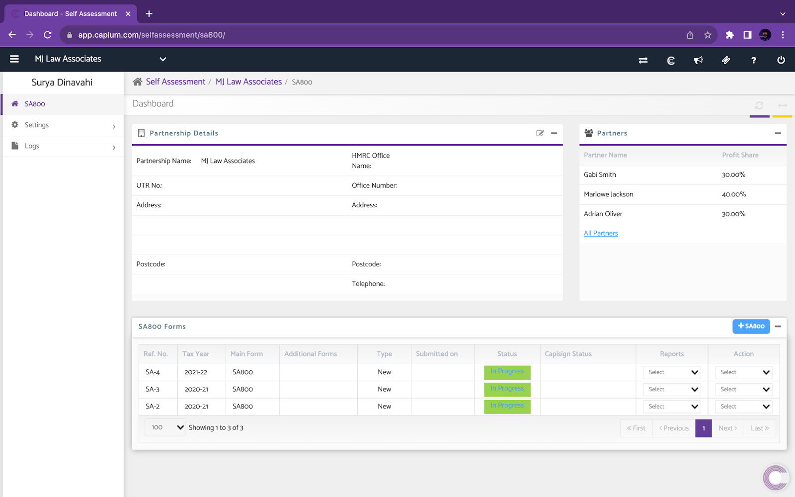
  - 
  - 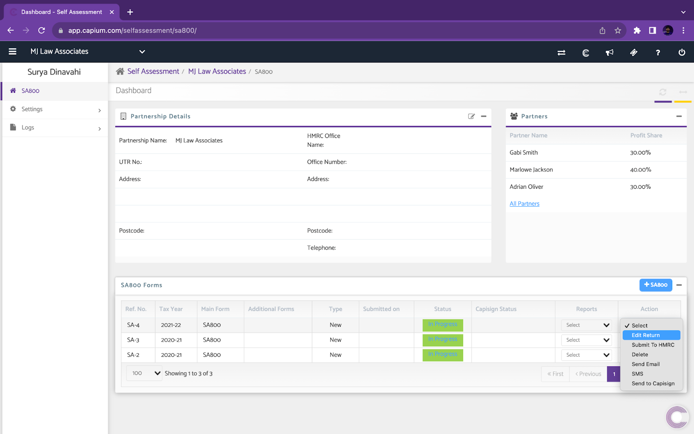
  - 
  - 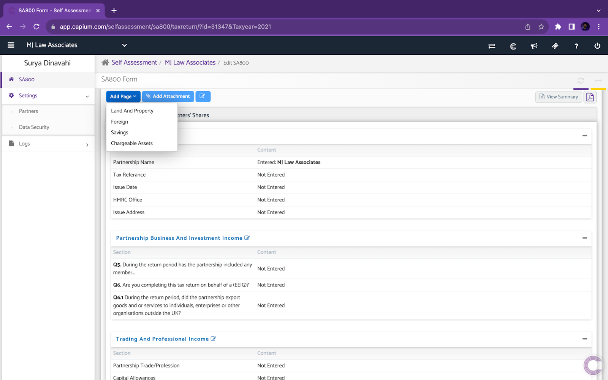
  - 
  - 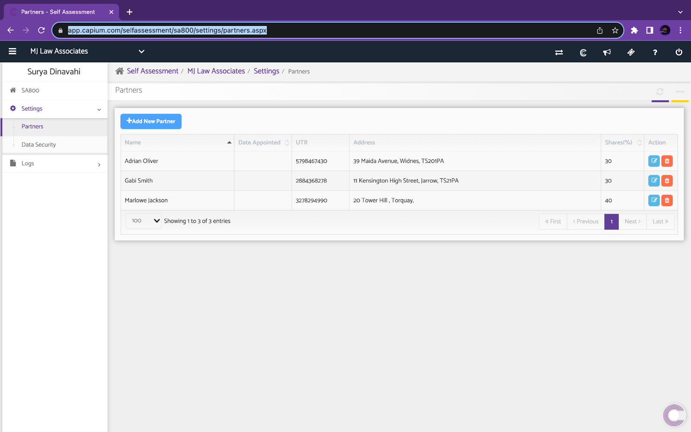
  - 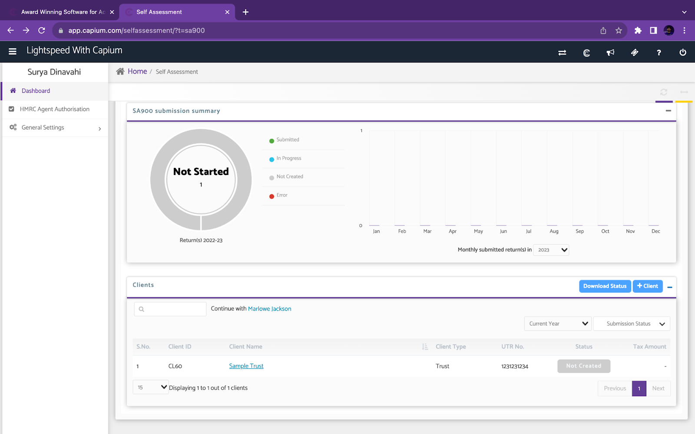
  - 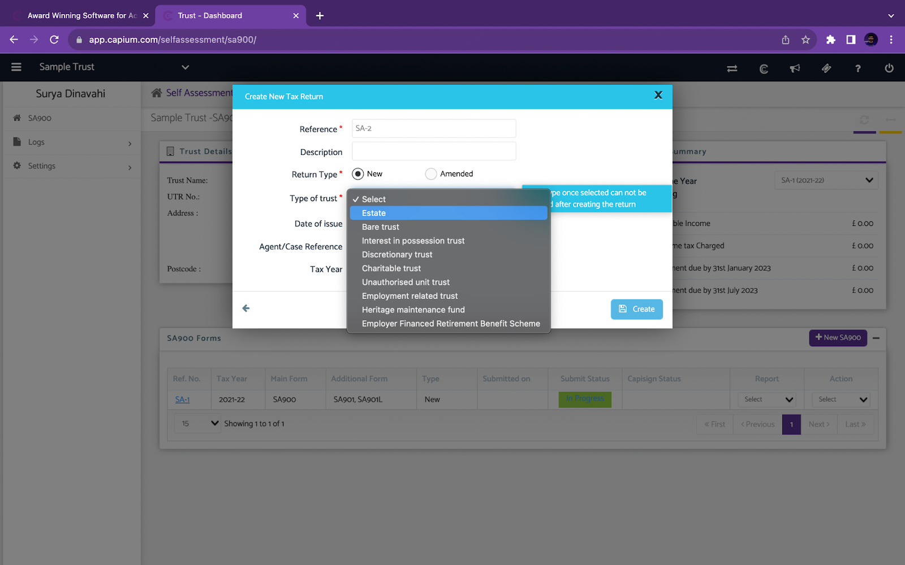

---

### 7. Quick Guide: Getting Started with Corporation Tax
- **Folder:** Quick Guides: Getting Started with Capium
- **Article ID:** `9000231148` | **Slug:** `quick-guide-getting-started-with-corporation-tax`
- **Markdown File:** [raw_articles/9000231148_quick-guide-getting-started-with-corporation-tax.md](../raw_articles/9000231148_quick-guide-getting-started-with-corporation-tax.md)
- **Images Count:** 10
- **Screenshots:**
  - 
  - 
  - 
  - 
  - 
  - 
  - 
  - 
  - 
  - 

---

### 8. Submission Credentials for Accounts and Corporation Tax filing
- **Folder:** Quick Guides: Getting Started with Capium
- **Article ID:** `9000237128` | **Slug:** `submission-credentials-for-accounts-and-corporation-tax-filing`
- **Markdown File:** [raw_articles/9000237128_submission-credentials-for-accounts-and-corporation-tax-filing.md](../raw_articles/9000237128_submission-credentials-for-accounts-and-corporation-tax-filing.md)
- **Images Count:** 0

---

### 9. MyAdmin: Recent Changes and Updates
- **Folder:** Quick Guides: Getting Started with Capium
- **Article ID:** `9000258775` | **Slug:** `myadmin-recent-changes-and-updates`
- **Markdown File:** [raw_articles/9000258775_myadmin-recent-changes-and-updates.md](../raw_articles/9000258775_myadmin-recent-changes-and-updates.md)
- **Images Count:** 0

---

### 10. Two factor authentication
- **Folder:** Quick Guides: Getting Started with Capium
- **Article ID:** `9000272207` | **Slug:** `two-factor-authentication`
- **Markdown File:** [raw_articles/9000272207_two-factor-authentication.md](../raw_articles/9000272207_two-factor-authentication.md)
- **Images Count:** 2
- **Screenshots:**
  - 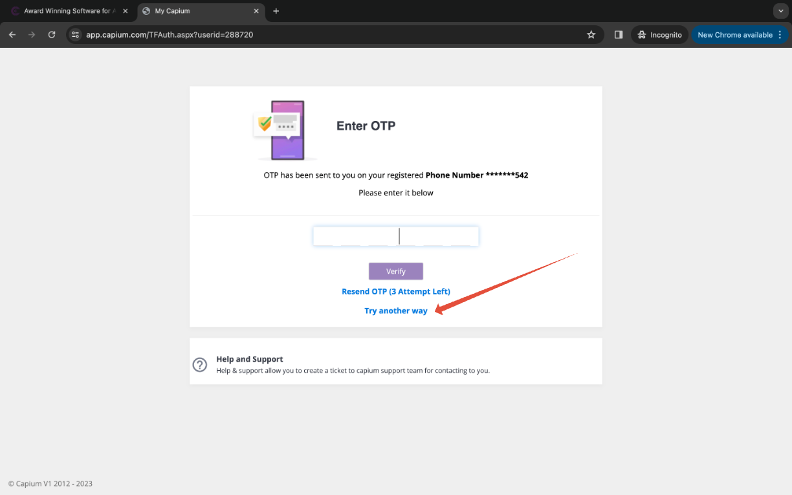
  - 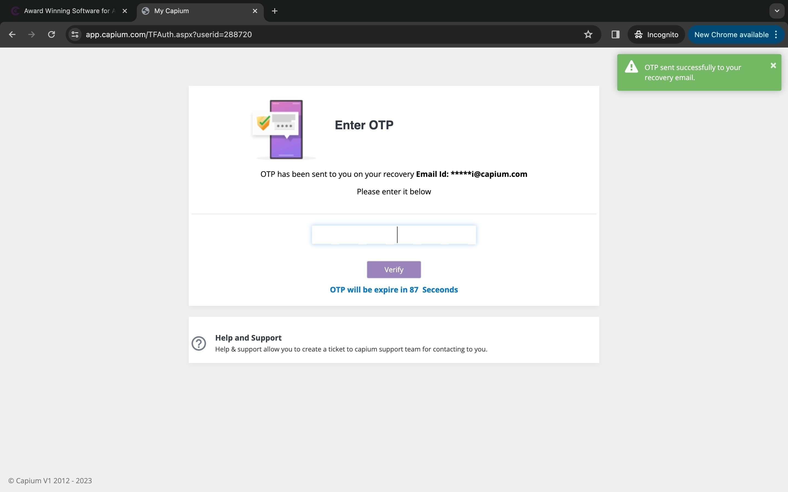

---

### 11. Email Settings: control how your practice appears on outgoing emails
- **Folder:** Quick Guides: Getting Started with Capium
- **Article ID:** `9000278276` | **Slug:** `email-settings-control-how-your-practice-appears-on-outgoing-emails`
- **Markdown File:** [raw_articles/9000278276_email-settings-control-how-your-practice-appears-on-outgoing-emails.md](../raw_articles/9000278276_email-settings-control-how-your-practice-appears-on-outgoing-emails.md)
- **Images Count:** 1
- **Screenshots:**
  - 

---

### 12. How to send emails to a client with multiple Email Addresses
- **Folder:** General
- **Article ID:** `9000189382` | **Slug:** `how-to-send-emails-to-a-client-with-multiple-email-addresses`
- **Markdown File:** [raw_articles/9000189382_how-to-send-emails-to-a-client-with-multiple-email-addresses.md](../raw_articles/9000189382_how-to-send-emails-to-a-client-with-multiple-email-addresses.md)
- **Images Count:** 3
- **Screenshots:**
  - 
  - 
  - 

---

### 13. How to add users and allocate permissions
- **Folder:** General
- **Article ID:** `9000149683` | **Slug:** `how-to-add-users-and-allocate-permissions`
- **Markdown File:** [raw_articles/9000149683_how-to-add-users-and-allocate-permissions.md](../raw_articles/9000149683_how-to-add-users-and-allocate-permissions.md)
- **Images Count:** 6
- **Screenshots:**
  - 
  - 
  - 
  - 
  - 
  - 

---

### 14. How do I change my password?
- **Folder:** General
- **Article ID:** `9000167302` | **Slug:** `how-do-i-change-my-password-`
- **Markdown File:** [raw_articles/9000167302_how-do-i-change-my-password-.md](../raw_articles/9000167302_how-do-i-change-my-password-.md)
- **Images Count:** 2
- **Screenshots:**
  - 
  - 

---

### 15. What is the difference between Book Start &amp; Business Start date?
- **Folder:** General
- **Article ID:** `9000167874` | **Slug:** `what-is-the-difference-between-book-start-business-start-date-`
- **Markdown File:** [raw_articles/9000167874_what-is-the-difference-between-book-start-business-start-date-.md](../raw_articles/9000167874_what-is-the-difference-between-book-start-business-start-date-.md)
- **Images Count:** 0

---

### 16. How to create a support ticket and get in contact with the support team
- **Folder:** General
- **Article ID:** `9000204002` | **Slug:** `how-to-create-a-support-ticket-and-get-in-contact-with-the-support-team`
- **Markdown File:** [raw_articles/9000204002_how-to-create-a-support-ticket-and-get-in-contact-with-the-support-team.md](../raw_articles/9000204002_how-to-create-a-support-ticket-and-get-in-contact-with-the-support-team.md)
- **Images Count:** 4
- **Screenshots:**
  - 
  - 
  - 
  - 

---

### 17. How to pay for Capium using GoCardless or Stripe
- **Folder:** General
- **Article ID:** `9000204164` | **Slug:** `how-to-pay-for-capium-using-gocardless-or-stripe`
- **Markdown File:** [raw_articles/9000204164_how-to-pay-for-capium-using-gocardless-or-stripe.md](../raw_articles/9000204164_how-to-pay-for-capium-using-gocardless-or-stripe.md)
- **Images Count:** 7
- **Screenshots:**
  - 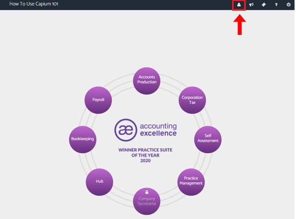
  - 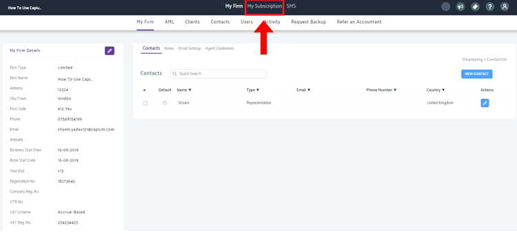
  - 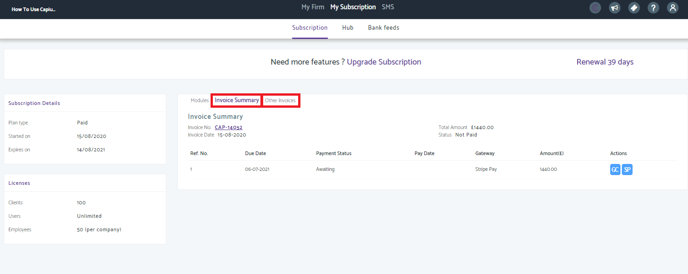
  - 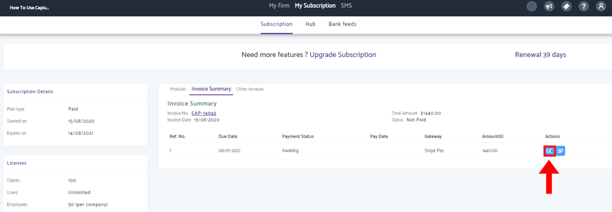
  - 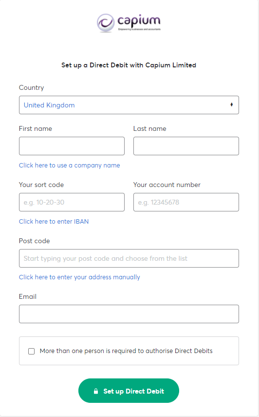
  - 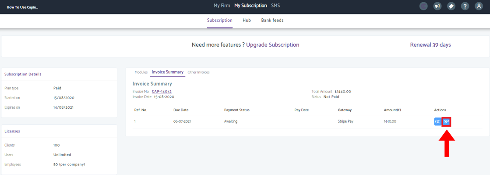
  - 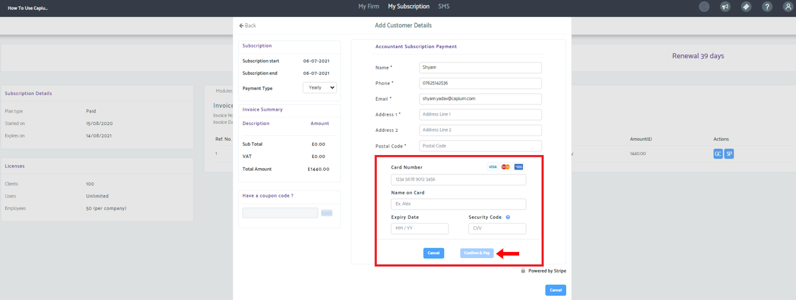

---

### 18. How to change the Accounting Peroid on Capium
- **Folder:** General
- **Article ID:** `9000221450` | **Slug:** `how-to-change-the-accounting-peroid-on-capium`
- **Markdown File:** [raw_articles/9000221450_how-to-change-the-accounting-peroid-on-capium.md](../raw_articles/9000221450_how-to-change-the-accounting-peroid-on-capium.md)
- **Images Count:** 3
- **Screenshots:**
  - 
  - 
  - 

---

### 19. PM: Setting up SMS
- **Folder:** General
- **Article ID:** `9000226438` | **Slug:** `pm-setting-up-sms`
- **Markdown File:** [raw_articles/9000226438_pm-setting-up-sms.md](../raw_articles/9000226438_pm-setting-up-sms.md)
- **Images Count:** 2
- **Screenshots:**
  - 
  - 

---

### 20. Two Factor Authentication
- **Folder:** General
- **Article ID:** `9000234256` | **Slug:** `two-factor-authentication`
- **Markdown File:** [raw_articles/9000234256_two-factor-authentication.md](../raw_articles/9000234256_two-factor-authentication.md)
- **Images Count:** 7
- **Screenshots:**
  - 
  - 
  - 
  - 
  - 
  - 
  - 

---

### 21. How to Change your Password
- **Folder:** General
- **Article ID:** `9000234321` | **Slug:** `how-to-change-your-password`
- **Markdown File:** [raw_articles/9000234321_how-to-change-your-password.md](../raw_articles/9000234321_how-to-change-your-password.md)
- **Images Count:** 2
- **Screenshots:**
  - 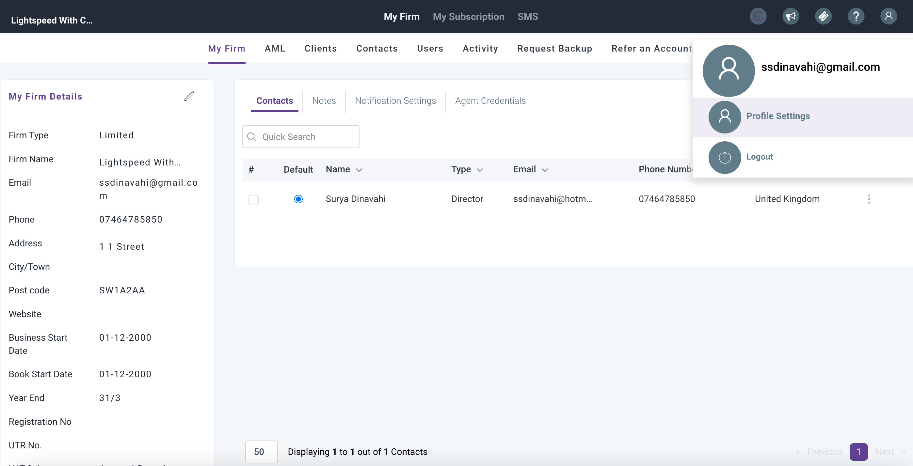
  - 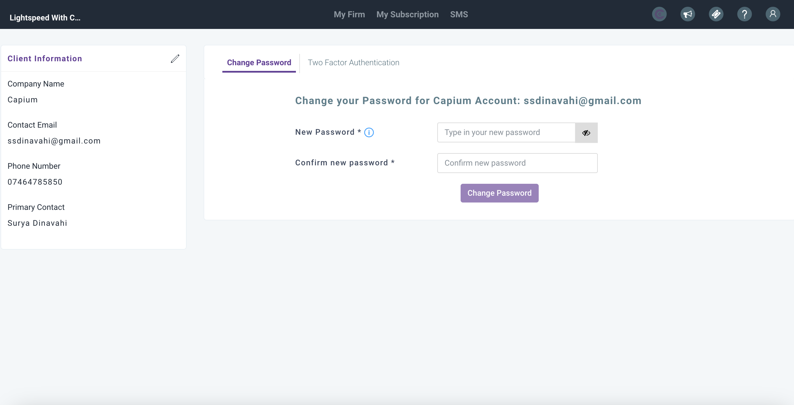

---

### 22. 2 Factor Authentication - Changing the Recovery Email and Phone Details
- **Folder:** General
- **Article ID:** `9000234356` | **Slug:** `2-factor-authentication-changing-the-recovery-email-and-phone-details`
- **Markdown File:** [raw_articles/9000234356_2-factor-authentication-changing-the-recovery-email-and-phone-details.md](../raw_articles/9000234356_2-factor-authentication-changing-the-recovery-email-and-phone-details.md)
- **Images Count:** 1
- **Screenshots:**
  - 

---

### 23. Enabling Location Permissions for Capium Two Factor Authentication
- **Folder:** General
- **Article ID:** `9000234373` | **Slug:** `enabling-location-permissions-for-capium-two-factor-authentication`
- **Markdown File:** [raw_articles/9000234373_enabling-location-permissions-for-capium-two-factor-authentication.md](../raw_articles/9000234373_enabling-location-permissions-for-capium-two-factor-authentication.md)
- **Images Count:** 0

---

### 24. Notification Settings
- **Folder:** General
- **Article ID:** `9000235057` | **Slug:** `notification-settings`
- **Markdown File:** [raw_articles/9000235057_notification-settings.md](../raw_articles/9000235057_notification-settings.md)
- **Images Count:** 4
- **Screenshots:**
  - 
  - 
  - 
  - 

---

### 25. How to register with Capium
- **Folder:** General
- **Article ID:** `9000236943` | **Slug:** `how-to-register-with-capium`
- **Markdown File:** [raw_articles/9000236943_how-to-register-with-capium.md](../raw_articles/9000236943_how-to-register-with-capium.md)
- **Images Count:** 2
- **Screenshots:**
  - 
  - 

---

### 26. Error Code 1046 -  Submitting your accounts and Corporation Tax
- **Folder:** General
- **Article ID:** `9000237028` | **Slug:** `error-code-1046-submitting-your-accounts-and-corporation-tax`
- **Markdown File:** [raw_articles/9000237028_error-code-1046-submitting-your-accounts-and-corporation-tax.md](../raw_articles/9000237028_error-code-1046-submitting-your-accounts-and-corporation-tax.md)
- **Images Count:** 0

---

### 27. How do I access announcements?
- **Folder:** General
- **Article ID:** `9000237754` | **Slug:** `how-do-i-access-announcements-`
- **Markdown File:** [raw_articles/9000237754_how-do-i-access-announcements-.md](../raw_articles/9000237754_how-do-i-access-announcements-.md)
- **Images Count:** 0

---

### 28. New My Admin UI
- **Folder:** General
- **Article ID:** `9000239114` | **Slug:** `new-my-admin-ui`
- **Markdown File:** [raw_articles/9000239114_new-my-admin-ui.md](../raw_articles/9000239114_new-my-admin-ui.md)
- **Images Count:** 4
- **Screenshots:**
  - 
  - 
  - 
  - 

---

### 29. Get access to the Income Record Viewer for agents
- **Folder:** General
- **Article ID:** `9000241917` | **Slug:** `get-access-to-the-income-record-viewer-for-agents`
- **Markdown File:** [raw_articles/9000241917_get-access-to-the-income-record-viewer-for-agents.md](../raw_articles/9000241917_get-access-to-the-income-record-viewer-for-agents.md)
- **Images Count:** 0

---

### 30. How to Add Clients as an Accountant User
- **Folder:** General
- **Article ID:** `9000267571` | **Slug:** `how-to-add-clients-as-an-accountant-user`
- **Markdown File:** [raw_articles/9000267571_how-to-add-clients-as-an-accountant-user.md](../raw_articles/9000267571_how-to-add-clients-as-an-accountant-user.md)
- **Images Count:** 5
- **Screenshots:**
  - 
  - 
  - 
  - 
  - 

---

### 31. How to set up a Direct Debit
- **Folder:** General
- **Article ID:** `9000271347` | **Slug:** `how-to-set-up-a-direct-debit`
- **Markdown File:** [raw_articles/9000271347_how-to-set-up-a-direct-debit.md](../raw_articles/9000271347_how-to-set-up-a-direct-debit.md)
- **Images Count:** 2
- **Screenshots:**
  - 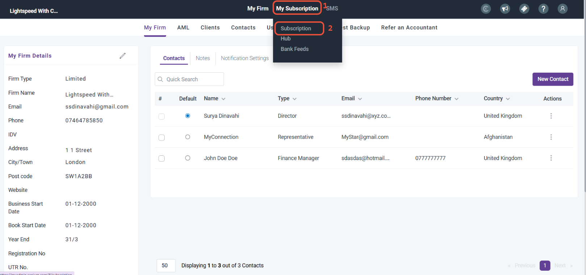
  - 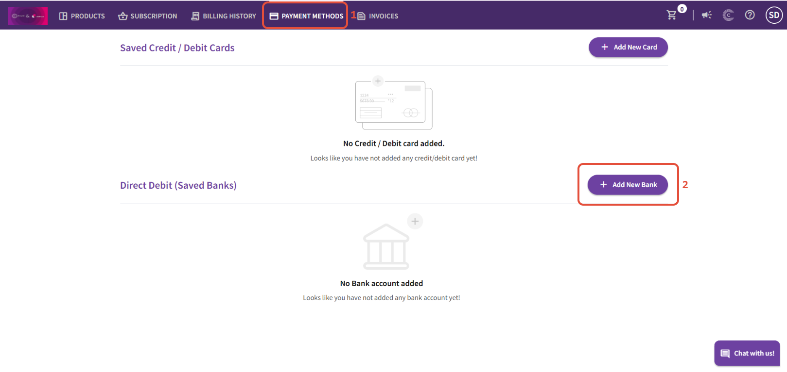

---

### 32. Companies House Identity Verification (IDV) – What You Need to Know
- **Folder:** General
- **Article ID:** `9000271560` | **Slug:** `companies-house-identity-verification-idv-what-you-need-to-know`
- **Markdown File:** [raw_articles/9000271560_companies-house-identity-verification-idv-what-you-need-to-know.md](../raw_articles/9000271560_companies-house-identity-verification-idv-what-you-need-to-know.md)
- **Images Count:** 0

---

### 33. How do Clients Login?
- **Folder:** General
- **Article ID:** `9000271567` | **Slug:** `how-do-clients-login-`
- **Markdown File:** [raw_articles/9000271567_how-do-clients-login-.md](../raw_articles/9000271567_how-do-clients-login-.md)
- **Images Count:** 4
- **Screenshots:**
  - 
  - 
  - 
  - 

---

### 34. Inactive clients
- **Folder:** General
- **Article ID:** `9000271605` | **Slug:** `inactive-clients`
- **Markdown File:** [raw_articles/9000271605_inactive-clients.md](../raw_articles/9000271605_inactive-clients.md)
- **Images Count:** 2
- **Screenshots:**
  - 
  - 

---

### 35. Why Capium Doesn’t Yet Offer a Public API
- **Folder:** General
- **Article ID:** `9000272308` | **Slug:** `why-capium-doesn-t-yet-offer-a-public-api`
- **Markdown File:** [raw_articles/9000272308_why-capium-doesn-t-yet-offer-a-public-api.md](../raw_articles/9000272308_why-capium-doesn-t-yet-offer-a-public-api.md)
- **Images Count:** 0

---

### 36. How to delete users in Capium
- **Folder:** General
- **Article ID:** `9000275692` | **Slug:** `how-to-delete-users-in-capium`
- **Markdown File:** [raw_articles/9000275692_how-to-delete-users-in-capium.md](../raw_articles/9000275692_how-to-delete-users-in-capium.md)
- **Images Count:** 1
- **Screenshots:**
  - 

---

### 37. Basis Period Reform Help sheet
- **Folder:** Basis Period Reform
- **Article ID:** `9000237508` | **Slug:** `basis-period-reform-help-sheet`
- **Markdown File:** [raw_articles/9000237508_basis-period-reform-help-sheet.md](../raw_articles/9000237508_basis-period-reform-help-sheet.md)
- **Images Count:** 1
- **Screenshots:**
  - 

---

### 38. Basis Period Reform Webinar
- **Folder:** Basis Period Reform
- **Article ID:** `9000237526` | **Slug:** `basis-period-reform-webinar`
- **Markdown File:** [raw_articles/9000237526_basis-period-reform-webinar.md](../raw_articles/9000237526_basis-period-reform-webinar.md)
- **Images Count:** 0

---

### 39. Annotated Helpsheet HS222 2024 from HMRC - Basis Period Reform
- **Folder:** Basis Period Reform
- **Article ID:** `9000237643` | **Slug:** `annotated-helpsheet-hs222-2024-from-hmrc-basis-period-reform`
- **Markdown File:** [raw_articles/9000237643_annotated-helpsheet-hs222-2024-from-hmrc-basis-period-reform.md](../raw_articles/9000237643_annotated-helpsheet-hs222-2024-from-hmrc-basis-period-reform.md)
- **Images Count:** 1
- **Screenshots:**
  - 

---

