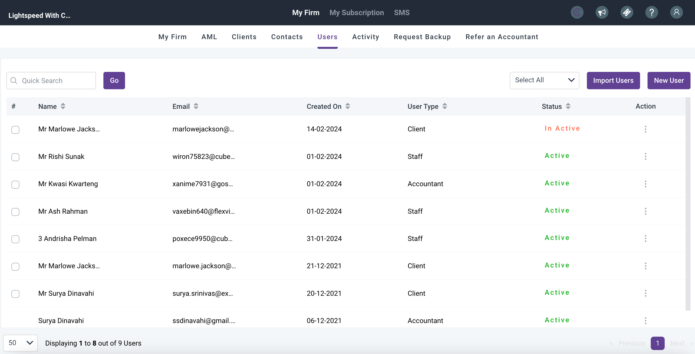
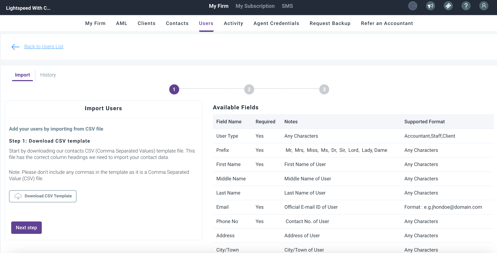
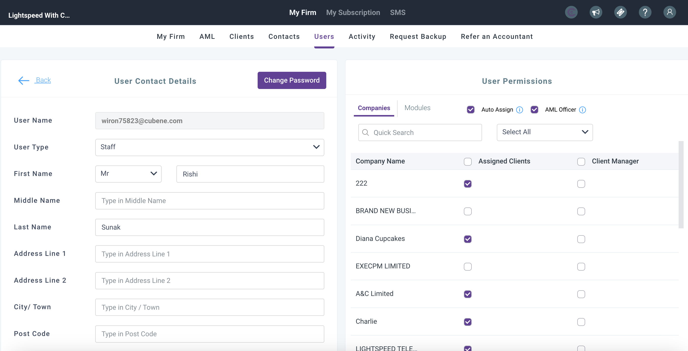
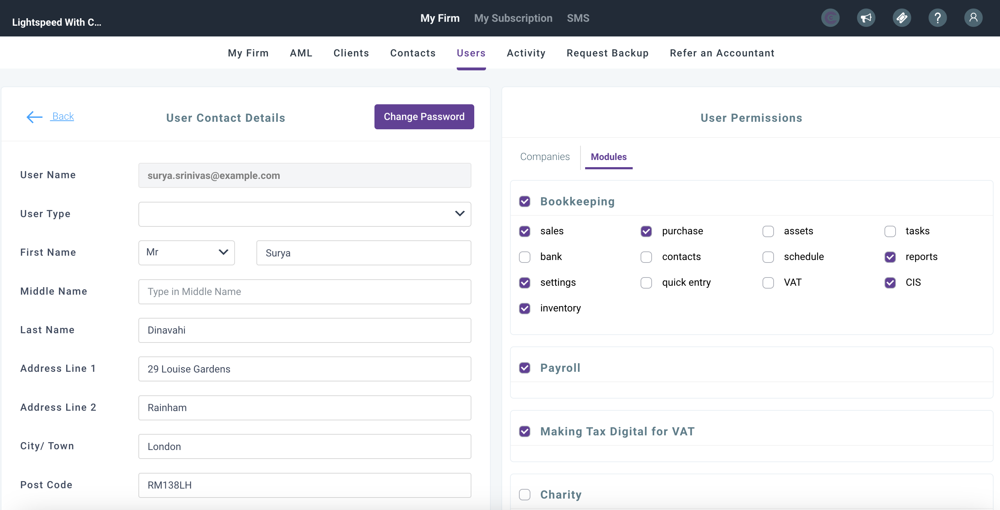

# How to add users and allocate permissions
	 	
			
			Print

- **Category:** General
- **Folder:** General
- **Source URL:** [https://capium.freshdesk.com/support/solutions/articles/9000149683-how-to-add-users-and-allocate-permissions](https://capium.freshdesk.com/support/solutions/articles/9000149683-how-to-add-users-and-allocate-permissions)
- **Article ID:** 9000149683

## Content

Solution home 
		General
		General

### How to add users and allocate permissions

			Print

	Modified on: Thu, 15 Aug, 2024 at 11:28 AM

		The article below will guide you how to add users and allocate permissions. 

Adding Users

Navigation: My Admin > Users

User types: ‘Super Accountant’, ‘Accountant’, ‘Staff’, and ‘Client’

Super Accountant: Access to all data and permission control.

Accountant: Access to all modules, with Super Accountant's client access restrictions.

Staff: Limited module and client access, controlled by Super Accountant.

Client: Access to the Bookkeeping, Payroll, Capium Hub & Charity modules for their company/s

To add users, you have two options:

Click on ‘New User’ to create users individually.

Use 'Import Users' to create users in bulk using the provided CSV template.

For each user, ensure you provide the following details:

User Type

Contact

Name

Email

Password

Phone

Address

When creating an individual user ensure these fields are populated, see image below:

Note - you will need to create a password which they will use to login with once you've created their user access.

When bulk importing users please ensure these fields in the CSV file are populated, see image below:

User Permissions 

The permissions will vary depending on whether the user is an accountant, staff or client

Accountant Access 

All modules will be accessible to an accountant, you can choose the clients the accountant sees, alternatively they can be the client manager for the clients. Accountants can also allocate Bank Feeds to the clients, as well as provide Hub Access. 

Checking auto assign means any new clients created the accountant will automatically be able to access the client.

Staff

The super-accountant will be able to assign certain or all clients and modules to staff users.  Without the module access being ticketed that staff member will not see that particular module. 

Clients

The client user can have access to the Bookkeeping, Payroll, Capium Hub & Charity modules for their company/s.

Congratulations! You've added your users and assigned permissions. If you encounter any issues or require further assistance, don't hesitate to reach out to your account manager.

										Did you find it helpful?
								Yes
								No

Send feedback	Sorry we couldn't be helpful. Help us improve this article with your feedback.

## Screenshots & Diagrams (6)

