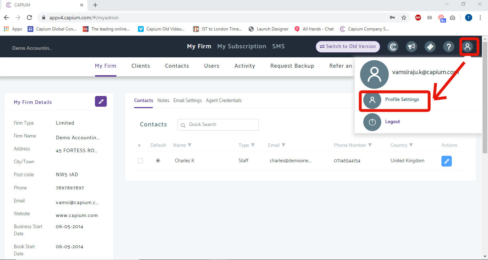
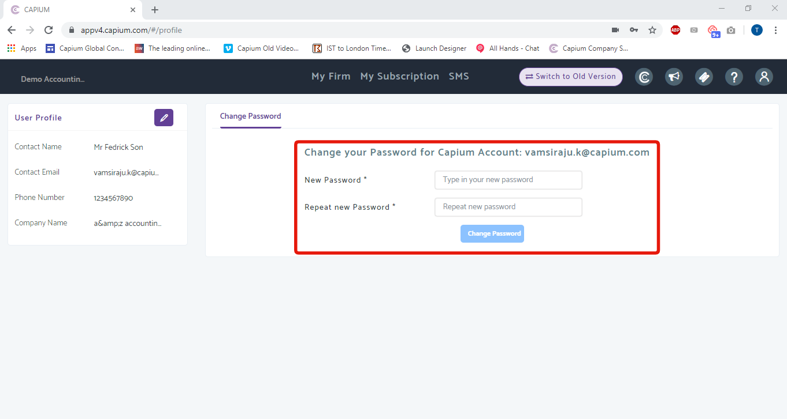

# How do I change my password?
	 	
			
			Print

- **Category:** General
- **Folder:** General
- **Source URL:** [https://capium.freshdesk.com/support/solutions/articles/9000167302-how-do-i-change-my-password-](https://capium.freshdesk.com/support/solutions/articles/9000167302-how-do-i-change-my-password-)
- **Article ID:** 9000167302

## Content

Solution home 
		General
		General

### How do I change my password?

			Print

	Modified on: Thu, 27 May, 2021 at 10:42 AM

		Location: My Admin > Profile > Profile Settings

Refer to the link

Click here to see how a client user changes their password

Click here to watch how to change your password as an accountant

To change your password whilst already logged into to your account, head to My Admin >>Profile >> Profile Settings. 

The first page you will be directed to will give you the option to change your password

Enter your new password (shown above) and click 'change password' to save the changes made.

										Did you find it helpful?
								Yes
								No

Send feedback	Sorry we couldn't be helpful. Help us improve this article with your feedback.

## Screenshots & Diagrams (2)

