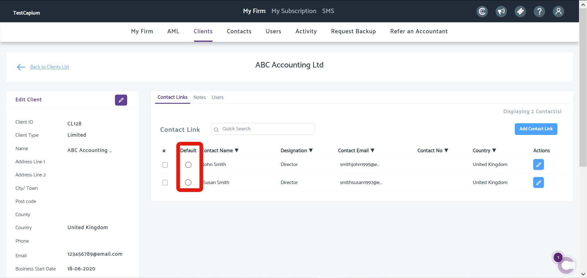
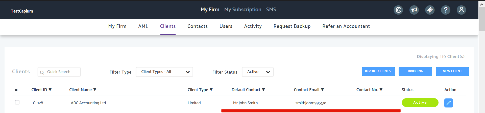
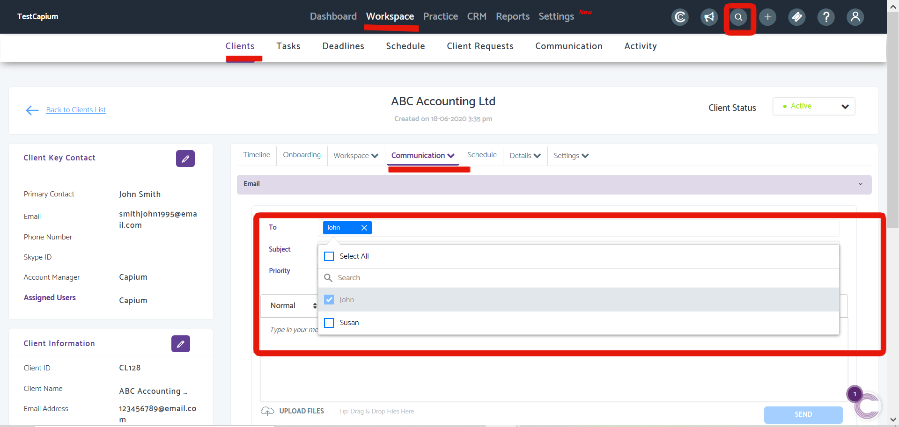

# How to send emails to a client with multiple Email Addresses
	 	
			
			Print

- **Category:** General
- **Folder:** General
- **Source URL:** [https://capium.freshdesk.com/support/solutions/articles/9000189382-how-to-send-emails-to-a-client-with-multiple-email-addresses](https://capium.freshdesk.com/support/solutions/articles/9000189382-how-to-send-emails-to-a-client-with-multiple-email-addresses)
- **Article ID:** 9000189382

## Content

Solution home 
		General
		General

### How to send emails to a client with multiple Email Addresses

			Print

	Modified on: Thu, 18 Jun, 2020 at  5:04 PM

		Navigation: My Admin > Clients > Edit Client 

Help/Guide

Begin in My Admin and select a client. Once in a clients' workspace, you will find 'Contact Links' as the first page. There you will need to add multiple contacts who will bear different email addresses.

Upon adding those contacts, you should see them listed as below (a). You can also use the Default column to select one of those contacts to become the Default Contact of that client - this means the contact details of the default contact will appear on your client's list (b)

(a)

(b)

Once you've added the various contacts for a client, head to Practice Management. Once there, navigate to Workspace > Clients and search for the client or use the quick search button on the top right of the Practice Management module.

Once in that clients' workspace, head to Communication as shown below (c) and under the 'To' field, any default contact will be automatically selected (in our case, John) but the option to select any and all other contacts is done by selecting the checkbox.

(c)

Lastly, enter an Email subject, type the body and click send.

Click here to watch How to add multiple Emails for one client when sending an Email

										Did you find it helpful?
								Yes
								No

Send feedback	Sorry we couldn't be helpful. Help us improve this article with your feedback.

## Screenshots & Diagrams (3)

