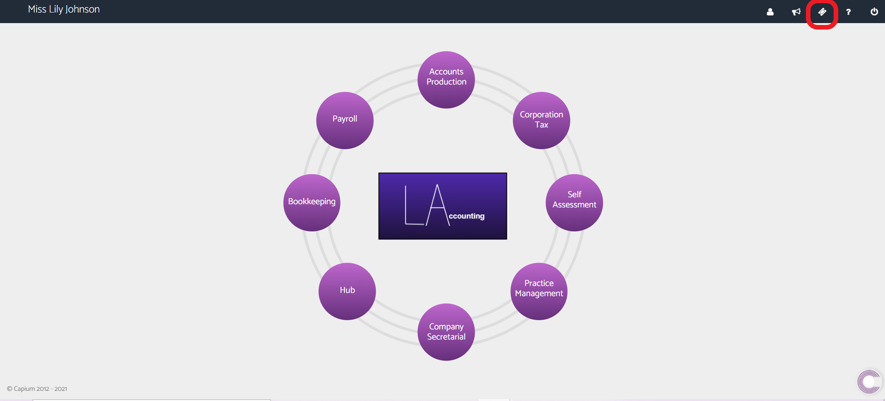
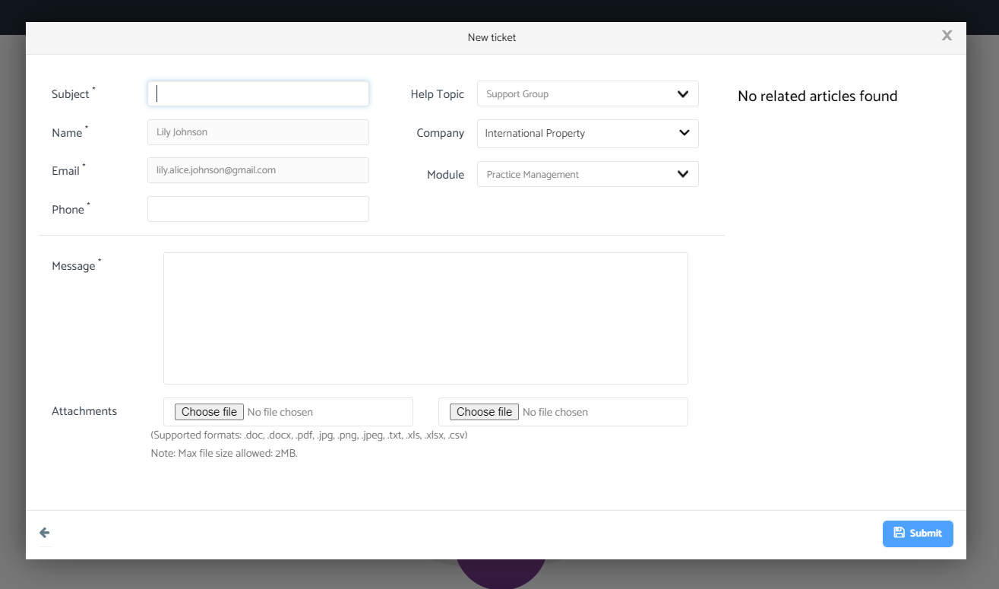
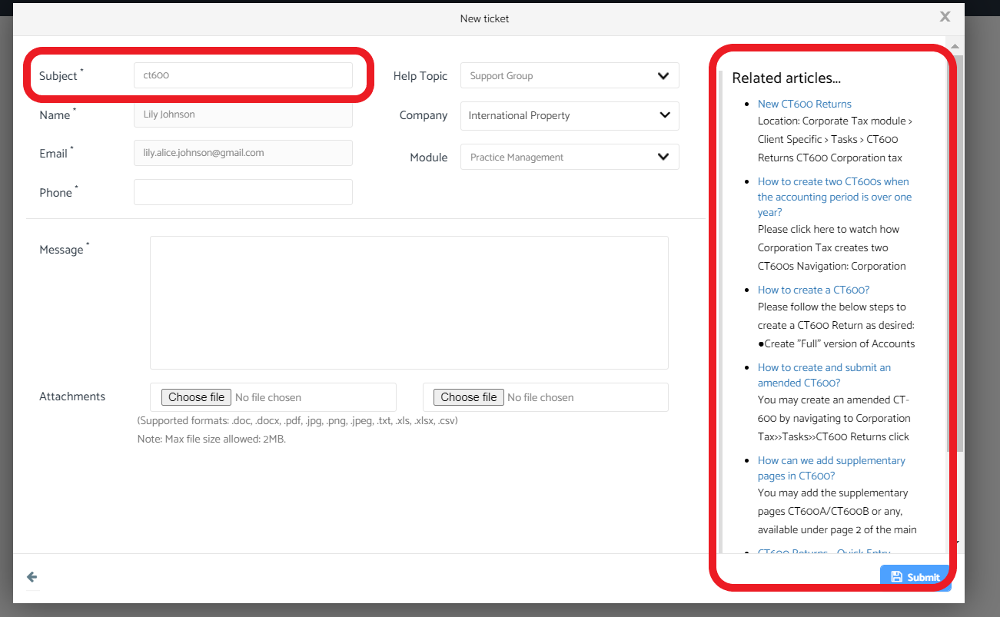

# How to create a support ticket and get in contact with the support team
	 	
			
			Print

- **Category:** General
- **Folder:** General
- **Source URL:** [https://capium.freshdesk.com/support/solutions/articles/9000204002-how-to-create-a-support-ticket-and-get-in-contact-with-the-support-team](https://capium.freshdesk.com/support/solutions/articles/9000204002-how-to-create-a-support-ticket-and-get-in-contact-with-the-support-team)
- **Article ID:** 9000204002

## Content

Solution home 
		General
		General

### How to create a support ticket and get in contact with the support team

			Print

	Modified on: Thu, 1 Jul, 2021 at  4:52 PM

Please click here to watch how to create a support ticket

Help/Guide 

You can get in touch directly with the support team by clicking on the support ticket button in the top right hand banner

Please select either New Ticket or View Tickets

A pop up will appear to enter in support information

From here you enter in the information,

There a various drop down boxes for you to fill out

Furthermore, you can add attachments to support your query.

If the subject matter has a related support article, these will appear in the related articles section on the right hand side

Please click the blue submit button to submit to the support team

										Did you find it helpful?
								Yes
								No

Send feedback	Sorry we couldn't be helpful. Help us improve this article with your feedback.

## Screenshots & Diagrams (4)

