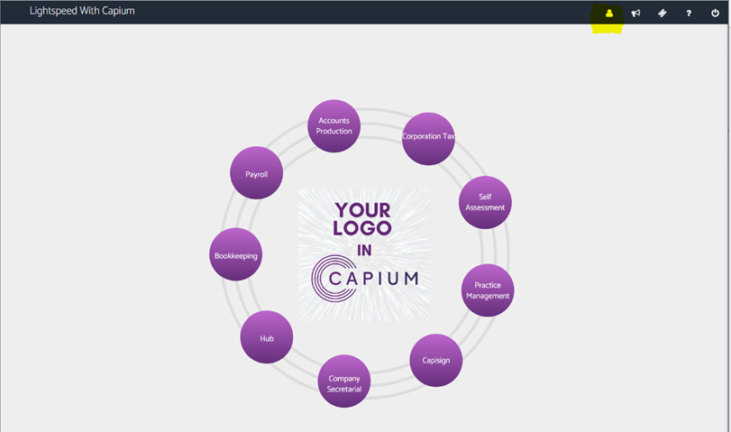
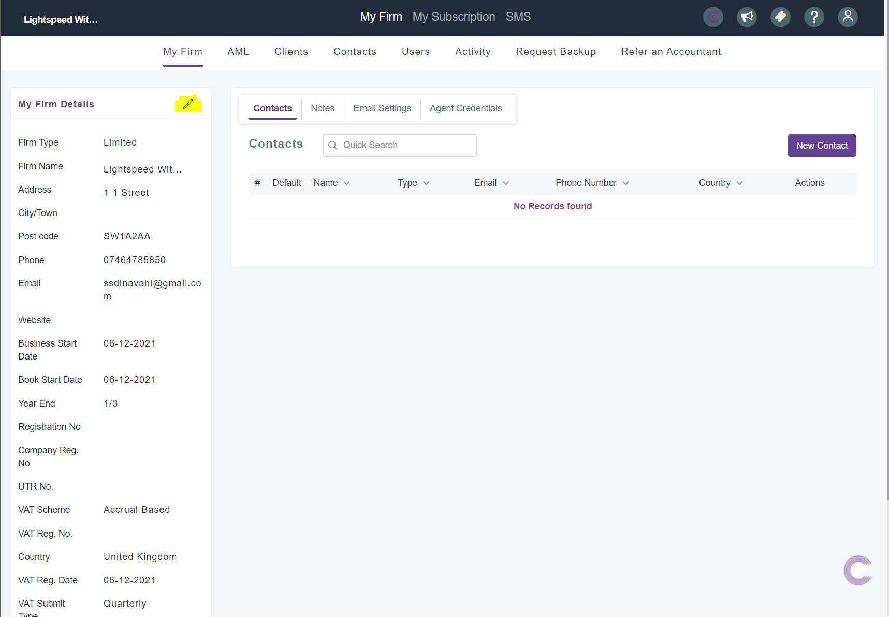
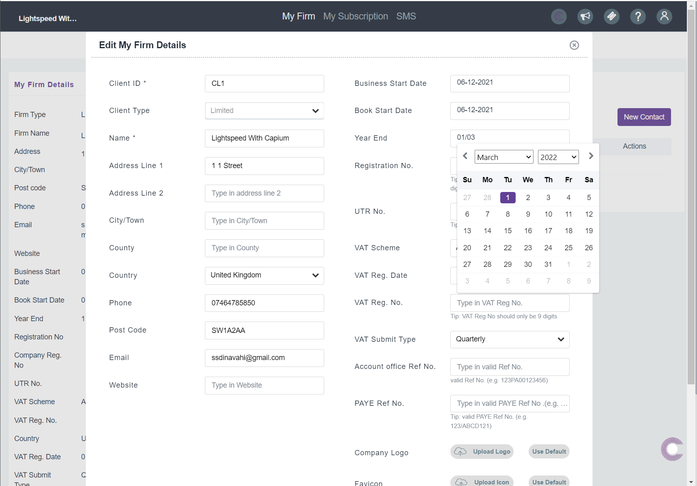

# How to change the Accounting Peroid on Capium
	 	
			
			Print

- **Category:** General
- **Folder:** General
- **Source URL:** [https://capium.freshdesk.com/support/solutions/articles/9000221450-how-to-change-the-accounting-peroid-on-capium](https://capium.freshdesk.com/support/solutions/articles/9000221450-how-to-change-the-accounting-peroid-on-capium)
- **Article ID:** 9000221450

## Content

Solution home 
		General
		General

### How to change the Accounting Peroid on Capium

			Print

	Modified on: Tue, 18 Jul, 2023 at  4:01 PM

		Help Guide:

My Admin>>> Edit firm details>>> Select correct Year end data according to your business

Step 1: Click on the My Admin icon in the top right, highlighted in yellow.

Step 2:  Click on the pencil in ‘My Firm details’ to edit information regarding your practise.

Step 3:  Finally, you can now choose the appropriate year end date by using the calendar to select the year end for your practise.

										Did you find it helpful?
								Yes
								No

Send feedback	Sorry we couldn't be helpful. Help us improve this article with your feedback.

## Screenshots & Diagrams (3)

