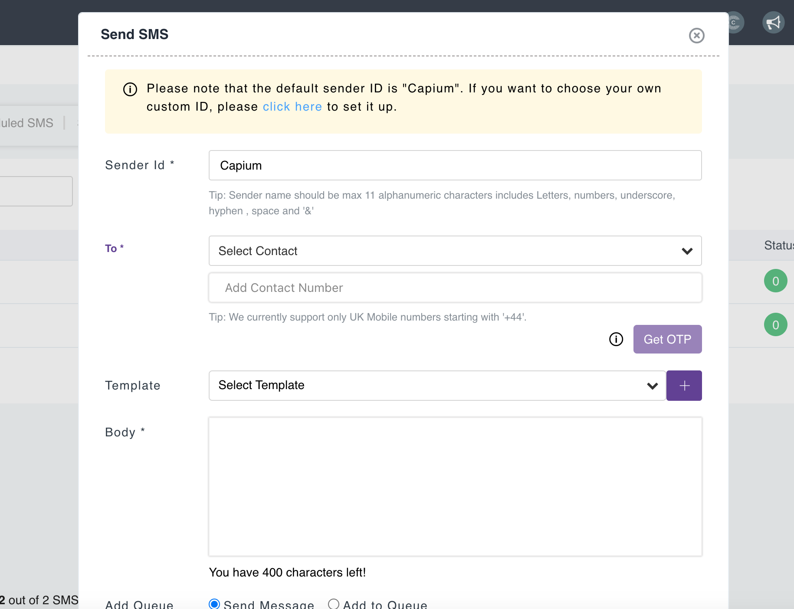
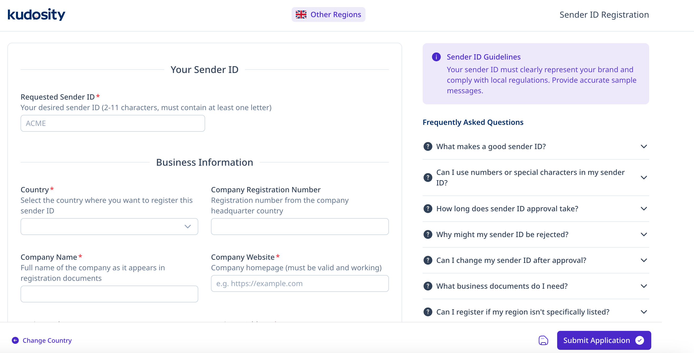

# PM: Setting up SMS
	 	
			
			Print

- **Category:** General
- **Folder:** General
- **Source URL:** [https://capium.freshdesk.com/support/solutions/articles/9000226438-pm-setting-up-sms](https://capium.freshdesk.com/support/solutions/articles/9000226438-pm-setting-up-sms)
- **Article ID:** 9000226438

## Content

Solution home 
		General
		General

### PM: Setting up SMS

			Print

	Modified on: Tue, 16 Jun, 2026 at  1:24 PM

		This article covers how to set-up SMS in the Practice Management Module. 

To send an SMS

Step 1: Navigate to the SMS Section

Navigation: Practice Management > Communication > SMS > Select 'Send SMS'

### Step 2: Compose and Send Your Message

Select the client from the dropdown list or add contact number manually. 

Note:

By this point you would have set up your services and assigned them to your clients, if not please use this article to guide you: 

Quick Guide: Getting Started with Practice Management

Then, add the message in the 'Body' or you have the option to create your own template by clicking the 'Plus' button as shown on the screenshot above. Then click Send.

By default, SMS messages will be sent using the sender ID: Capium -  If you would like to have your own custom ID please use the steps below:

Using Your Own Sender ID

Step 1: Register on Kudosity

Please register your Sender ID using the following link:

https://senderid.burstsms.com/?country=United+Kingdom&account=78981

Step 2: Complete the Registration Process

Follow the instructions provided by Burst SMS to submit and verify your Sender ID. See screenshot below: 

Important

- Custom Sender IDs must be registered directly with Burst SMS before they can be used.

- Typical processing time is 5-10 business days after submission.

Need Help?

If you experience any issues registering your Sender ID or sending SMS messages, please contact your onboarding manager or Support@capium.com.

You can also contact Kudosity directly (24hr Support):

AU: +61 1300 012 014

CA: +1 888 266 9330

NZ: +64 9 909 1938

PH: +63 2 8231 3564

SG: +65 6978 6301

UK: +44 20 4525 8940

US: +1 888 426 0999

Email: helpdesk@kudosity.com

Related Guides:

Communication-How to send and schedule emails and SMS

Onboarding Guide: Getting Started with Practice Management

										Did you find it helpful?
								Yes
								No

Send feedback	Sorry we couldn't be helpful. Help us improve this article with your feedback.

## Screenshots & Diagrams (2)

