# Quick Guide: Getting Started with My Admin
	 	
			
			Print

- **Category:** General
- **Folder:** Quick Guides: Getting Started with Capium
- **Source URL:** [https://capium.freshdesk.com/support/solutions/articles/9000231133-quick-guide-getting-started-with-my-admin](https://capium.freshdesk.com/support/solutions/articles/9000231133-quick-guide-getting-started-with-my-admin)
- **Article ID:** 9000231133

## Content

Solution home 
		General
		Quick Guides: Getting Started with Capium

### Quick Guide: Getting Started with My Admin

			Print

	Modified on: Wed, 1 Oct, 2025 at  9:54 AM

		Welcome to our Quick Guide for My Admin! This guide will walk you through essential initial steps and best practices to ensure a smooth setup and successful deployment.

### Please see below a contents for this page: 

 - Please see below a contents for this page: 
Mandatory Sections in your Firm
Adding Agent Credentials
Adding Clients
Adding Contacts
Linking Clients and ContactsInside client and contact linking
Outside client and contact linking
Shareholder Linking

How to Search Companies House for your Client
Adding Users
 - Requesting Backup
 - AML Option

### Mandatory Sections in your Firm

Navigation: My Admin > Firm Details

When you start working on Capium for the first time, it's important to complete the mandatory information within the Firm Details section. This includes:

Client ID

Practice name

Email address

Phone number

Address

Business start date

Book start date

Registration number

UTR number

VAT scheme details

Account Office Reference Number

PAYE Reference Number

### Adding Agent Credentials

Navigation: My Admin > My Firm > Agent Credentials

To add Agent Credentials, follow these steps:

Select 'Action’.

Select 'Edit'.

Populate the agent credentials.

Select ‘Save’.

For each section, ensure you provide the following details:

Agent ID

User ID

Password

Contact Name

Company Name

Address

Adding Clients

### Adding Clients

Navigation: My Admin > Clients

To add clients, you have two options:

Select 'New Client' to create clients individually.

Select 'Import Clients' to create clients in bulk using the provided CSV template.

For each client, ensure you provide the following details:

Client ID

Client Type

Name

Email

Phone

Address

Business Start Date

Book Start Date

Registration Number

UTR Number

VAT scheme details

Account Office Reference Number

PAYE Reference Number

### Adding Contacts

Navigation: My Admin > Contacts

To add contacts, you have two options:

Click on 'New Contact' to create contacts individually.

Use 'Import Contacts' to create contacts in bulk using the provided CSV template.

For each contact, ensure you provide the following details:

Type

Name

Email

Phone

Address

### Linking Clients and Contacts

Navigation: My Admin > Clients > Client Specific > Contact Links

To link clients and contacts, you have two options:

Going into the client and linking through the 'Add Contact Link' button; or

Adding contacts from the client screen.

### Inside client and contact linking

To add a client manually through the 'Add Contact Link' button, you first have to go into the client by selecting their client ID, you can then follow the steps below:

Select ‘Add Contact Link’ option. 

Select Contact Type.

Choose the relevant contact from the drop-down menu ‘Select Contact.’

Select ‘Save’.

You can also add a client in bulk by navigating to the tab next to the one you would be on:

From this page you can bulk assign many contacts to this client.

### Outside client and contact linking

To add a contact through the client screen, you'll be able to see an 'Add Contact' hyperlink for clients with no contacts. When you click on this you will be presented with the same pop-up as above:

You will also be able to see the client ID and client name at the top.

### Shareholder Linking

Navigation: My Admin > Clients > Client Specific > Contact Links

To link clients (Ltds, LLPs, and Partnerships) and directors/shareholders, you have three options:

Click on ‘Add Contact Link’ to link contacts individually.

Use the ‘Bulk Contacts’ option to assign contacts in bulk.

Companies House synchronisation.

For each manual contact link, follow these steps:

Select ‘Add Contact Link’ option.

Select Contact Type.

Choose the relevant contact from the drop-down menu ‘Select Contact.’

Select ‘Save’.

### How to Search Companies House for your Client

Navigation: My Admin > Clients > New Client > Client Name

For Companies House synchronisation:

Select the magnifying glass by the ‘Name’ field.

Use the search bar to search for a client name or Companies House registration number.

Select the appropriate client from the populated list.

### Adding Users

Navigation: My Admin > Users

User types: ‘Super Accountant’, ‘Accountant’, ‘Staff’, and ‘Client’

Super Accountant: Access to all data and permission control.

Accountant: Access to all modules, with Super Accountant's client access restrictions.

Staff: Limited module and client access, controlled by Super Accountant.

Client: Access to the Payroll and Bookkeeping modules for their company.

To add users, you have two options:

Click on ‘New User’ to create users individually.

Use 'Import Users' to create users in bulk using the provided CSV template.

For each user, ensure you provide the following details:

User Type

Contact

Name

Email

Password

Phone

Address

Once the information is populated, you can assign company/companies and module permissions.

### Requesting Backup

Navigation: My Admin > Request Backup

To request a backup:

Select ‘Request’ option.

Provide a description.

Select the relevant request option: ‘Selected Clients’ or ‘All Clients.’

Select ‘Save’.

### AML Option

To add AML option to your account:

Sign up with ‘Veriphy’ and populate the relevant information.

Once confirmed by the Veriphy Team, you will be able to do AML checks.

Congratulations! You've completed the essential steps to set up My Admin. If you encounter any issues or require further assistance, don't hesitate to reach out to our support team.

										Did you find it helpful?
								Yes
								No

Send feedback	Sorry we couldn't be helpful. Help us improve this article with your feedback.

## Screenshots & Diagrams (20)

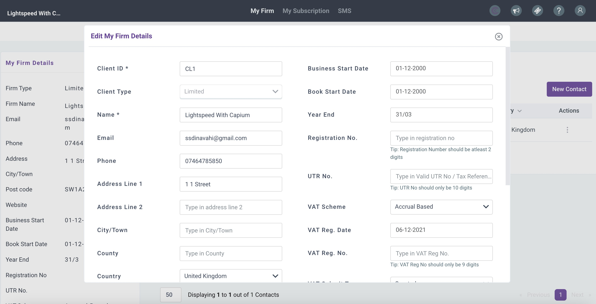

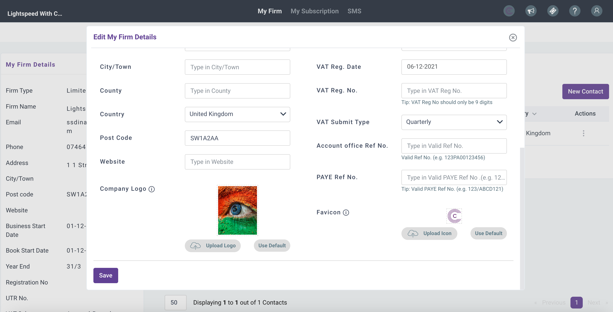

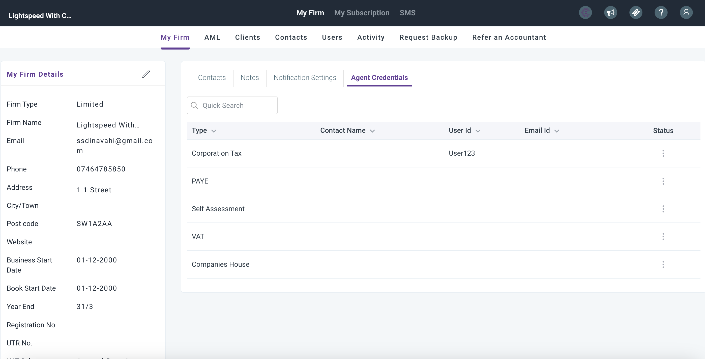

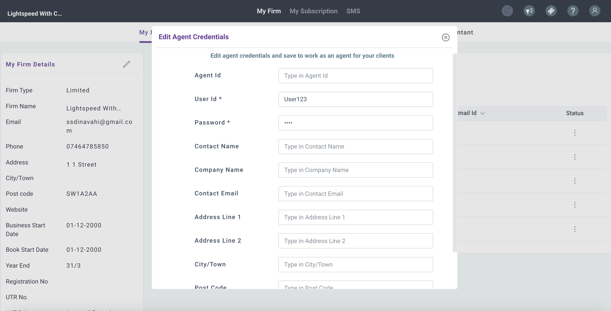

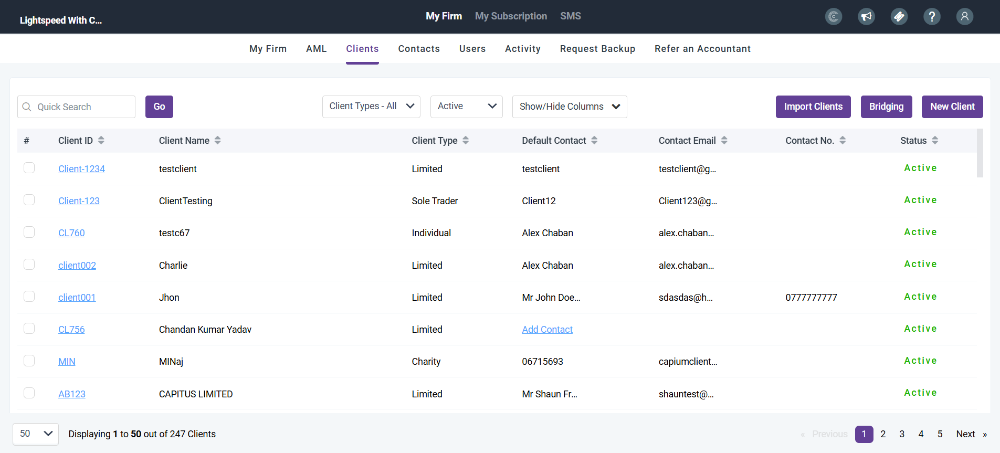

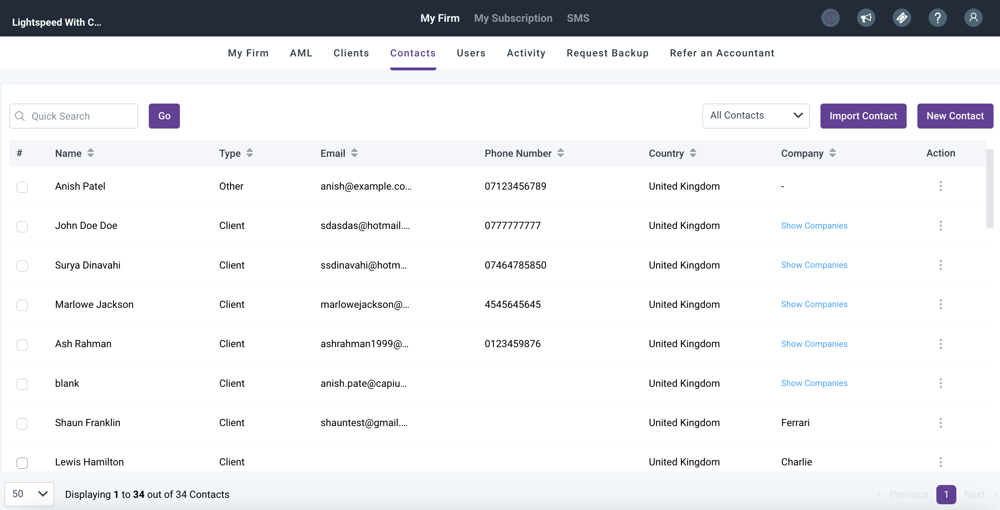

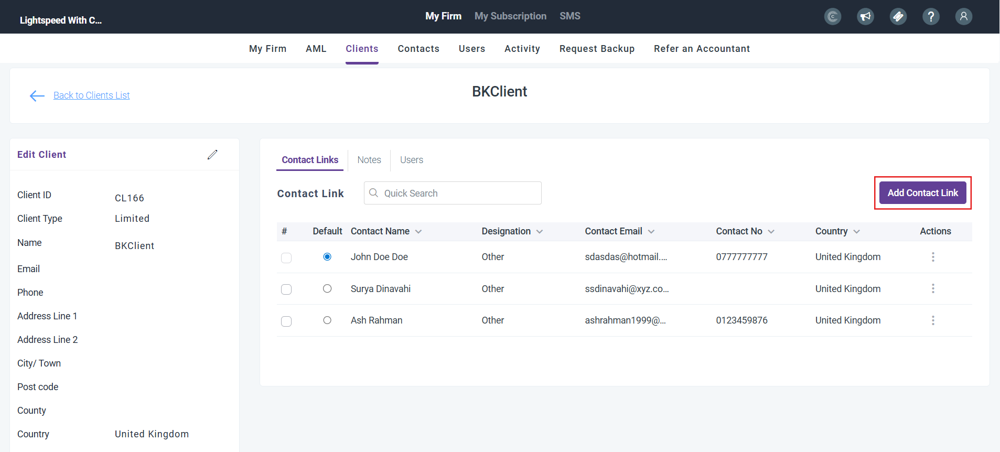

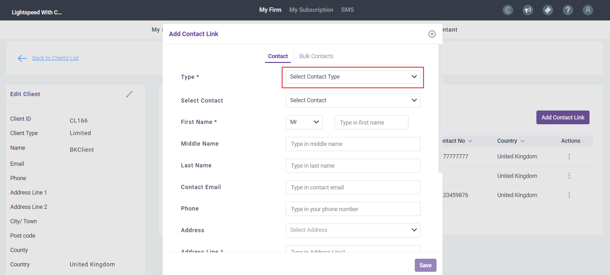

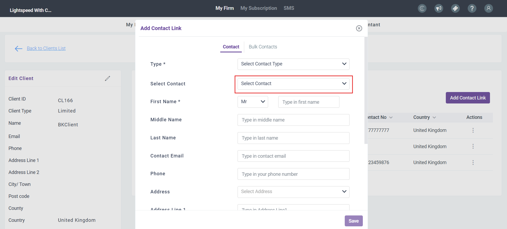

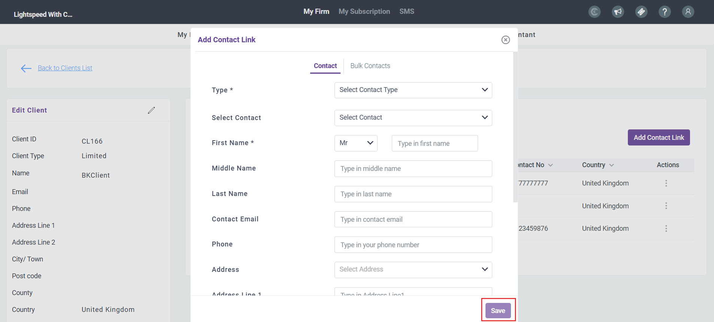

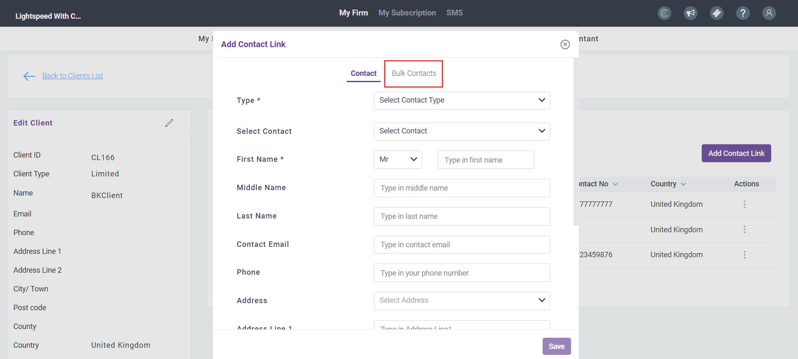

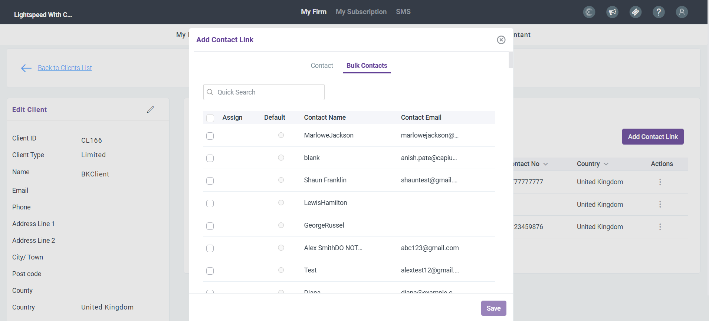

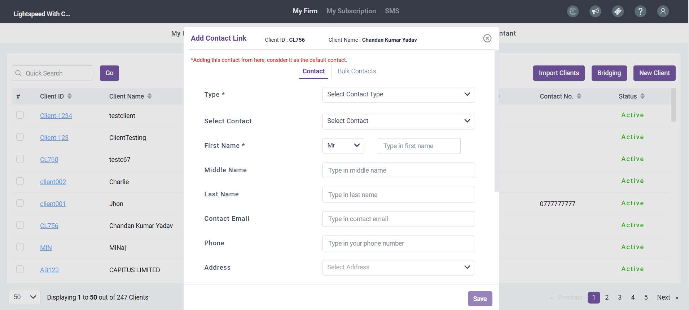

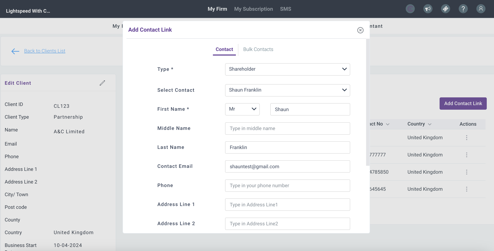

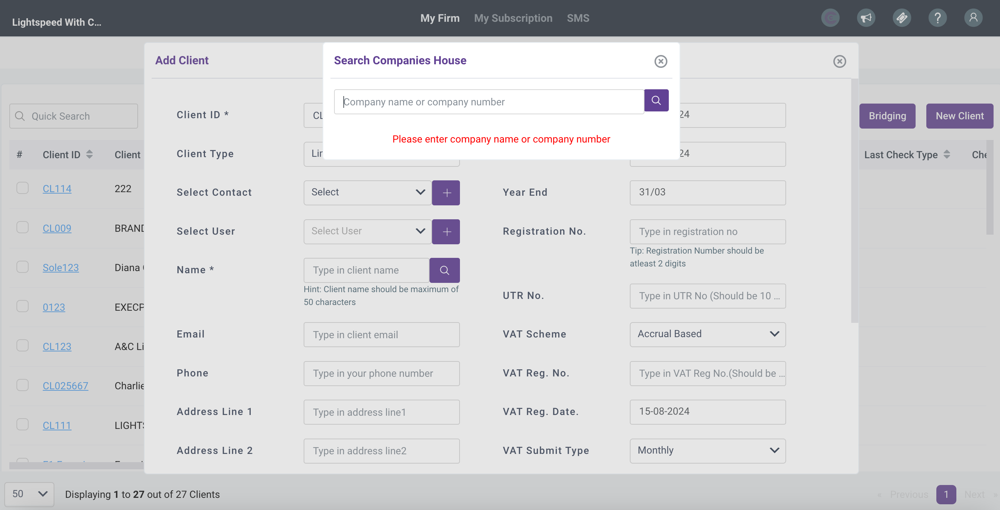

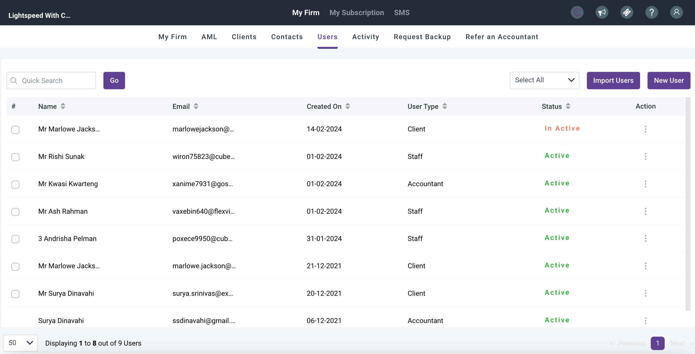

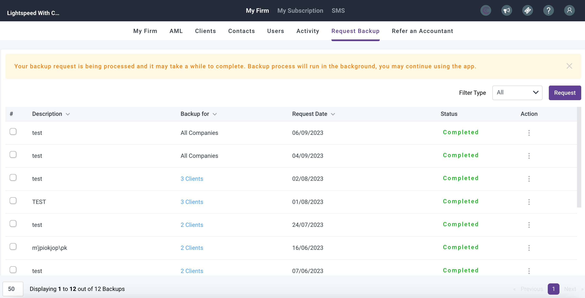

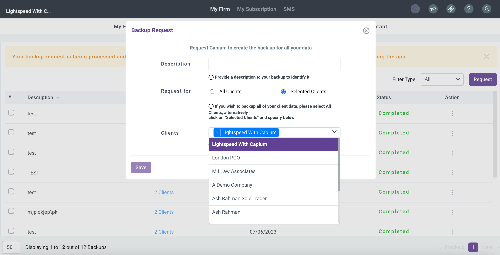

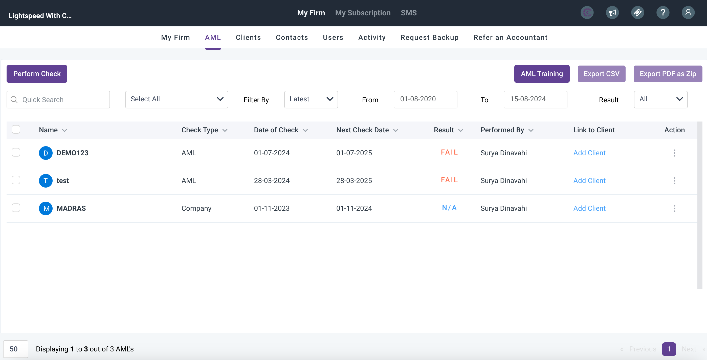

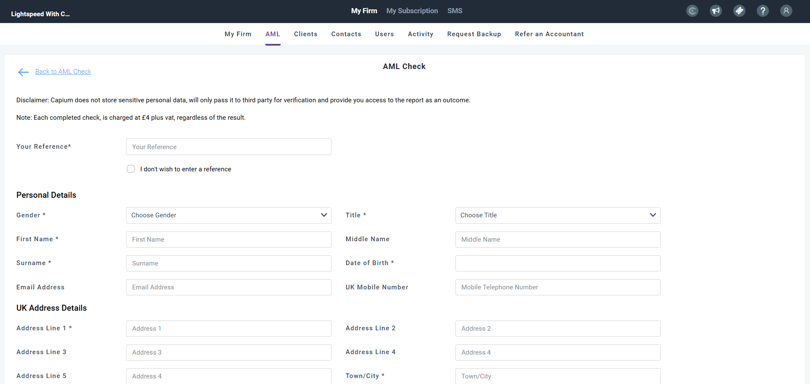

