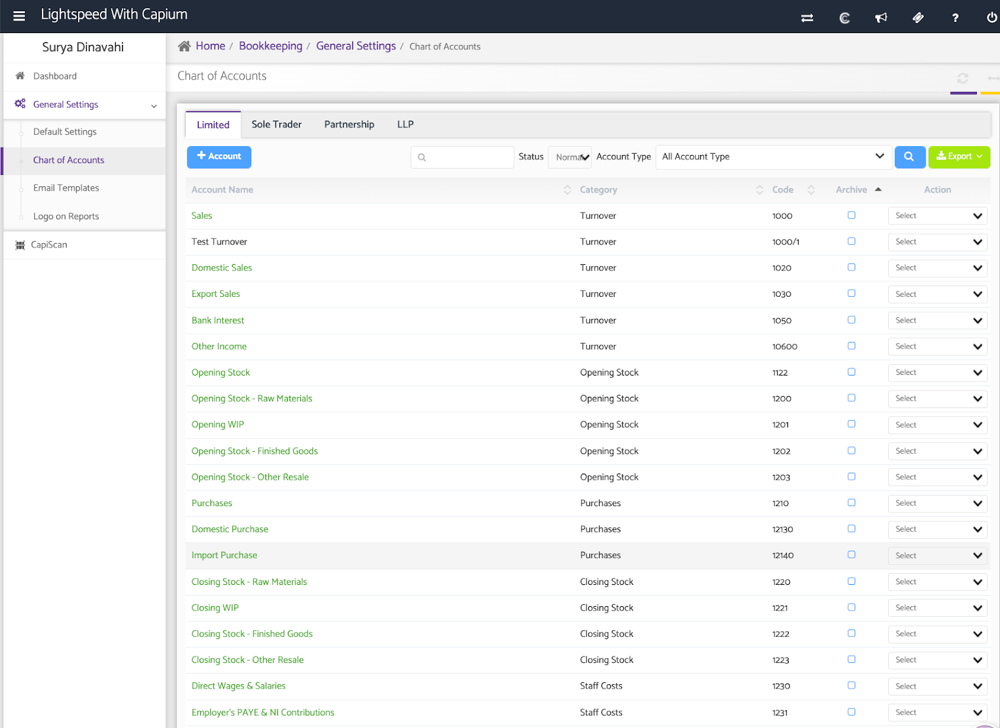
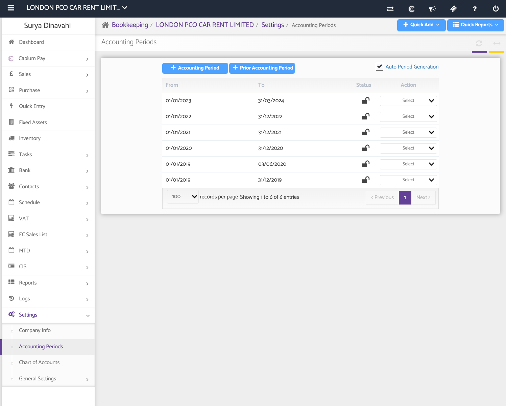
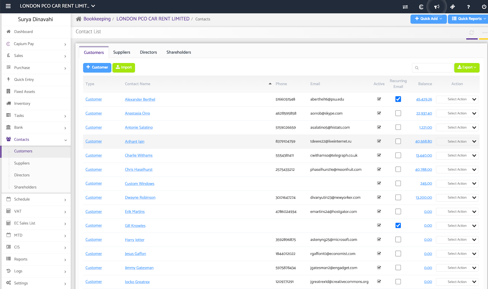
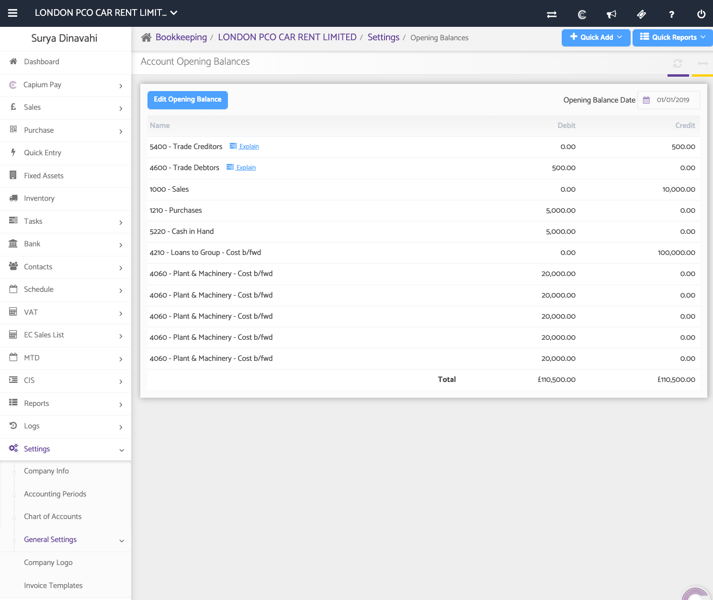
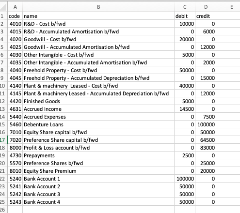
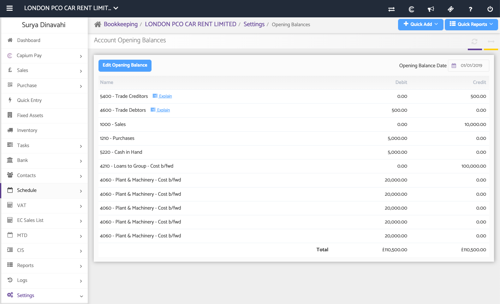
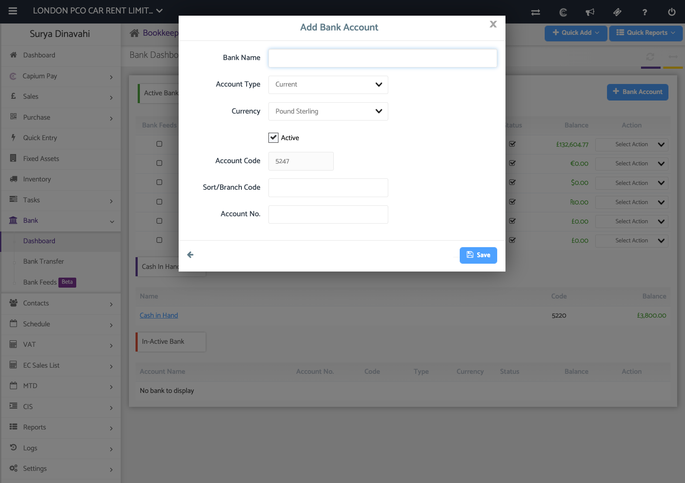

# Quick Guide: Getting Started with Bookkeeping
	 	
			
			Print

- **Category:** General
- **Folder:** Quick Guides: Getting Started with Capium
- **Source URL:** [https://capium.freshdesk.com/support/solutions/articles/9000231141-quick-guide-getting-started-with-bookkeeping](https://capium.freshdesk.com/support/solutions/articles/9000231141-quick-guide-getting-started-with-bookkeeping)
- **Article ID:** 9000231141

## Content

Solution home 
		General
		Quick Guides: Getting Started with Capium

### Quick Guide: Getting Started with Bookkeeping

			Print

	Modified on: Wed, 13 Sep, 2023 at 10:35 AM

		Welcome to our Quick Guide for Bookkeeping! This guide will walk you through essential initial steps and best practices to ensure a smooth setup and successful deployment.

Chart of Accounts

Here, you can find the universal Chart of Accounts as seen below. You can create additional codes here and then apply them universally for all company types. 

Navigation: Bookkeeping  > General Settings > Chart of Accounts

Note: You also have the option to amend the Chart of Accounts on a client specific level too. You can do this by clicking on a client and navigating to the general settings there where you see the Chart of Accounts specific to the client in question.

Add Accounting Period

Navigation: Bookkeeping  > Settings > Accounting Periods

You can add an current accounting period here by clicking on the ‘+ accounting period’ and the same process for adding a prior accounting period.

If you click on ‘Auto Period Generation’, then the system will automatically create the next accounting period for you once the current period is closed.

Importing Customers & Suppliers

Navigation: Bookkeeping  > Contacts > Customers/Suppliers

There are 2 options to import the customers and suppliers onto the system. Use the ‘Add Supplier/Customer’ for the manual addition of a customer/supplier or click on ‘Import’ to download our import CSV file. You can then populate the data on the file and upload.

Configuring Opening balances

Navigation: Bookkeeping > Settings > General Settings > Opening Balances

To input your opening balances, navigate to Settings>General Settings> Opening balance. 

Here, you can now manually enter your opening balances on the system or click on the ‘import’ green button. This will allow you to download the opening balance import CSV file (Image below) and upload once finalised.

Once the opening balances are imported, the final step is now to explain the Trade creditors & debtors. By this, it means allocating the different opening balances against the customers/suppliers. Just click ‘Explain’ and then you have the option to allocate these balances.

Adding Bank accounts & Importing bank transactions

Navigation: Bookkeeping > Bank > Dashboard

To add a bank account, navigate to the Bank>Dashboard and select ‘+ Bank Account’.

You can populate the bank details here, and a unique nominal code will be given for the created bank account. Once created, the bank will automatically appear on the bank dashboard.

To get bank transactions on the system, there are 3 methods to select between:

Bank feeds: We have an API with a true layer to connect your clients account onto Capium so the bank transactions automatically refresh daily. These cost £1.50 per account plus VAT.

Manual Import: Once inside the bank account, you can click ‘manual import’ at the top which will allow you to directly input the bank transactions onto the system.

Bank Import: Once inside the bank account, you can download our csv bank import file (which is a simple file which will enable you to populate the bank transactions onto the sheet and then upload them in bulk on the system.)

Congratulations! You've completed the essential steps to set up your Bookkeeping module. If you encounter any issues or require further assistance, don't hesitate to reach out to our support team.

										Did you find it helpful?
								Yes
								No

Send feedback	Sorry we couldn't be helpful. Help us improve this article with your feedback.

## Screenshots & Diagrams (7)

