# Quick Guide: Getting Started with Payroll
	 	
			
			Print

- **Category:** General
- **Folder:** Quick Guides: Getting Started with Capium
- **Source URL:** [https://capium.freshdesk.com/support/solutions/articles/9000231143-quick-guide-getting-started-with-payroll](https://capium.freshdesk.com/support/solutions/articles/9000231143-quick-guide-getting-started-with-payroll)
- **Article ID:** 9000231143

## Content

Solution home 
		General
		Quick Guides: Getting Started with Capium

### Quick Guide: Getting Started with Payroll

			Print

	Modified on: Thu, 24 Aug, 2023 at  8:16 PM

		Welcome to our Quick Guide for Payroll! This guide will walk you through the essential initial steps and best practices to ensure a smooth setup and successful deployment.

Client-Specific General Settings

Navigation: Payroll > Client Specific > General Settings

When you start working with a client for the first time in the Payroll module, it's important to complete the mandatory information within the General Settings section. This includes:

PAYE Details

Contact Details

HMRC Credentials

Payslip Template

Pay Rate

Data Security

Adding Employees

Navigation: Payroll > Client Specific > Manage Payroll > Employees

To add employees, you have two options:

Click on '+Add Employee' to create employees individually.

Use 'Import Employees' to create employees in bulk by utilising the provided template CSV file.

For each employee, ensure you provide the following details:

Personal Details

Starter Details

Payroll Details

NI & Tax

Payment Details

Pension Details

Uploading Employee YTD

Navigation: Payroll > Client Specific > Manage Payroll > Employees

To upload Year-to-Date (YTD) information for employees, follow these steps:

Go to 'Employee YTD' within the Manage Payroll section.

Choose an employee from the dropdown list.

Click '+Import YTD' to upload YTD data in bulk via the provided CSV template.

Setting Up Pensions

Navigation: Payroll > Client Specific > Auto Enrolment

For pension setup:

In the Pension Details section, input the 'Staging Date' or 'Re-enrolment Date.'

In the Pension Schemes section, add a scheme by selecting 'Add Scheme.' Enter scheme and pension information.

Additional Information, Leaves & Holidays, and Timekeeping

Navigation: Payroll > Client Specific > Manage Payroll > Additional

In the Additional section, you can fine-tune payroll details, including:

Employee Leave

Additions and Deductions

Attachment of Earnings

Mileage Claims

Expense Claims

Use the dropdown menu (where applicable) and select '+Add …' to input relevant data.

Navigation: Payroll > Client Specific > Manage Payroll > Leaves & Holidays

For Leaves & Holidays:

Navigate to the section.

Select 'Add Leave' to input Annual Leave, Statutory Leave, and Bank Holidays.

Navigation: Payroll > Client Specific > Manage Payroll > Timekeeping

In the Timekeeping section:

Input time records for hourly-paid employees.

Ensure filters correctly identify the employee before adding time records.

To add records:

Click '+Add Time Record' for individual entries.

Use 'Import Time Record' for bulk entries via the provided CSV template.

Note: 0.30 hours equals 0.50 hours.

Running Payroll

Navigation: Payroll > Client Specific > Process Payroll

When all payroll information is updated:

Approve payroll by selecting employees and clicking 'Approve.'

Use the calculator for final adjustments to Gross Pay.

To run payroll, click 'Run Payroll' in the Payroll section.

RTI Submission

Navigation: Payroll > Client Specific > Submission

After processing and running payroll:

For Full Payment Submission (FPS):

Click '+Add Submission' in the FPS section.

Select employees for the submission.

Validate data for potential errors.

Validate HMRC Credentials.

For Employer Payment Submission (EPS):

Click '+Add Submission' in the EPS section.

Fill in required information.

Select 'HMRC Submit' upon completion.

P11D

Navigation: Payroll > Client Specific > P11D > P11D Form

To create a P11D:

Select '+Create New Return.'

Set up return details.

Enter P11D information in the Quick Entry Data menu.

Navigation: Payroll > Client Specific > P11D > Submit > P11D

To submit P11D:

Click 'Submit P11D' to generate the form.

Complete submission to HMRC.

Bulk Payroll

Navigation: Payroll > Bulk Payroll > Automation Settings

For automated Payroll and FPS submission:

Click '+Client' and assign a client.

Manage Schedule:

Set Payroll Run Date.

Set Submission Date.

Set Pay Date.

Notify to (All Processes). 

Notify to (After Submission).

Congratulations! You've completed the essential steps to set up your Payroll module. If you encounter any issues or require further assistance, don't hesitate to reach out to our support team.

										Did you find it helpful?
								Yes
								No

Send feedback	Sorry we couldn't be helpful. Help us improve this article with your feedback.

## Screenshots & Diagrams (13)

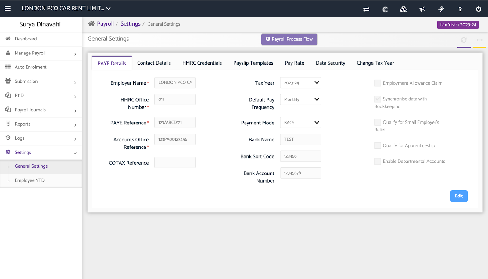

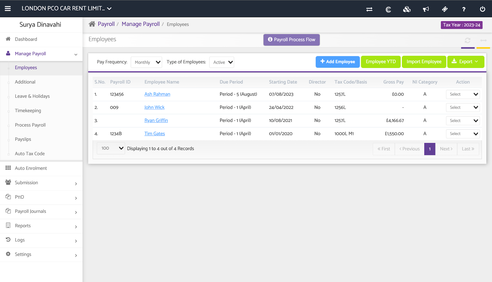

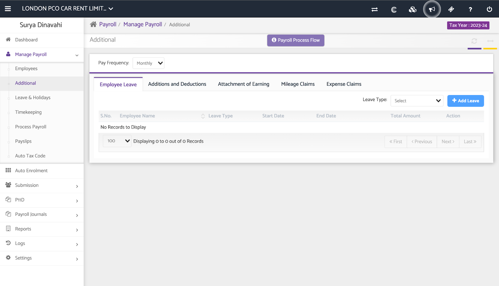

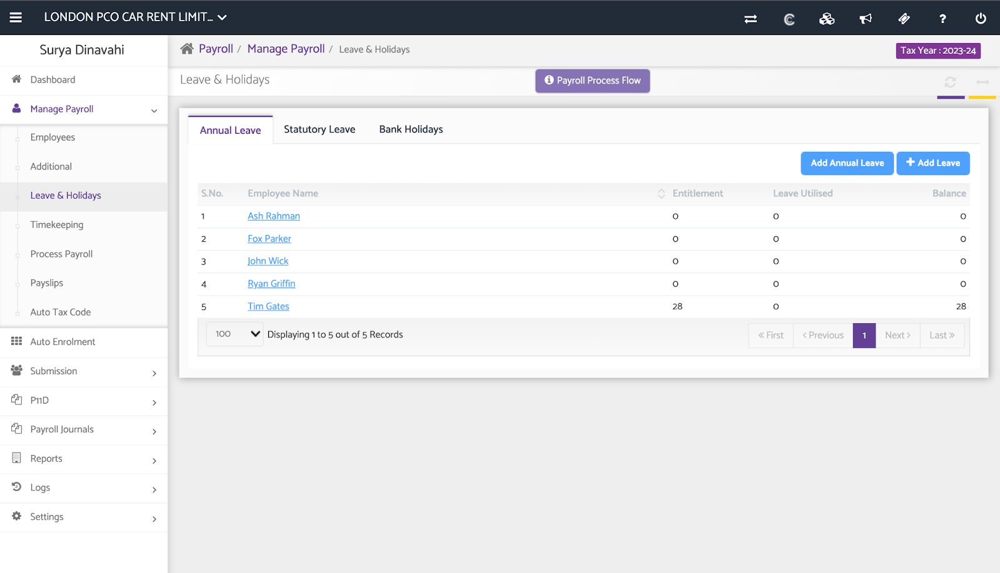

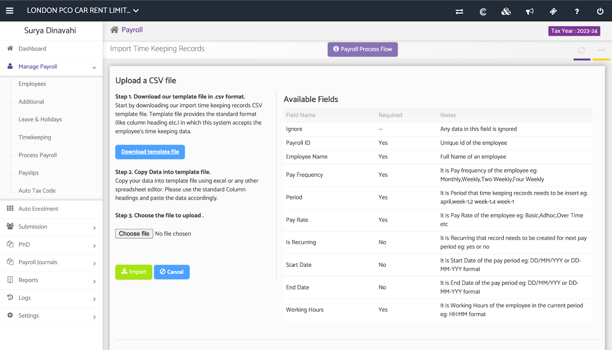

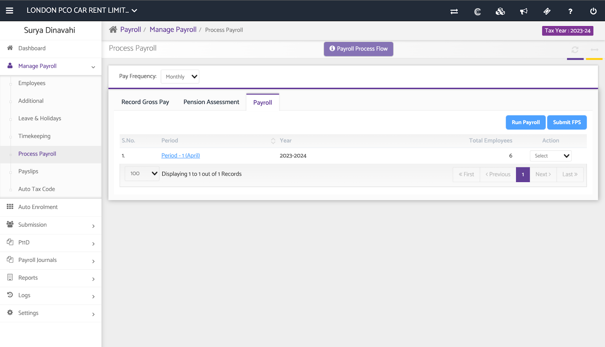

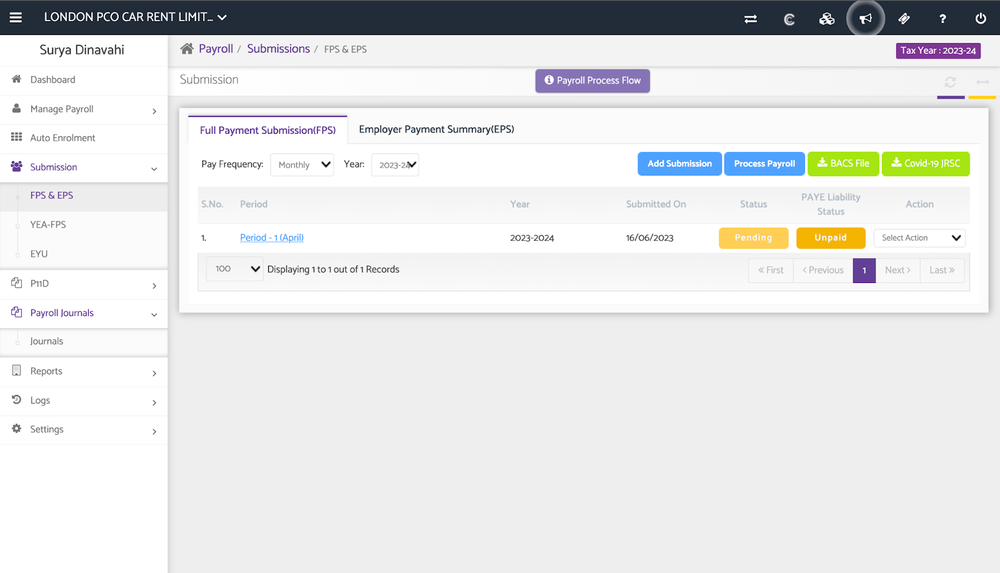

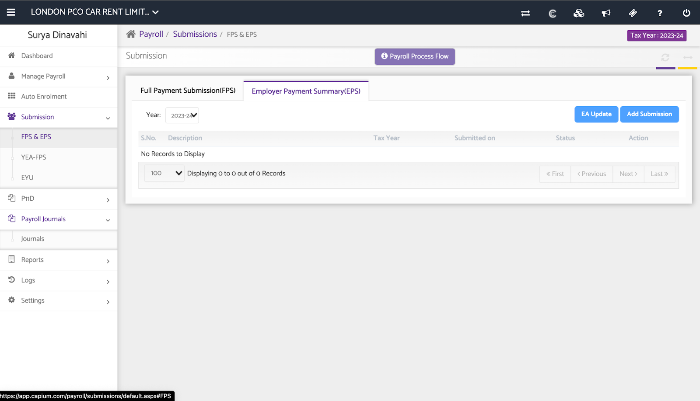

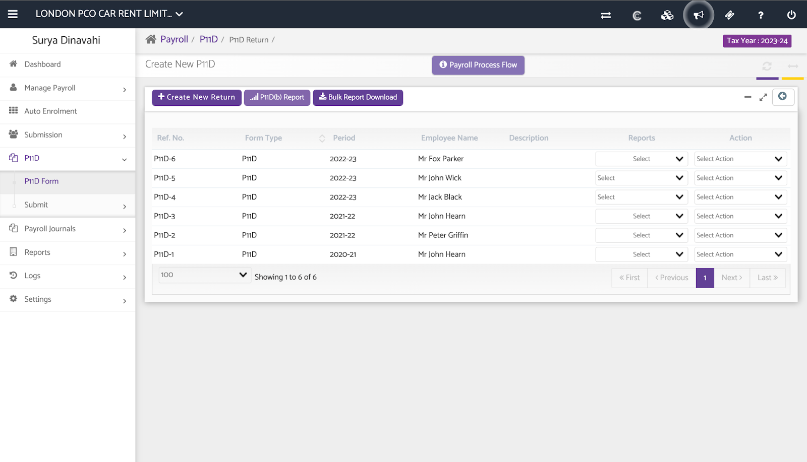

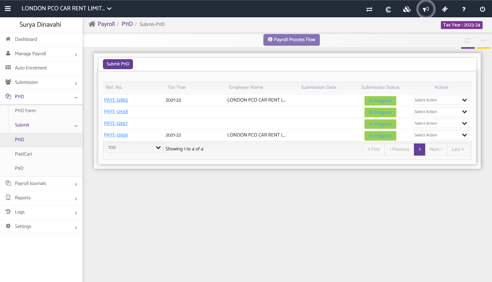

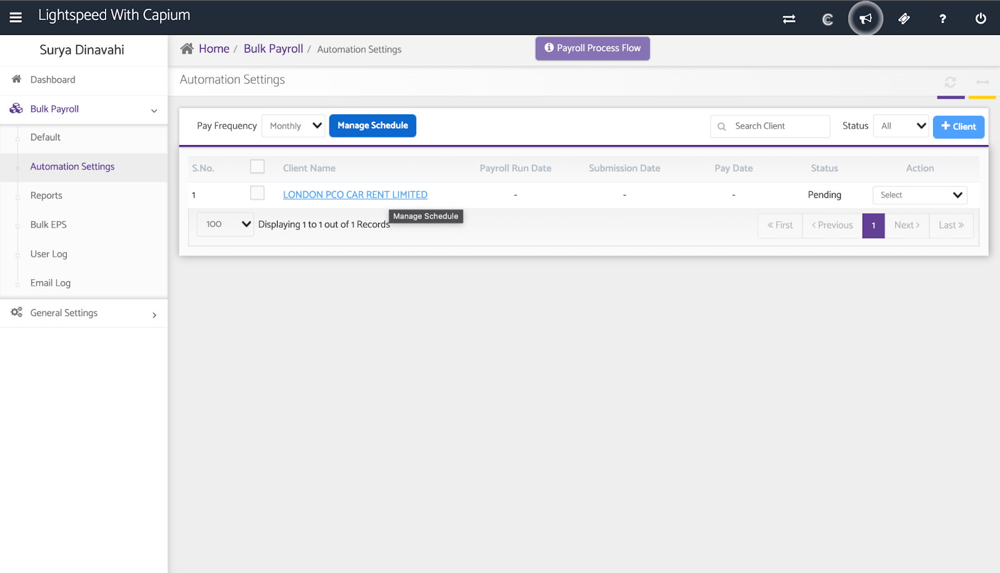

