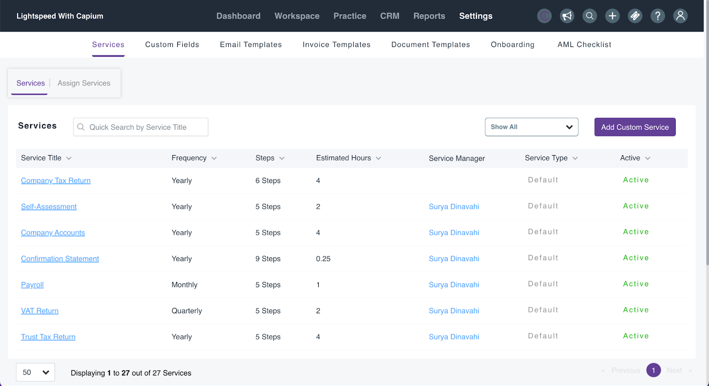
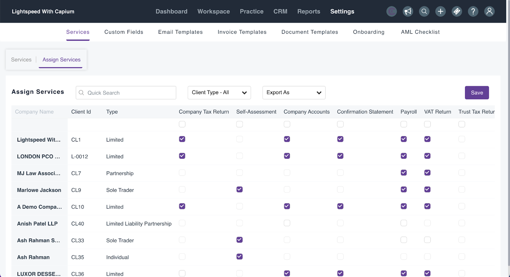
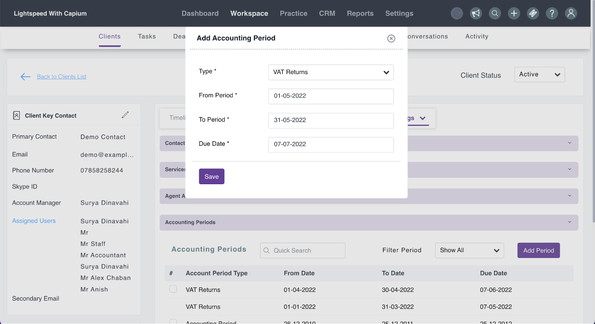
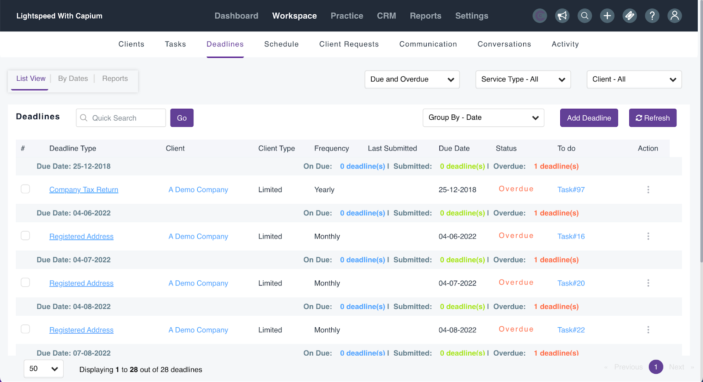
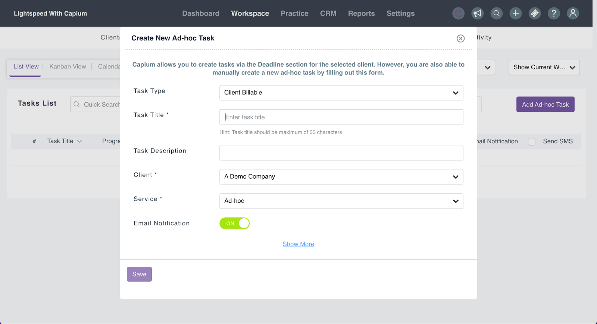

# Quick Guide: Getting Started with Practice Management
	 	
			
			Print

- **Category:** General
- **Folder:** Quick Guides: Getting Started with Capium
- **Source URL:** [https://capium.freshdesk.com/support/solutions/articles/9000231144-quick-guide-getting-started-with-practice-management](https://capium.freshdesk.com/support/solutions/articles/9000231144-quick-guide-getting-started-with-practice-management)
- **Article ID:** 9000231144

## Content

Solution home 
		General
		Quick Guides: Getting Started with Capium

### Quick Guide: Getting Started with Practice Management

			Print

	Modified on: Thu, 21 Dec, 2023 at  4:01 PM

		Welcome to our Quick Guide for Practice Management! This guide will walk you through the essential initial steps and best practices to ensure a smooth setup and successful deployment.

Customising and Creating Services

Navigation: Practice Management > Settings > Services

When you start working with a client for the first time in the Practice Management module, it's important to complete the mandatory information within the Settings section. This includes:

Updating Default Services

Updating Steps/tasks to fulfil services.

Updating reminders for the services (both internal and external)

Creating Additional Services (If required)

Assigning Services

Navigation: Practice Management > Settings > Services > Assign Services

It is important to assign custom/created services to your clients. You can do it on a client specific basis as well as in bulk. To complete this task, you are required to:

Check the box with the relevant service next to your client

Check the box with the relevant service just below the relevant service (for bulk assigning)

Click Save to assign these services

Setting up Accounting Periods

Navigation: Practice Management > Workspace > Clients > Specific Client > Settings > Accounting Periods

To add accounting periods, you are required to follow the navigation process and select ‘Add period’, the pop up window will include a few fields to populate:

Type information (Accounting Period)

From Period

To Period

Due Date

Deadline Creation

Navigation: Practice Management > Workspace > Deadlines

To create a deadline, you must select ‘Add Deadline’ and populate relevant fields:

Select Clients

Select Service

You can make it a Recurring Deadline

You can Add a deadline to Tasks

Save

You can also navigate into a specific client under workspace and populate the deadline too. Workspace > Client > Add deadline.

Please note: Confirmation statements and annual accounts deadlines are available after you assign a client for these services via the Companies House synchronisation. In order to add a deadline you are required to:

Assign a client 

Select ‘Refresh’ under Workspace (Deadlines)

 How to Create/Edit Tasks

 Navigation: Practice Management > Workspace > Tasks

To create a task, you must select ‘Add Ad-hoc Task’ and populate relevant fields:

Task Type     

Task Title

Task Description

Select a Client

Select a Service

Start Date

Due Date

Visibility

Priority

Assign to

Save

Please note: You can also create a task in a client specific level by navigating to clients > Workspace > Add Ad hoc task.

SMS

Please can you register here with burst SMS: https://senderid.burstsms.com/?country=United+Kingdom&account=78981

Please ensure to register before attempting to send the SMS. Our SMS provider has recently changed their policy, so you need to create an account with them in order to send the SMS.

Further more, if you want to send more 10 SMS's you will need to authenticated your account by entering a OTP, which will be sent to your designated mobile phone or email address.

Congratulations! You've completed the essential steps to set up Practice Management. If you encounter any issues or require further assistance, don't hesitate to reach out to our support team.

										Did you find it helpful?
								Yes
								No

Send feedback	Sorry we couldn't be helpful. Help us improve this article with your feedback.

## Screenshots & Diagrams (5)

