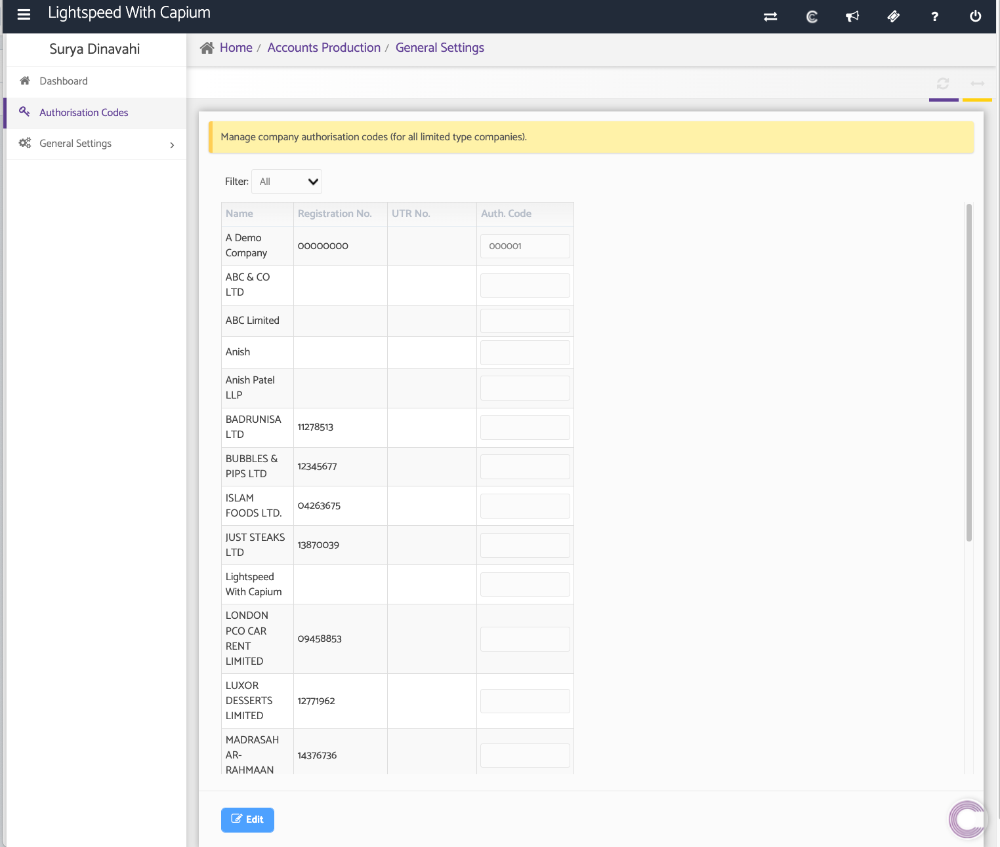
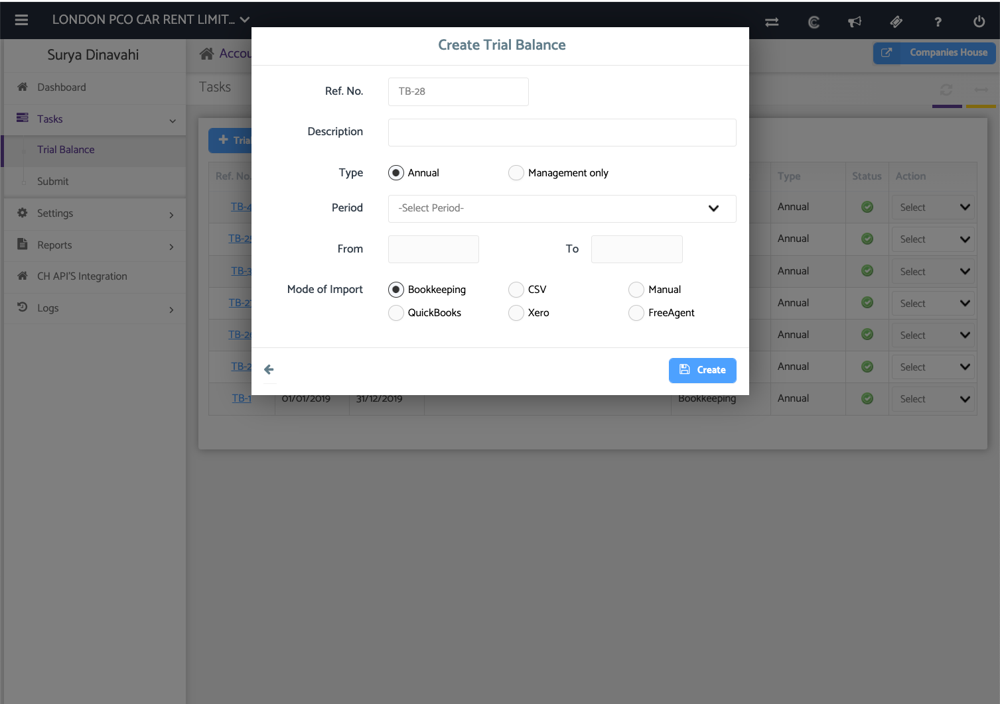
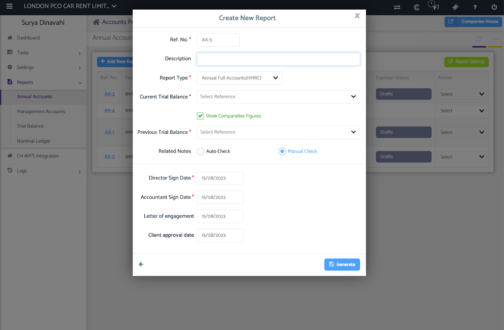
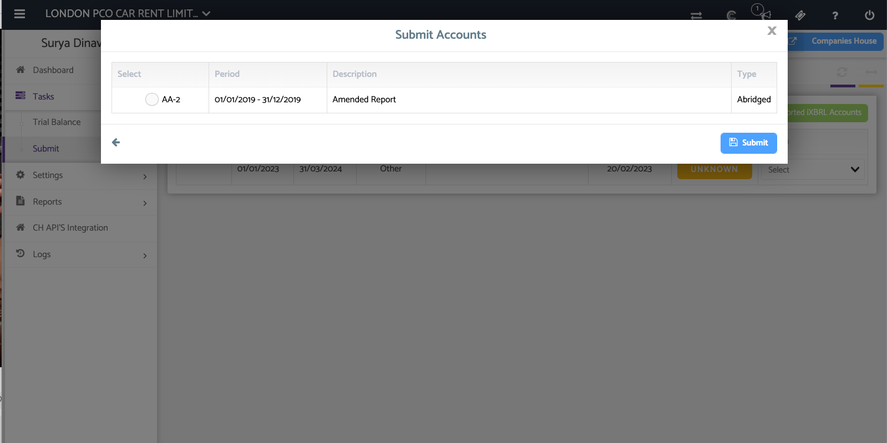

# Quick Guide: Getting Started with Accounts Production
	 	
			
			Print

- **Category:** General
- **Folder:** Quick Guides: Getting Started with Capium
- **Source URL:** [https://capium.freshdesk.com/support/solutions/articles/9000231145-quick-guide-getting-started-with-accounts-production](https://capium.freshdesk.com/support/solutions/articles/9000231145-quick-guide-getting-started-with-accounts-production)
- **Article ID:** 9000231145

## Content

Solution home 
		General
		Quick Guides: Getting Started with Capium

### Quick Guide: Getting Started with Accounts Production

			Print

	Modified on: Fri, 25 Aug, 2023 at 12:20 PM

		Welcome to our Quick Guide for Accounts Production! This guide will walk you through the essential initial steps and best practices to ensure a smooth setup and successful deployment.

Navigation: Accounts Production > General Settings> Authorisation codes  

Please enter the relevant registration and companies house authentication codes in this section for your clients. This will be stored and saved for you so when you submit, you don't need to repeatedly enter them when making submissions.

Navigation: Accounts Production > General Settings> Chart of Accounts

Adding nominal Chart of Account codes

If you haven’t already in the bookkeeping module, you can input additional nominal codes in Capium’s Chart of Accounts for all company types. 

If you have already imputed them in the Bookkeeping module, the 2 charts of accounts are linked so they will automatically sync through.

You can also go into a specific client > Settings & add a code specifically for that client too.

Navigation: Accounts Production > Settings> Accounting Periods

Adding in Accounting periods

Next, once you go into a specific client of yours, ensure the accounting period/ any other prior periods are all set up here. Again, if already done in the bookkeeping module, these will automatically sync through for you.

Navigation: Accounts Production > Tasks > Trial balance > + Trial Balance

Adding in a trial balance

To add in the trial balance on Capium, select the period the TB is for under the drop down.

Modes of import:

Integrations: Quickbooks, Xero or Freegagent (Login with your credentials do one of these vendors through Capium and can map the TB into Capium’s format)

CSV: Download our template file to populate and then reupload your TB

Manual: The TB can be manually entered on Capium itself

Bookkeeping: This would be the most efficient option, due to the shared nominal COA between our Bookkeeping & Accounts production modules, the data would be brought forward into Accounts production to auto populate the trial balance.

Report Generation

Navigation: Accounts Production > Reports > Annual Accounts > + New Report

Now you can select a description, report type (Annual full Accounts, Abridged or Filleted), & select the trial balance for the correct period.

If you want to include a comparative trial balance, you can tick the ‘show comparative figures’ box & the system will then let you include a second trial balance for comparative purposes.

Once done, hit generate for the full report which you can then download as a PDF & save.

Please Note: You also have the option to get these reports be-signed by using our Capisign module. Under the report, you can use the action dropdown and select ‘Send to Capisign’.

Navigation: Accounts Production > Tasks > Submit > Submit Accounts

Submission

Capium’s Account production is integrated with Companies House. When ready to submit, you can submit directly through this module and select the report you want to submit.

There is then a 4 step submission process which includes:

Validation check (System flags up potential errors to check/resolve)

Verify report one more time

Enter companies house gateways credentials if not already populated

Finally, submission.

Congratulations! You've completed the essential steps to set up your Accounts Production module. If you encounter any issues or require further assistance, don't hesitate to reach out to our support team.

										Did you find it helpful?
								Yes
								No

Send feedback	Sorry we couldn't be helpful. Help us improve this article with your feedback.

## Screenshots & Diagrams (6)

