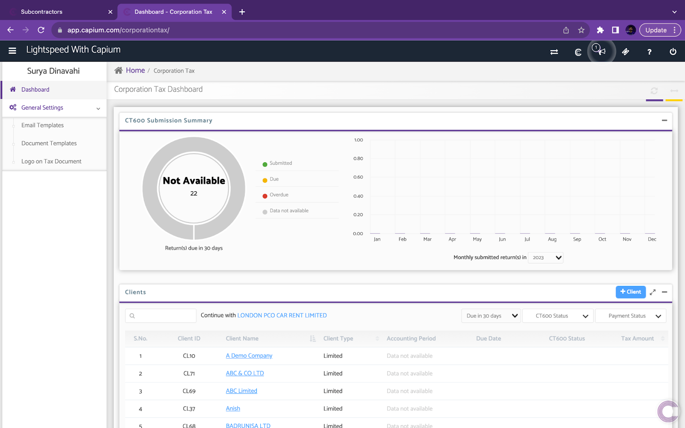
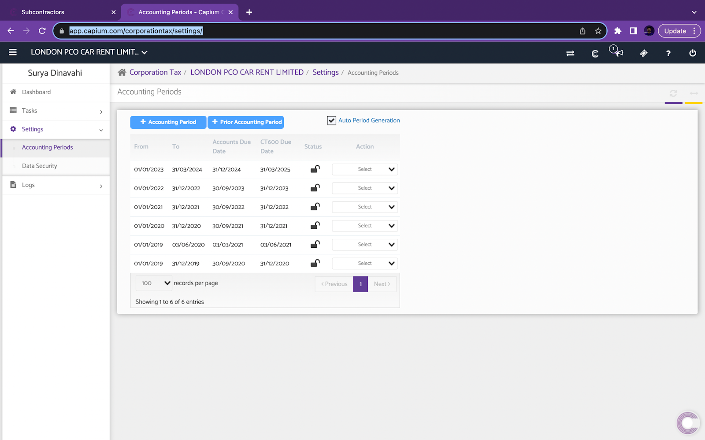
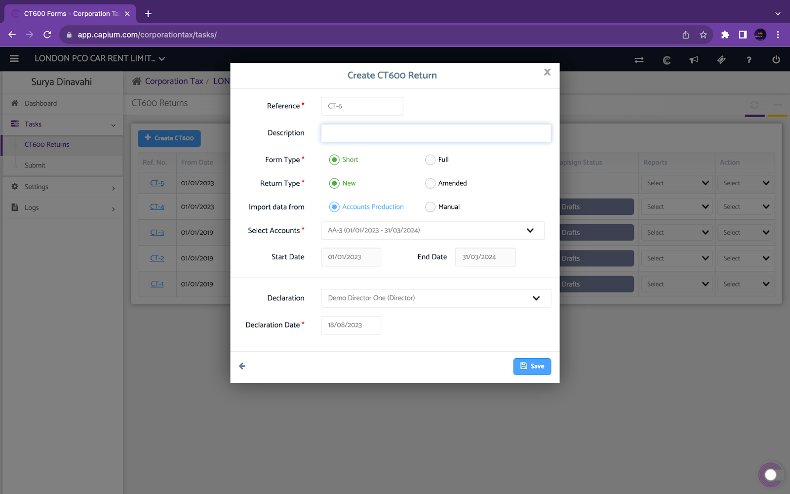
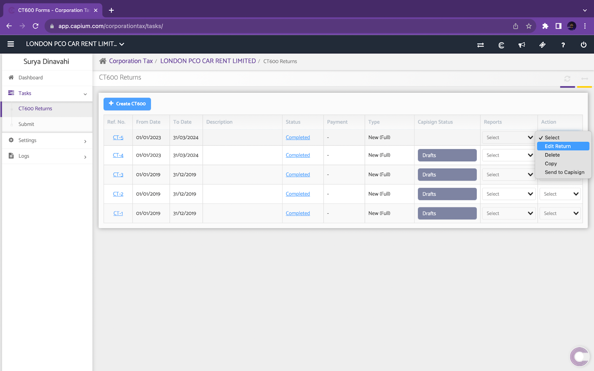
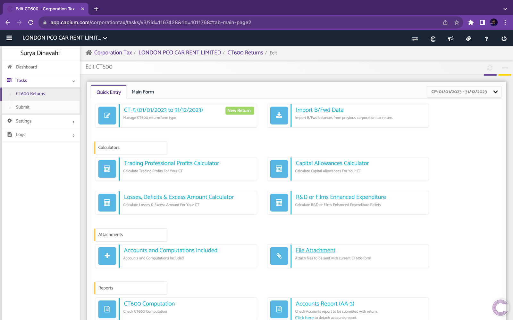
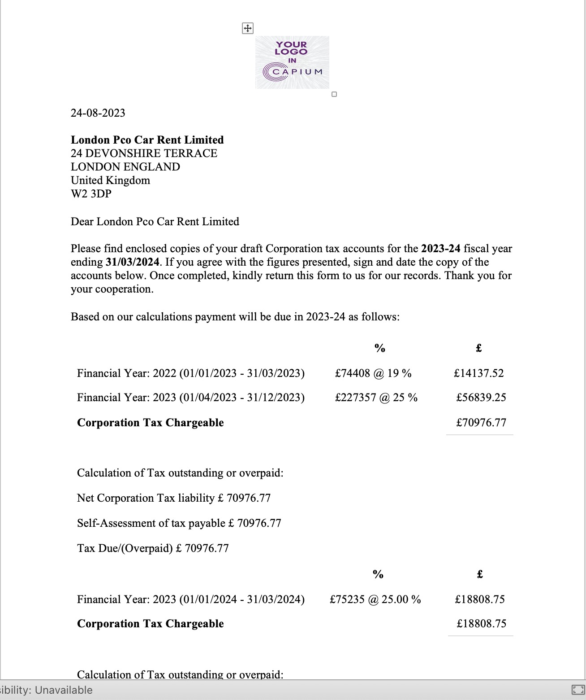

# Quick Guide: Getting Started with Corporation Tax
	 	
			
			Print

- **Category:** General
- **Folder:** Quick Guides: Getting Started with Capium
- **Source URL:** [https://capium.freshdesk.com/support/solutions/articles/9000231148-quick-guide-getting-started-with-corporation-tax](https://capium.freshdesk.com/support/solutions/articles/9000231148-quick-guide-getting-started-with-corporation-tax)
- **Article ID:** 9000231148

## Content

Solution home 
		General
		Quick Guides: Getting Started with Capium

### Quick Guide: Getting Started with Corporation Tax

			Print

	Modified on: Fri, 25 Aug, 2023 at 12:20 PM

		Welcome to our Quick Guide for Corporation Tax! This guide will walk you through the essential initial steps and best practices to ensure a smooth setup and successful deployment.

Navigation: Corporation Tax > General Settings

On the home page under the General Settings tab, you can see: 

Email Templates

Document Templates

Logo on Tax Documents 

Setting/Checking accounting periods

Navigation: Corporation Tax > Settings> Accounting Periods

Next, once you go into a specific client of yours, ensure the accounting period/ any other prior periods are all set up here. Again, if already done in the bookkeeping or accounts production module, these will automatically sync through for you.

Adding in the annual accounts

Navigation: Corporation Tax > Tasks > CT600 > + CT600

To add in the CT600 return on Capium, select accounts for the relevant period from the select accounts dropdown. 

Modes of inputs for CT600. 

Accounts production: Users are able to attach the accounts directly from the accounts production module. While importing the data some fields within CT600 will be populated automatically. 

Manual import: Users are able to attach iXBRL accounts produced in other software within Capium. In this method CT600 fields are not populated automatically. 

Preparing the CT600

To prepare the CT600 return that has been added onto Capium, select the action dropdown button and proceed to ‘Edit Return’. 

As displayed above once you click on edit return you will land on the page shown below. 

Next, you can see that there are a number of calculators on this screen, these can be used in conjunction with filling the main form. 

As you can see above there is also an option to edit the main form to add further information to the CT600 returns, even while editing this manually the computations within CT600 are updated automatically.

You also have the option to add supplementary pages to the CT600 on Page 2 and tick the relevant supplementary page. 

Navigation: Corporation Tax > Tasks > Submit CT600.

Once finalised, you can submit your CT600 directly to HMRC by navigating to the above tasks and submit CT600.

There will be a pre validation check before submitting where the system will flag any potential issues that need to be resolved. 

The pre validation check is based on a traffic light system:

Red: The requirement needs to be resolved before submission

Amber: This is a proceed with caution, so please double check the message and ensure the requirement is correct.

Navigation:  Tasks > CT600 return > Status

Syncing Corporation tax data in Accounts Production & Bookkeeping

Finally, once the Corporation Tax return is complete, you can navigate to the CT600 return and change the status from ‘in progress’ to ‘complete’.

This will then input a journal entry in the bookkeeping module for the client as well as updating the tax in the Accounts production trial balance.

You can then navigate back into the Accounts Production module and regenerate the report so it includes the latest corporation tax.

Navigation:  Tasks > CT600 return > reports > Get tax summary doc

Generating Tax Doc summary

You can also generate a Tax summary document for your clients to get them to review and sign off.

You can find this document by navigating under the CT600 return > Reports & click ‘Get Tax Summary doc’. This will then generate the document for you in a word document containing the relevant corporation tax chargeable and due dates. It also includes guidance on how to pay the corporation tax to HMRC.

Congratulations!  You've completed the essential steps to set up your Corporation Tax module. If you encounter any issues or require further assistance, don't hesitate to reach out to your Onboarding Manager.

										Did you find it helpful?
								Yes
								No

Send feedback	Sorry we couldn't be helpful. Help us improve this article with your feedback.

## Screenshots & Diagrams (10)

