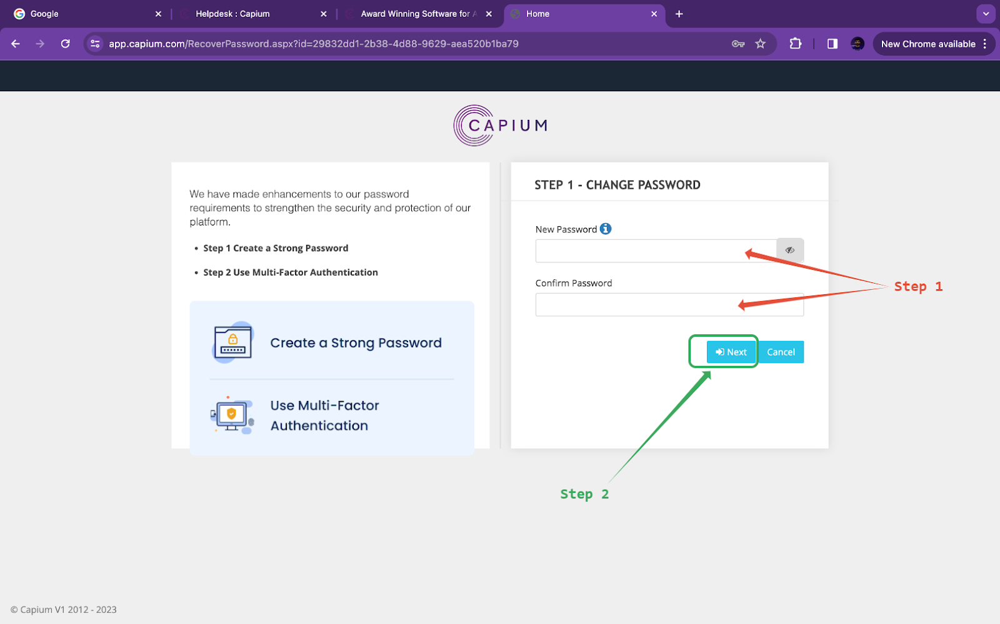
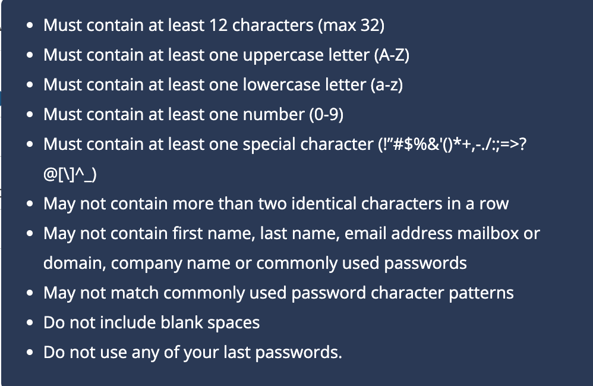
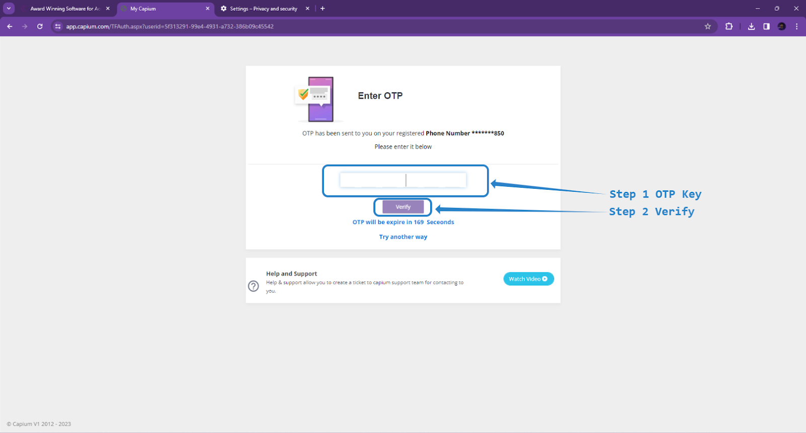
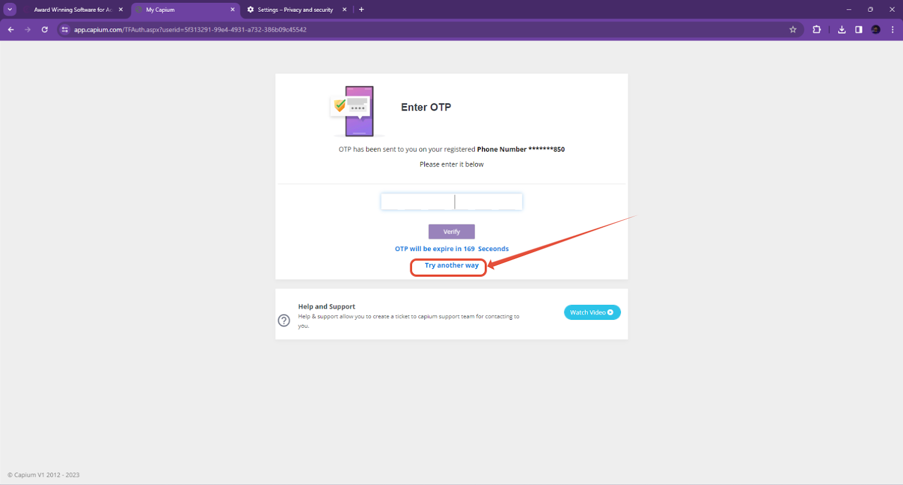
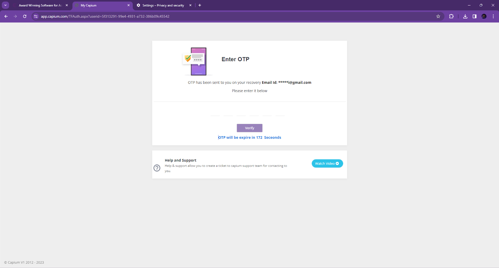
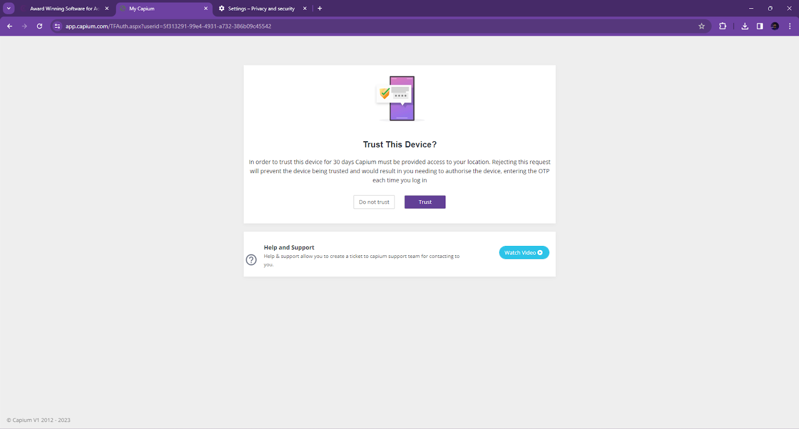
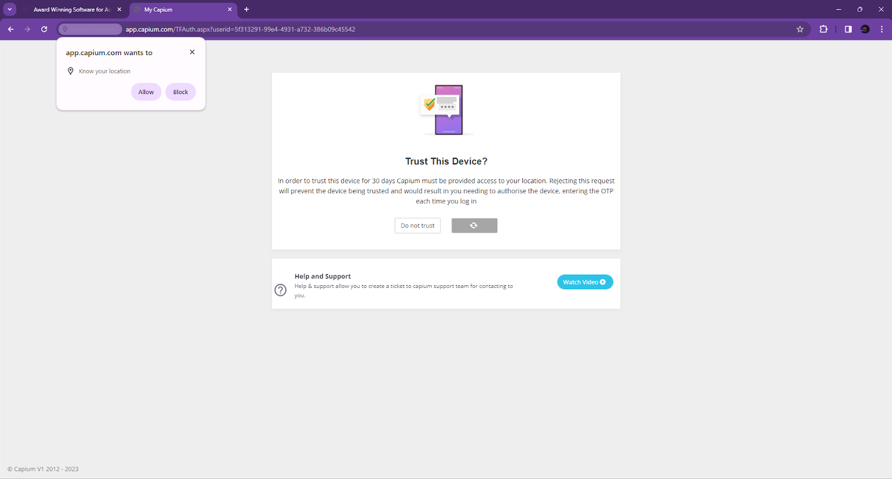

# Two Factor Authentication
	 	
			
			Print

- **Category:** General
- **Folder:** General
- **Source URL:** [https://capium.freshdesk.com/support/solutions/articles/9000234256-two-factor-authentication](https://capium.freshdesk.com/support/solutions/articles/9000234256-two-factor-authentication)
- **Article ID:** 9000234256

## Content

Solution home 
		General
		General

### Two Factor Authentication

			Print

	Modified on: Fri, 29 Dec, 2023 at  7:14 PM

		To enhance Capium's and your firm's security we have made two-factor authentication mandatory when logging into Capium for you, your staff, and your clients, to more ably protect your data.

Once you have entered your One Time Passcode, you will have the ability for the device to be remembered for 30 days. If you do not click trust, then the next time you log in you will need to enter the OTP.

Please refer to the video below which is the full guide. You can also scroll down for the full article. 

STEP 1

Logging in and changing password

When you log in to Capium you will be redirected to the page below to change your password and update it with a stronger password. There is a new password criteria that has been introduced to increase security within the application. Please refer to the second screenshot below:

The strong password criteria is shown below:

Once the password is set please click on 'Next' as illustrated in step 2. 

Step 2:

Setting up your mobile number and email for two-factor authentication

Once the above step is complete, you will go to the next page where you will have to update your mobile number and email ID. 

Please make sure that the credentials you provide here are current and accurate. 

Step 3:

Logging in with your new credentials

Step 4:
Verifying the OTP

Once you have logged in using your new credentials, you will be redirected to this page where the system will send an OTP (One Time Password). 

You will populate that OTP in the box shown in blue below and click 'Verify' to log in. 

Troubleshooting OTP Not Received

If your OTP hasn't arrived in 3 minutes, please retry. Keep in mind that OTP delivery speeds can vary based on your mobile carrier and signal strength.

If you'd prefer, you can try verification via email by following the steps below:

At this point, an OTP will be sent to your email.  

Which you can populate in and verify. 

Please note that the Code is Case Sensitive.

Once you click on ‘Verify’, you will be redirected to the page below:

Step 5:
Trusting the device

Once you are redirected to the page below you have two options:

Trust Device: When you trust the device that you are loggin in with. 

Do not trust: Use this option when you don’t own the device or if you are connected using public wifi networks. 

If you click ‘Do not trust’ you will log in directly. However you will need to populate the OTP for each time you want to log in. 

If you click ‘Trust Device’ your device will be remembered for 30 days for faster login. Please note: to trust a device we require the device location. This is illustrated on the screenshot below. 

Not Seeing the pop-up?

Please check your browser settings. Here is the article for Enabling Location Permissions for Capium Two Factor Authentication (2FA) on Google Chrome

If you are still not seeing the above pop-up. Please disable any ad-blockers or extensions. As they can interfere with the location data and not let you log in to Capium. 

If you create an exclusion for capium within your extensions you would be able to see this pop-up and log in.

If you don’t want to create an exclusion for Capium you can follow the ‘Do not trust’ mode at which point you will have to authorise each time you log in. 

Please Note: Each time you reset/update your password you will be required to enter an OTP.

										Did you find it helpful?
								Yes
								No

Send feedback	Sorry we couldn't be helpful. Help us improve this article with your feedback.

## Screenshots & Diagrams (7)

