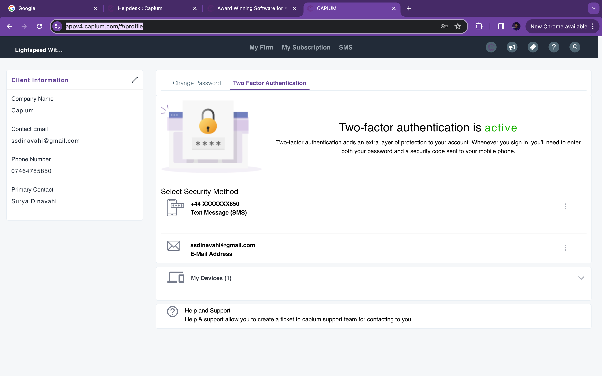

# 2 Factor Authentication - Changing the Recovery Email and Phone Details
	 	
			
			Print

- **Category:** General
- **Folder:** General
- **Source URL:** [https://capium.freshdesk.com/support/solutions/articles/9000234356-2-factor-authentication-changing-the-recovery-email-and-phone-details](https://capium.freshdesk.com/support/solutions/articles/9000234356-2-factor-authentication-changing-the-recovery-email-and-phone-details)
- **Article ID:** 9000234356

## Content

Solution home 
		General
		General

### 2 Factor Authentication - Changing the Recovery Email and Phone Details

			Print

	Modified on: Mon, 25 Dec, 2023 at 11:35 AM

		In order to change the recovery username and password please navigate to:
My Admin >> Profile >> Profile Settings

Alternatively, please click on this link to be redirected

You are required to verify the previous email or phone number before you change it to your new backup. Please contact the support team if you don't have access to your email or phone number. 

										Did you find it helpful?
								Yes
								No

Send feedback	Sorry we couldn't be helpful. Help us improve this article with your feedback.

## Screenshots & Diagrams (1)

