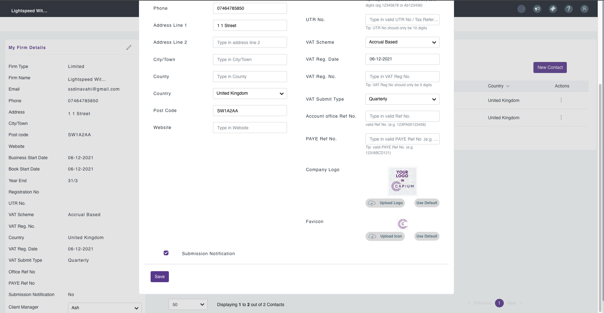
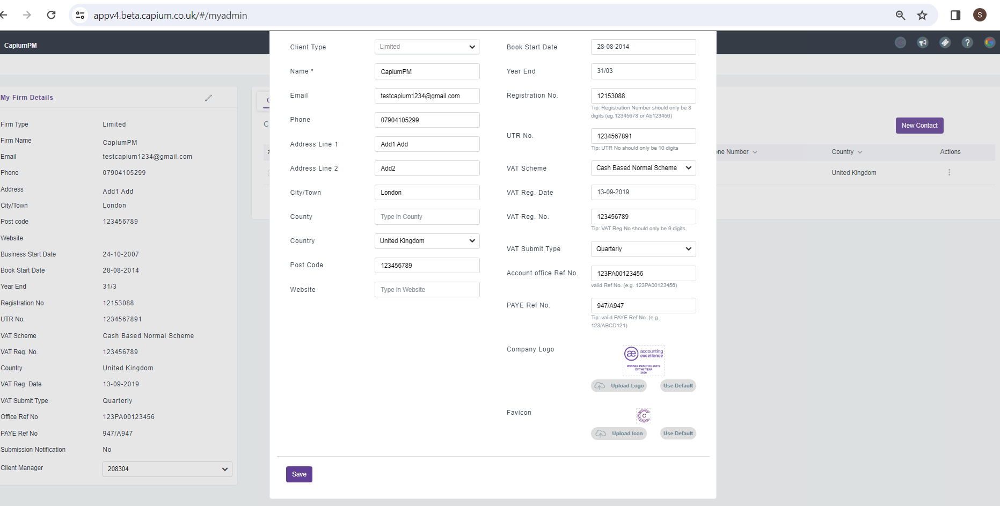
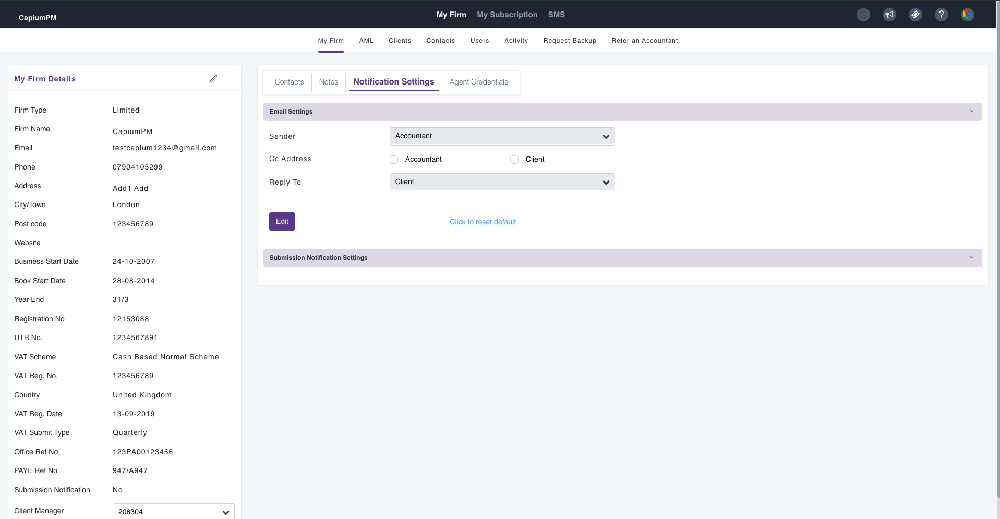
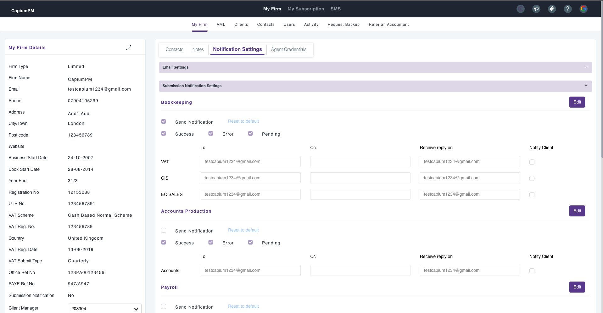

# Notification Settings
	 	
			
			Print

- **Category:** General
- **Folder:** General
- **Source URL:** [https://capium.freshdesk.com/support/solutions/articles/9000235057-notification-settings](https://capium.freshdesk.com/support/solutions/articles/9000235057-notification-settings)
- **Article ID:** 9000235057

## Content

Solution home 
		General
		General

### Notification Settings

			Print

	Modified on: Fri, 9 Feb, 2024 at  4:14 PM

Navigation: My Admin > My Firm > My Firm Details

Previously to configure the Submission Notifications you would need to go in the My Firm Details, if you select the Submission Notification checkbox, it will automatically tick the Send Notifications checkbox within the Notification Settings.

The new functionality has removed this option, and all Notification Setting configuration must be done in the Notification Setting section.

Navigation: My Admin > My Firm > Notification Settings > Email Settings

In the Email Settings, you are able to edit the Sender ID, Cc Address and the Reply to ID.

Navigation: My Admin > My Firm > Notification Settings > Submission Notification Settings

In the Notification Settings, you are able to configure the email notifications for the following submissions in Capium:

Bookkeeping:

VAT

CIS

EC SALES

Payroll:

FPS

EPS

YEA FPS

P11D

P46

Accounts Production:

Annual Accounts

Corporation Tax:

CT600

Self Assessment

SA100

SA800

SA900

The default configuration will send successful, errors and pending notifications regarding the submissions to the main accountant.

To edit the configuration, you can select the 'Edit' option on the module section and select the checkbox if you would like the successful, errors or pending notifications to be sent.

To change the email address that would receive the notification, you can change the default email in the 'To' box. Additionally you can choose an email to be copied in to the notification and an email which will receive the replies. 

To notify the client through email for any of the submissions, you can select the 'Client' checkbox on the right hand side of the relevant submission.

										Did you find it helpful?
								Yes
								No

Send feedback	Sorry we couldn't be helpful. Help us improve this article with your feedback.

## Screenshots & Diagrams (4)

