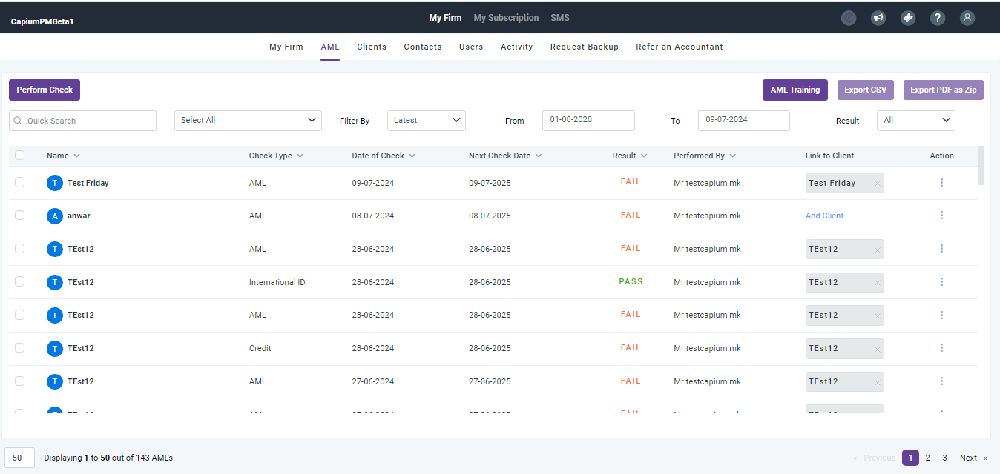
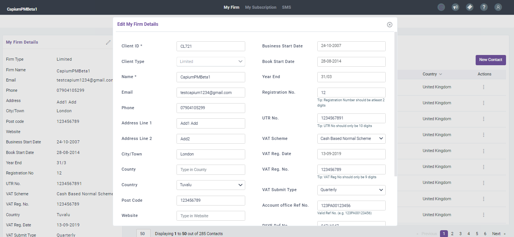
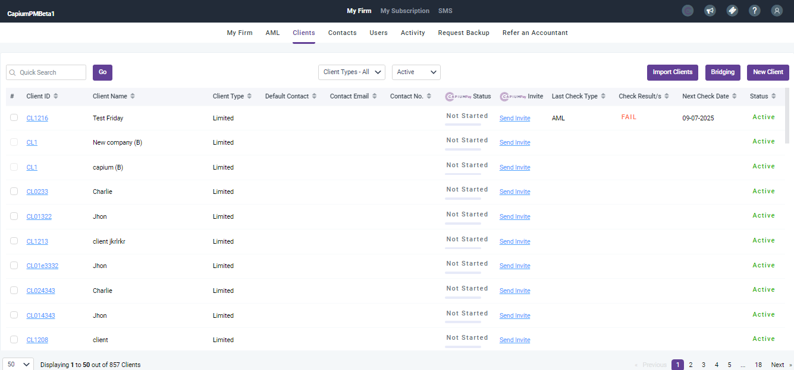
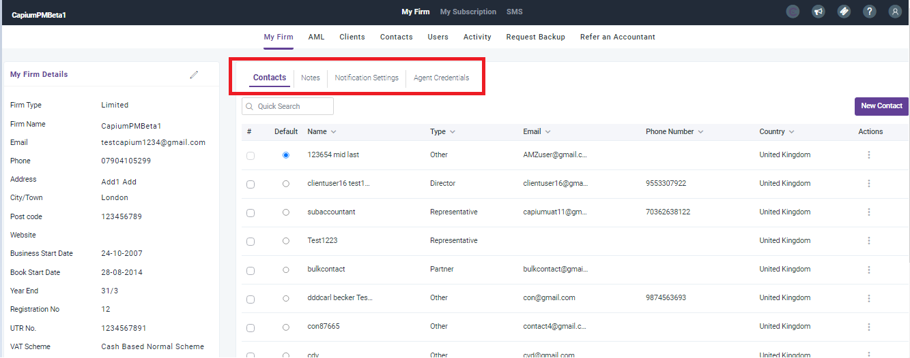

# New My Admin UI
	 	
			
			Print

- **Category:** General
- **Folder:** General
- **Source URL:** [https://capium.freshdesk.com/support/solutions/articles/9000239114-new-my-admin-ui](https://capium.freshdesk.com/support/solutions/articles/9000239114-new-my-admin-ui)
- **Article ID:** 9000239114

## Content

Solution home 
		General
		General

### New My Admin UI

			Print

	Modified on: Thu, 11 Jul, 2024 at 10:40 AM

		Please note that you might notice a few differences on your My Admin panel from Saturday 13th July onwards.

We have made some user interface changes which will help you search for what you are looking for faster, easier for you to view data, and will provide further support with client management. We hope that you like these new features.

Here are few screen shots of what the changes will look like:

										Did you find it helpful?
								Yes
								No

Send feedback	Sorry we couldn't be helpful. Help us improve this article with your feedback.

## Screenshots & Diagrams (4)

