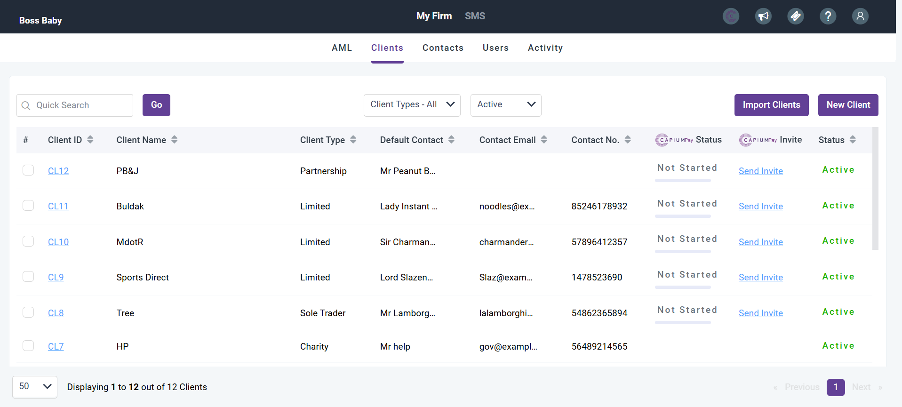
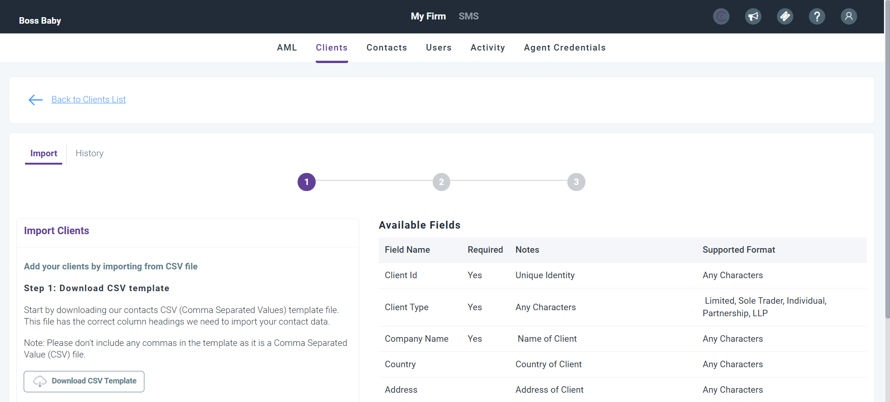
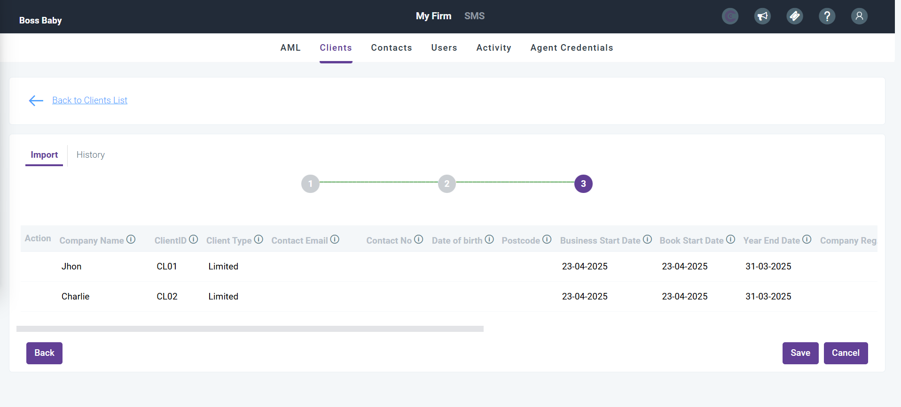
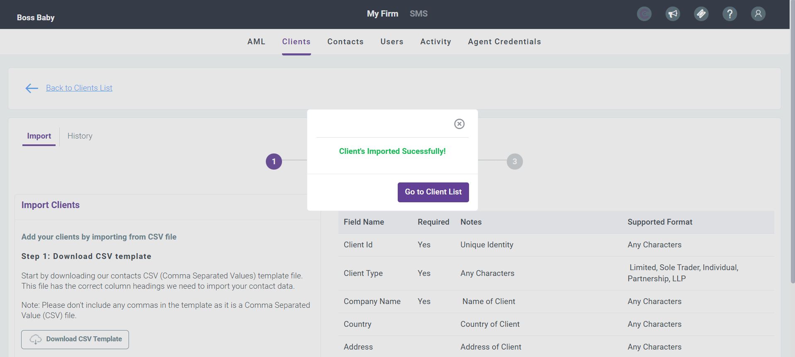
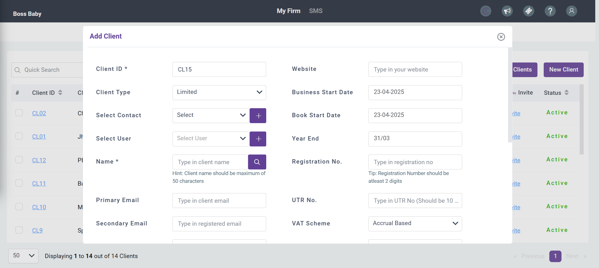

# How to Add Clients as an Accountant User
	 	
			
			Print

- **Category:** General
- **Folder:** General
- **Source URL:** [https://capium.freshdesk.com/support/solutions/articles/9000267571-how-to-add-clients-as-an-accountant-user](https://capium.freshdesk.com/support/solutions/articles/9000267571-how-to-add-clients-as-an-accountant-user)
- **Article ID:** 9000267571

## Content

Solution home 
		General
		General

### How to Add Clients as an Accountant User

			Print

	Modified on: Wed, 11 Jun, 2025 at  9:29 AM

		In this article we will cover how to add clients if you are an accountant user type in your subscription.

Navigation: My Admin > My Firm > Clients

Within this section, you will be able to navigate to the two purple buttons in the top right: 'Import Clients' and 'New Client'. Both these buttons allow you to add in new clients.

Import Clients

Our import feature allows you to add in clients with a CSV file.

You can download the CSV template from this section and populate the fields within it. Once populated, you can export it as a CSV file and reupload it into Capium. You will then be taken to a validation step where you can see the clients you have imported and check to make sure their data is correct.

From this step you can press 'Save' and your clients will be imported.

New Client

If you want to add a new client manually, you can click the 'New Client' button. This will take you to this pop-up:

 You can populate this page and then scroll to the bottom to press 'Save' to add a new client manually.

If you have any problems with importing your clients, please refer to this article:

Bulk Client Import - Troubleshooting

										Did you find it helpful?
								Yes
								No

Send feedback	Sorry we couldn't be helpful. Help us improve this article with your feedback.

## Screenshots & Diagrams (5)

