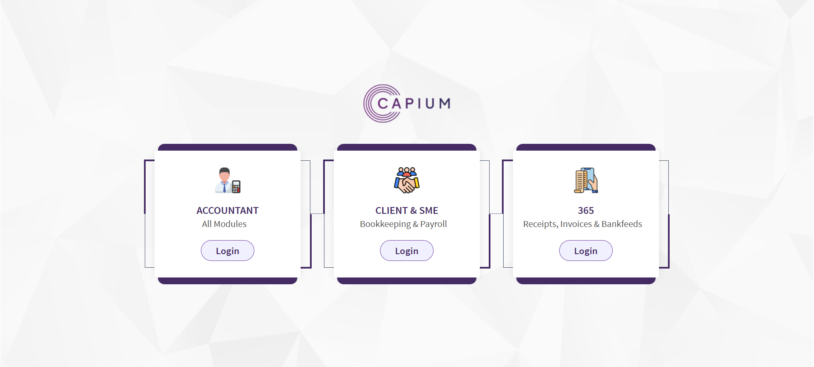
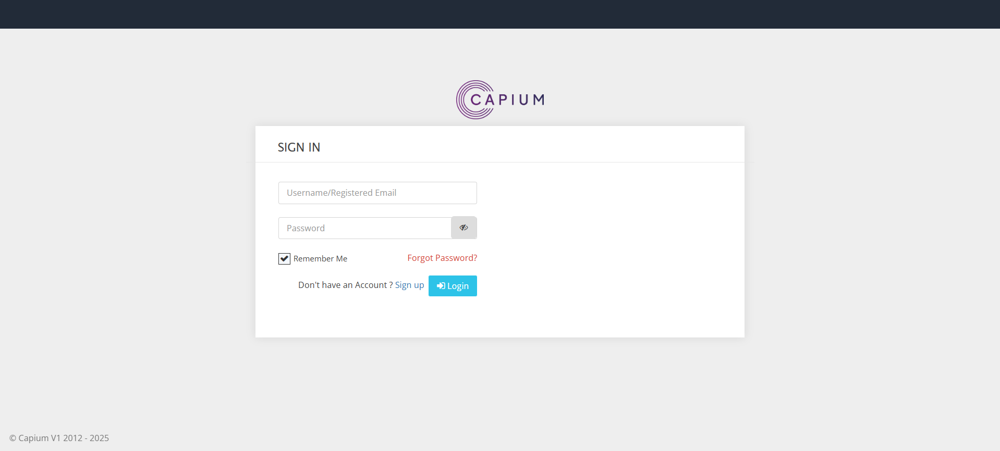
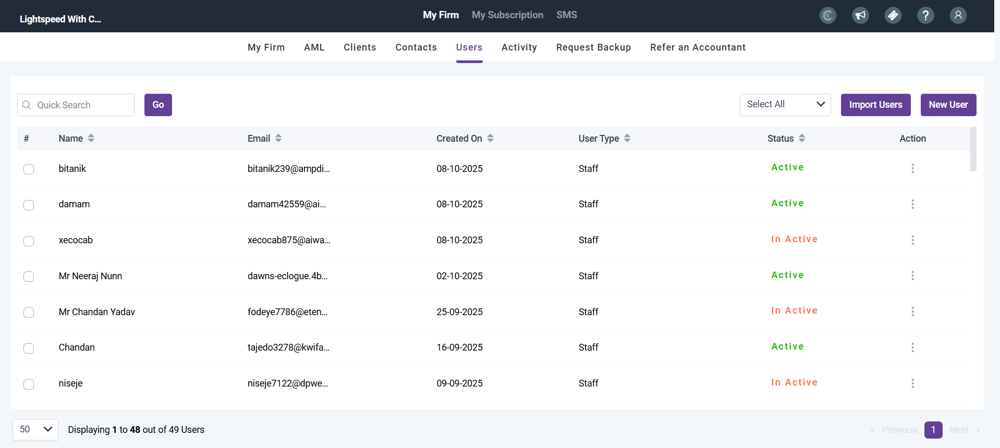
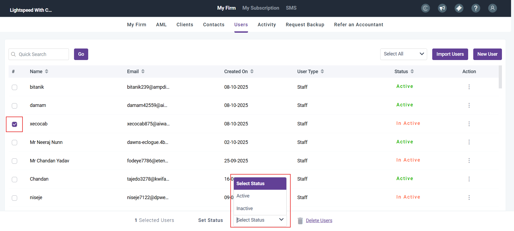

# How do Clients Login?
	 	
			
			Print

- **Category:** General
- **Folder:** General
- **Source URL:** [https://capium.freshdesk.com/support/solutions/articles/9000271567-how-do-clients-login-](https://capium.freshdesk.com/support/solutions/articles/9000271567-how-do-clients-login-)
- **Article ID:** 9000271567

## Content

Solution home 
		General
		General

### How do Clients Login?

			Print

	Modified on: Wed, 8 Oct, 2025 at  5:03 PM

		After you have set up your client users (if you haven't done this, please visit this article), they will be able to log into Capium themselves.

When they go to login, they should see this page:

Client users should always use the middle login option, which will take them to this page:

This is where they can use their email and password to log in.

If your client user is still facing trouble with logging in, we suggest first looking to see if their user is active. To do this, navigate to the users section in My Admin:

Here, you will be able to see which users are active and inactive. To change the status of any of these users, click the box at the far left of the row:

You will then be able to see a drop down where you can choose from either active or inactive.

If you client is still facing trouble, please either contact support@capium.com, or your account manager.

										Did you find it helpful?
								Yes
								No

Send feedback	Sorry we couldn't be helpful. Help us improve this article with your feedback.

## Screenshots & Diagrams (4)

