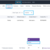
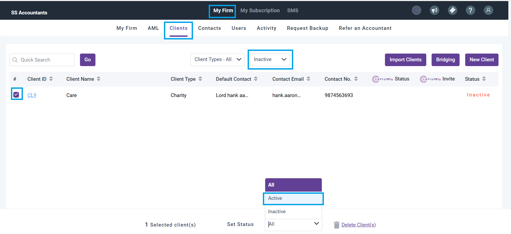

# Inactive clients
	 	
			
			Print

- **Category:** General
- **Folder:** General
- **Source URL:** [https://capium.freshdesk.com/support/solutions/articles/9000271605-inactive-clients](https://capium.freshdesk.com/support/solutions/articles/9000271605-inactive-clients)
- **Article ID:** 9000271605

## Content

Solution home 
		General
		General

### Inactive clients

			Print

	Modified on: Thu, 23 Oct, 2025 at  9:45 AM

		Title: How to Activate Inactive Clients

If you have inactive clients in your system, you can easily activate them by following these simple steps:

1. Navigate to My Admin: Log in to your account and go to the My Admin section.

2. Go to Clients: Once in the My Admin section, click on the Clients tab to view a list of all your clients.

3. Select Inactive: Look for the Inactive option and click on it to view a list of all your inactive clients.

4. Search Client and Check the Box: Use the search bar to find the specific client you want to activate. Once you have located the client, check the box next to their name.

5. Select Active: After checking the box next to the client's name, look for the option to Select Active. Click on this option to activate the client.

Please refer to the attached image for visual guidance on these steps.

		Annotated - ... (94.2 KB) 

										Did you find it helpful?
								Yes
								No

Send feedback	Sorry we couldn't be helpful. Help us improve this article with your feedback.

## Screenshots & Diagrams (2)

