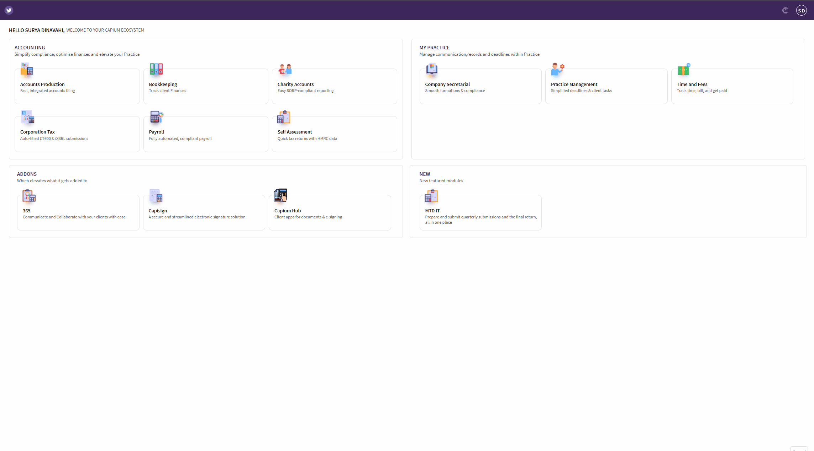

# How to delete users in Capium
	 	
			
			Print

- **Category:** General
- **Folder:** General
- **Source URL:** [https://capium.freshdesk.com/support/solutions/articles/9000275692-how-to-delete-users-in-capium](https://capium.freshdesk.com/support/solutions/articles/9000275692-how-to-delete-users-in-capium)
- **Article ID:** 9000275692

## Content

Solution home 
		General
		General

### How to delete users in Capium

			Print

	Modified on: Tue, 7 Apr, 2026 at  5:09 PM

		This article explains how to delete users in Capium when a staff member or client no longer requires access. This can be completed directly by the Super Accountant, so there is no need to raise a support ticket. 

Deleting Users 

Navigation: My Admin > Users

Alternatively, you can click on this link to be redirected

Once users have been added, they will appear in the users list.

To delete a user, tick the checkbox next to the user name you want to remove.

After selecting the user, navigate to the bottom of the page and click 'Delete Users'.

The selected user will then be removed from the users list.

See video reference:

You have now successfully completed the user deletion process. If you encounter any issues or require further assistance, please do not hesitate to reach out to your account manager.

										Did you find it helpful?
								Yes
								No

Send feedback	Sorry we couldn't be helpful. Help us improve this article with your feedback.

## Screenshots & Diagrams (1)

