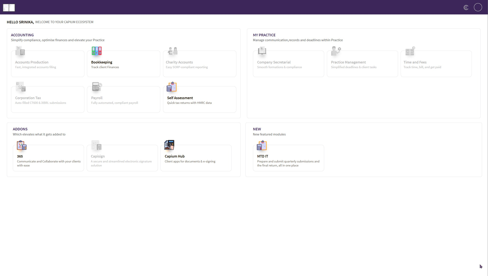

# Email Settings: control how your practice appears on outgoing emails
	 	
			
			Print

- **Category:** General
- **Folder:** Quick Guides: Getting Started with Capium
- **Source URL:** [https://capium.freshdesk.com/support/solutions/articles/9000278276-email-settings-control-how-your-practice-appears-on-outgoing-emails](https://capium.freshdesk.com/support/solutions/articles/9000278276-email-settings-control-how-your-practice-appears-on-outgoing-emails)
- **Article ID:** 9000278276

## Content

Solution home 
		General
		Quick Guides: Getting Started with Capium

### Email Settings: control how your practice appears on outgoing emails

			Print

	Modified on: Thu, 13 Aug, 2026 at  9:48 AM

		Capium now lets you control how your practice is presented to clients on emails sent from the system. From the My Subscription portal, you can set the display name your clients see, choose who is copied in, and decide where replies are directed.

Navigation > My Subscription > Email Settings

Please Note:
This setting can only be accessed by the primary user/super user in the firm. 

Phased rollout

This feature is being released in phases. The first phase covers the Payroll module. Emails and reports sent from Payroll will use these settings, while emails from other modules continue to work as they do today.

Further modules will be added over the coming releases, and this article will be updated as each one goes live.

Within Payroll, the settings are held at subscription level, so they apply across your whole account rather than needing to be configured client by client.

### Who can access this

Email Settings is visible and editable by the Primary user (super user) only.

Other users on the subscription will not see the option. If a change is needed, it must be made by the Primary user on their behalf.

### How to update your Email Settings

### 

Log in as the Primary user.
Navigation > My Subscription > Email Settings
Complete the fields set out below.
Save your changes.

Changes take effect on the next email sent from the system.

### 
What you can configure

FieldWhat it doesNumber of entriesDisplay nameThe name your client sees in the "From" line of their inboxOneCCCopies the outgoing email to additional people in your practiceMultipleReply-toThe mailbox client replies are delivered toOne only
Display name

Set this to your practice or trading name, for example Smith and Co Accountants, so that emails are immediately recognisable to the client rather than appearing as a generic system message.

CC

Add as many people from your practice as you need. Every address entered here receives a copy of the outgoing email. This is useful where a practice manager, admin inbox, or partner needs sight of everything sent to clients without being added manually each time.

Reply-to

Set the person replies should be delivered to. When a client selects reply on an email they have received, their response is directed to the mailbox you nominate here.

This field accepts a single recipient only, so all client replies come back to the same place. Choose whoever handles payroll queries day to day, or use a shared or monitored inbox if you would prefer replies were not tied to one individual's availability.

### 

Please Note:
The sending address does not change, all emails continue to be sent from noreply@capium.com

### 

Email Settings controls the presentation of the email, being the name your client sees, who is copied, and where replies land. It does not change the underlying sending address. This is by design: sending from Capium's own verified domain protects deliverability and means you do not need to configure SPF, DKIM, or DNS records for your own domain.

In practice, your client sees an email from your practice name, and any reply they send arrives in your nominated inbox.

### What these settings apply to

In this first phase, Email Settings governs emails and reports sent from the Payroll module, including:

Reports sent from within a client record
Reports sent from outside a client record, including exported reports
Emails sent from other modules are not yet covered and will follow in later phases.

### These settings override your existing settings in My Admin

If you have previously configured email settings under My Admin, please note that My Subscription > Email Settings takes precedence.

Where both are configured, the values held in the subscription portal are the ones applied to Payroll reports and emails. The My Admin settings are not used for these emails.

We recommend reviewing your My Subscription email settings now to confirm the display name, CC, and reply-to address are correct, so that your clients continue to receive emails presented the way you expect.

### Frequently asked questions

Can I send from my own email address instead of noreply@capium.com?
Not at this time. All emails are sent from Capium's verified sending domain to protect deliverability. You can, however, control the display name and reply-to address so that the email reads as coming from your practice.

Will my clients see noreply@capium.com?
The display name you set is what appears most prominently in the inbox. The underlying address remains visible if the recipient expands the sender details.

Do I need to configure this for each client?
No. The settings are applied at subscription level and used across all your clients.

Does this work for modules other than Payroll?
Not yet. Payroll is the first phase of the rollout. Emails from other modules continue to use your existing configuration until those modules are included in a later phase.

Can I add more than one reply-to address?
No. Reply-to accepts a single recipient. If several people need sight of client responses, either set the reply-to to a shared or monitored inbox, or add those people to the CC field so they receive a copy of the outgoing email.

I cannot see Email Settings in My Subscription.
The option is restricted to the Primary user (super user) on the subscription. If you need the settings changed and you are not the Primary user, ask them to make the update.

										Did you find it helpful?
								Yes
								No

Send feedback	Sorry we couldn't be helpful. Help us improve this article with your feedback.

## Screenshots & Diagrams (1)

