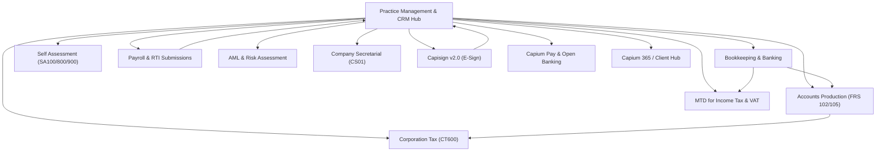

# Sansuite Complete Ecosystem - Master Architecture & Module Index

## নির্বাহী সারাংশ (Executive Summary)

**Sansuite** হলো ইউকে ভিত্তিক একাউন্ট্যান্সি এবং প্র্যাকটিস ম্যানেজমেন্টের জন্য একটি আধুনিক, সমন্বিত অল-ইন-ওয়ান ক্লাউড সফটওয়্যার স্যুট। 

Capium Freshdesk সলিউশন পোর্টালের **২০টি মডিউলের** সমস্ত নলেজবেস আর্টিকেল, ব্যবসায়িক নিয়মাবলি (Business Rules), ফাইলিং নিয়মাবলি (HMRC & Companies House Compliance), ডেটা মডেল এবং ব্যবহারকারী ইন্টারফেসের স্ক্রিনশট পুঙ্খানুপুঙ্খভাবে সংগ্রহ করে `d:/sansuite` ডিরেক্টরিতে প্রতিটি মডিউলের জন্য আলাদা ফোল্ডারে সুসংগঠিত করা হয়েছে।

---

## ১. সম্পূর্ণ ইকোসিস্টেমের পরিসংখ্যান (Ecosystem Summary Stats)

- **সর্বমোট মডিউল সংখ্যা:** **২০ টি**
- **সর্বমোট স্ক্র্যাপ ও প্রসেস করা আর্টিকেল:** **১,০৩৩ টি**
- **সর্বমোট ইউজার ইন্টারফেস ইমেজ/স্ক্রিনশট ফোল্ডার:** **৭২৪ টি**
- **প্রতিটি মডিউলে সংরক্ষিত ফাইলসমূহ:**
  - `[MODULE_NAME]_MASTER_REPORT.md` : মডিউলের বিস্তারিত অ্যানালাইসিস ও ফিচার স্পেসিফিকেশন।
  - `full_dataset.json` : সকল আর্টিকেলের সম্পূর্ণ মেশিন-রিডেবল ডেটাসেট।
  - `raw_articles/` : প্রতিটি আর্টিকেলের স্বতন্ত্র Markdown এবং JSON সংস্করণ।
  - `images/` : প্রতিটি ফিচারের অরিজিনাল UI স্ক্রিনশট এবং ডায়াগ্রাম।
  - `docs/` : মডিউল ইনডেক্স ও আর্কিটেকচারাল রেফারেন্স ফাইল।

---

## ২. ২০টি মডিউলের বিস্তারিত তালিকা ও পরিসংখ্যান (Modules Master Table)

| # | মডিউলের নাম (Module Name) | ডিরেক্টরি পাথ | আর্টিকেল সংখ্যা | ইমেজ ফোল্ডার | প্রধান ফিচার ও বিবরণ |
| :- | :--- | :--- | :- | :- | :--- |
| 1 | [Practice Management](file:///d:/sansuite/Practice%20Management/) | `d:/sansuite/Practice Management/` | **65** | **61** | Client CRM, Workflow Steps, Statutory Deadlines, Task Planner, Email Conversations, LoE, Capisign E-Sign, AML |
| 2 | [Accounts Production](file:///d:/sansuite/Accounts%20Production/) | `d:/sansuite/Accounts Production/` | **108** | **80** | FRS 102 (1A), FRS 105 Micro-entity, Full & Abridged Accounts, Trial Balance, Disclosures, Companies House & HMRC iXBRL filing |
| 3 | [Bookkeeping](file:///d:/sansuite/Bookkeeping/) | `d:/sansuite/Bookkeeping/` | **139** | **123** | Sales, Purchases, Bank Reconciliation, Live Bank Feeds, MTD VAT Returns, Journals, Reports, Receipt Capture |
| 4 | [Corporation Tax](file:///d:/sansuite/Corporation%20Tax/) | `d:/sansuite/Corporation Tax/` | **59** | **40** | CT600 Computations, Capital Allowances, R&D Relief, Loss Relief, CT600A/C/D/L schedules, HMRC e-filing |
| 5 | [Self Assessment](file:///d:/sansuite/Self%20Assessment/) | `d:/sansuite/Self Assessment/` | **103** | **77** | SA100 Individual, SA800 Partnership, SA900 Trust returns, Employment, Property, Foreign Income, Capital Gains, HMRC filing |
| 6 | [Payroll](file:///d:/sansuite/Payroll/) | `d:/sansuite/Payroll/` | **136** | **103** | RTI Submissions (FPS/EPS), Auto-Enrolment Pensions, SSP/SMP/SPP, CIS Returns, P45, P60, Payslips, HMRC e-filing |
| 7 | [MTD IT](file:///d:/sansuite/MTD%20IT/) | `d:/sansuite/MTD IT/` | **89** | **41** | Making Tax Digital for Income Tax, Quarterly Updates, End of Period Statements (EOPS), Final Declaration |
| 8 | [Charities](file:///d:/sansuite/Charities/) | `d:/sansuite/Charities/` | **26** | **18** | Charity Accounts Production (SORP FRS 102), Fund Accounting (Restricted/Unrestricted), Trustees Reports |
| 9 | [Anti-Money Laundering](file:///d:/sansuite/Anti-Money%20Laundering/) | `d:/sansuite/Anti-Money Laundering/` | **13** | **7** | AML Compliance, Electronic ID Checks, PEP & Sanctions Screening, Risk Assessment Scoring, Compliance Audit Trail |
| 10 | [Company Secretarial](file:///d:/sansuite/Company%20Secretarial/) | `d:/sansuite/Company Secretarial/` | **12** | **6** | Companies House Filings, Confirmation Statement (CS01), Share Allocations/Transfers, PSC Register, Officer Appointments |
| 11 | [Time and Fees](file:///d:/sansuite/Time%20and%20Fees/) | `d:/sansuite/Time and Fees/` | **15** | **14** | Staff Time Tracking, Timesheet Grids, WIP Management, Client Billing, Fee Allocation, Utilization Reports |
| 12 | [Capisign v2.0](file:///d:/sansuite/Capisign%20v2.0/) | `d:/sansuite/Capisign v2.0/` | **16** | **10** | Legally Binding Electronic Signatures, Multi-Party Signing, Template Designer, Audit Certificates, Client Portal |
| 13 | [Capium Pay](file:///d:/sansuite/Capium%20Pay/) | `d:/sansuite/Capium Pay/` | **30** | **7** | Integrated Merchant Payments, Direct Debit (GoCardless), Instant Bank Pay (Open Banking), Auto-reconciliation |
| 14 | [Capium 365](file:///d:/sansuite/Capium%20365/) | `d:/sansuite/Capium 365/` | **134** | **74** | Cloud & Mobile SME Client Portal, Invoicing on the go, Receipt Scanning, Bank Feed Linking, Accountant Chat |
| 15 | [Capium Hub](file:///d:/sansuite/Capium%20Hub/) | `d:/sansuite/Capium Hub/` | **8** | **8** | Client Collaborative Document Portal, Approval Center, Request Responses, Secure File Sharing |
| 16 | [Onboarding](file:///d:/sansuite/Onboarding/) | `d:/sansuite/Onboarding/` | **25** | **23** | Getting Started Guides, Practice Setup, Migration from Sage/Iris/Xero/QuickBooks, Chart of Accounts Setup |
| 17 | [General](file:///d:/sansuite/General/) | `d:/sansuite/General/` | **39** | **29** | User Management, MFA/2FA Security, System Settings, Backup, Subscription & Licensing, API Keys |
| 18 | [SME User Information](file:///d:/sansuite/SME%20User%20Information/) | `d:/sansuite/SME User Information/` | **2** | **1** | End-client guides for business owners using the client portal and mobile apps |
| 19 | [Refresher Courses](file:///d:/sansuite/Refresher%20Courses/) | `d:/sansuite/Refresher Courses/` | **5** | **1** | Comprehensive step-by-step training manuals for accountants and practice staff |
| 20 | [Webinars](file:///d:/sansuite/Webinars/) | `d:/sansuite/Webinars/` | **9** | **1** | Feature walkthroughs, legislative updates (MTD, Basis Period Reform, Budget Changes) |
| **মোট** | **২০টি মডিউল** | `d:/sansuite/` | **1033 টি** | **724 টি** | **সম্পূর্ণ ইকোসিস্টেম কভারেজ** |

---

## ৩. Sansuite মডিউলার আর্কিটেকচার ও কানেক্টিভিটি



---

## ৪. ডিরেক্টরি স্ট্রাকচার ও নেভিগেশন গাইড

```
d:/sansuite/
├── README.md                                  # মাস্টার ওভারভিউ ও নেভিগেশন ইনডেক্স
├── MASTER_SANSUITE_ECOSYSTEM_REPORT.md       # সম্পূর্ণ ইকোসিস্টেম রিপোর্ট
├── Practice Management/                       # প্র্যাকটিস ম্যানেজমেন্ট মডিউল (৬৫ আর্টিকেল)
│   ├── PRACTICE_MANAGEMENT_MASTER_REPORT.md
│   ├── README.md
│   ├── capium_pm_full_dataset.json
│   ├── docs/ (01 to 05)
│   ├── images/
│   └── raw_articles/
├── Accounts Production/                       # একাউন্টস প্রোডাকশন মডিউল (১০৮ আর্টিকেল)
├── Bookkeeping/                               # বুককিপিং মডিউল (১৩৯ আর্টিকেল)
├── Corporation Tax/                           # কর্পোরেশন ট্যাক্স মডিউল (৫৯ আর্টিকেল)
├── Self Assessment/                           # সেলফ অ্যাসেসমেন্ট মডিউল (১০৩ আর্টিকেল)
├── Payroll/                                   # পেরোল মডিউল (১৩৬ আর্টিকেল)
├── MTD IT/                                    # এমটিডি ইনকাম ট্যাক্স মডিউল (৮৯ আর্টিকেল)
├── Charities/                                 # চ্যারিটি একাউন্টস মডিউল (২৬ আর্টিকেল)
├── Anti-Money Laundering/                     # এএমএল কমপ্লায়েন্স মডিউল (১৩ আর্টিকেল)
├── Company Secretarial/                       # কোম্পানি সেক্রেটারি মডিউল (১২ আর্টিকেল)
├── Time and Fees/                             # টাইম ট্র্যাকিং ও ফি মডিউল (১৫ আর্টিকেল)
├── Capisign v2.0/                             # ই-সাইনিং মডিউল (১৬ আর্টিকেল)
├── Capium Pay/                                # পেমেন্ট গেটওয়ে মডিউল (৩০ আর্টিকেল)
├── Capium 365/                                # ক্লায়েন্ট পোর্টাল ও মোবাইল অ্যাপ (১৩৪ আর্টিকেল)
├── Capium Hub/                                # ডকুমেন্ট শেয়ারিং হাব (৮ আর্টিকেল)
├── Onboarding/                                # অনবোর্ডিং ও ডেটা মাইগ্রেশন (২৫ আর্টিকেল)
├── General/                                   # জেনারেল ও অ্যাডমিন সেটিংস (৩৯ আর্টিকেল)
├── SME User Information/                      # এসএমই ক্লায়েন্ট গাইড (২ আর্টিকেল)
├── Refresher Courses/                         # ট্রেনিং ও রিফ্রেশার গাইড (৫ আর্টিকেল)
└── Webinars/                                  # ওয়েবিনার ও পলিসি আপডেট (৯ আর্টিকেল)
```
