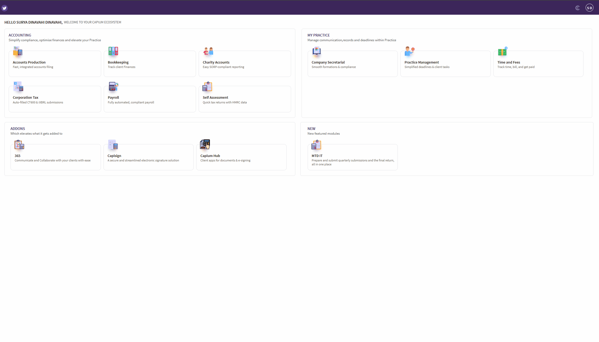

# MTD IT - How to set up the module for the first time
	 	
			
			Print

- **Category:** MTD IT
- **Folder:** MTD IT
- **Source URL:** [https://capium.freshdesk.com/support/solutions/articles/9000274754-mtd-it-how-to-set-up-the-module-for-the-first-time](https://capium.freshdesk.com/support/solutions/articles/9000274754-mtd-it-how-to-set-up-the-module-for-the-first-time)
- **Article ID:** 9000274754

## Content

Solution home 
		MTD IT
		MTD IT

### MTD IT - How to set up the module for the first time

			Print

	Modified on: Mon, 22 Jun, 2026 at 11:52 PM

		The MTD IT module must be purchased before it can be accessed. For full guidance on selecting a package and completing payment, refer to: MTD IT - How to Purchase the Module.

Once purchased, the module will appear in your Capium App Menu.

Step 1: Access the MTD IT Module

Navigation > Capium App Menu > MTD IT > Manage

Select Add Client in the top-left corner.

Please note: When you set up the MTD IT module for the first time, you will not see any clients listed within it. Clients must be added or enabled through the Capium 365 module before they will appear in MTD IT. 

Step 2: Add New Clients or Grant Access to Existing Clients

Ensure the client is set up as an Individual and the MTD IT module is enabled for them. For full guidance on adding a new client or enabling an existing client for MTD IT, refer to: MTD IT - Adding New Clients.

Step 3 (Optional): Link Sole Traders to Individuals

If you have sole trader clients that need to be brought into the MTD IT module, the sole trader must first be linked to an individual, as only individuals can currently be added to the module.

For full guidance on how to do this, refer to: MTD IT - Linking Individuals and Sole Traders.

If you need to link multiple sole traders to individuals at once, refer to: MTD IT - Linking the Sole Traders and Individuals in Bulk.

Step 4 Authenticate and Authorise the Client with HMRC

Before you can submit on a client's behalf, you must verify their eligibility through your HMRC Agent Services Account (ASA) and authorise Capium as their MTD IT software.

For full guidance on this process, including how to identify affected clients, verify eligibility, and complete authorisation, refer to: MTD IT - Client Authorisation Workflow.

If you need to authorise multiple clients at once, refer to: MTD IT - Bulk Authorisation.

Step 5 Choose the Right Workflow

Capium supports four workflows within the MTD IT module, and the correct one for each client depends on their income type and the services they require.

For full guidance on the four workflows and the decision flowchart to help you choose, refer to: MTD IT - Choosing the Right Workflow.

										Did you find it helpful?
								Yes
								No

Send feedback	Sorry we couldn't be helpful. Help us improve this article with your feedback.

## Screenshots & Diagrams (1)

