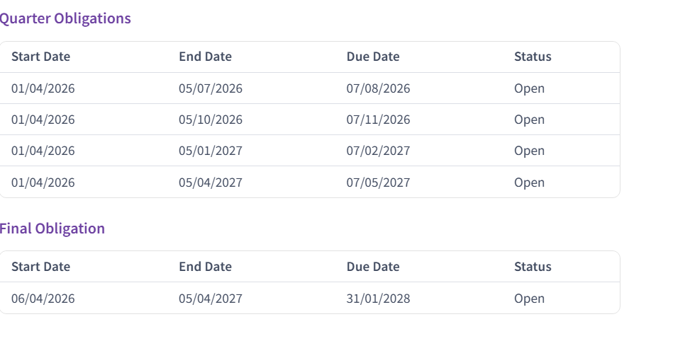

# MTD IT -  No obligations/incorrect obligations or Error message (error in creating cumulative period summary)
	 	
			
			Print

- **Category:** MTD IT
- **Folder:** MTD IT FAQs
- **Source URL:** [https://capium.freshdesk.com/support/solutions/articles/9000275595-mtd-it-no-obligations-incorrect-obligations-or-error-message-error-in-creating-cumulative-period-](https://capium.freshdesk.com/support/solutions/articles/9000275595-mtd-it-no-obligations-incorrect-obligations-or-error-message-error-in-creating-cumulative-period-)
- **Article ID:** 9000275595

## Content

Solution home 
		MTD IT
		MTD IT FAQs

### MTD IT -  No obligations/incorrect obligations or Error message (error in creating cumulative period summary)

			Print

	Modified on: Mon, 27 Jul, 2026 at  5:08 PM

### No Quarterly Obligations – What It Means

For the current tax year, there are no quarterly obligations set by HMRC for this business. This situation can arise for a couple of reasons.

Firstly, the business may not have opted into quarterly submissions for this tax year.

Alternatively, HMRC may not yet have updated the quarterly obligations in their system for the current period. We recommend checking in the new tax year.

You can try to revoke authorisation and reauthorise to see if the obligations pull through.

https://capium.freshdesk.com/support/solutions/articles/9000277172-mtd-it-how-to-unauthorise-revoke-hmrc-authorisation-for-a-client

If this does not work, you will need to contact HMRC

Incorrect Obligations or Error message (error in creating cumulative period summary)

If when selecting calendar or standard type elections, and they are not showing the below dates, you need to speak to HMRC to understand why. As Capium is only pulling through the information from HMRC.

Standard Quarters (Default Position)

By default, quarterly updates must follow the standard tax year quarters, which align with the UK tax year (6 April to 5 April).

The standard quarters are:

6 April to 5 July

6 July to 5 October

6 October to 5 January

6 January to 5 April

These apply automatically unless a business elects otherwise.

### Calendar Quarter Election

Businesses will have the option to elect to report using calendar quarters instead of standard tax year quarters.

The calendar quarters are:

1 April to 30 June

1 July to 30 September

1 October to 31 December

1 January to 31 March

This election can simplify bookkeeping, particularly for businesses already aligned to calendar month reporting or VAT quarters.

The obligation dates below are non standard, hence the error message, error in creating cumulative period summary

You may also try to select an alternative election to see whether those obligations match the below, but this will impact your reporting period.

https://capium.freshdesk.com/a/solutions/articles/9000275927?portalId=9000044273

To avoid any issues, you should review the obligations by checking the Obligations Statuses screen. This will provide confirmation of whether obligations are in place and ensure that any submissions you make are valid.

										Did you find it helpful?
								Yes
								No

Send feedback	Sorry we couldn't be helpful. Help us improve this article with your feedback.

## Screenshots & Diagrams (1)

