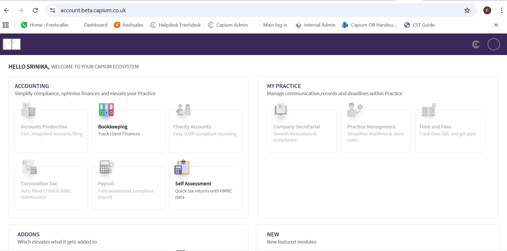
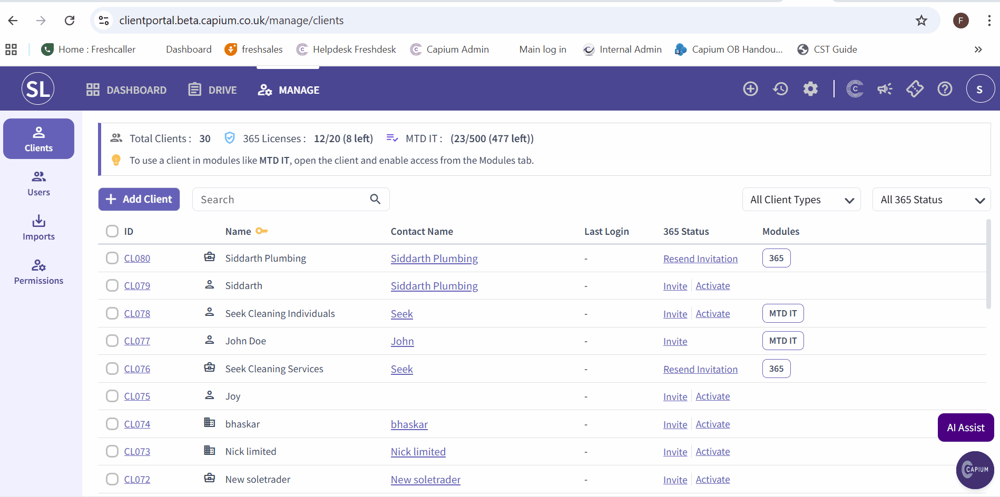
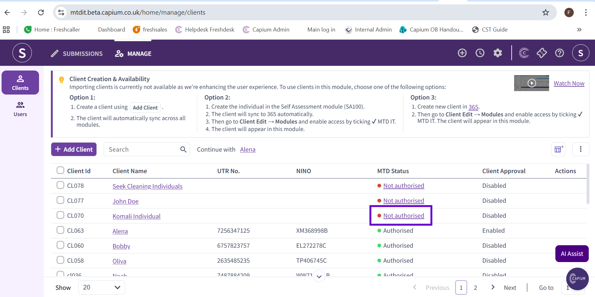

# MTD IT - Linking Individuals and Sole Traders
	 	
			
			Print

- **Category:** MTD IT
- **Folder:** MTD IT
- **Source URL:** [https://capium.freshdesk.com/support/solutions/articles/9000275912-mtd-it-linking-individuals-and-sole-traders](https://capium.freshdesk.com/support/solutions/articles/9000275912-mtd-it-linking-individuals-and-sole-traders)
- **Article ID:** 9000275912

## Content

Solution home 
		MTD IT
		MTD IT

### MTD IT - Linking Individuals and Sole Traders

			Print

	Modified on: Wed, 29 Apr, 2026 at 12:23 PM

		Authorisation workflow MTD IT

### Overview

With the introduction of Making Tax Digital for Income Tax (MTD IT), the way sole trader and individual clients are managed in Capium has changed. Previously, sole trader clients could be used independently for bookkeeping, payroll, accounts, and Self Assessment submissions. Individual clients were typically created for those only requiring an SA-100 submission.

Under MTD IT, a sole trader can no longer submit directly. Instead, the sole trader client must be linked to an individual client. The individual is the entity responsible for making both quarterly and annual submissions, whilst the sole trader is treated as one of that individual's sources of income.

### 
Understanding the Client Types

Within the MTD IT module, each individual client has a Sources section. This is where their various income sources are listed, including any linked sole trader businesses.

In the Capium 365 Client Portal, you can identify client types by their icons:

Briefcase icon – Sole trader client
Person icon – Individual client

### 

### 

### Step 1: Access the Capium 365 Client Portal

The linking of sole traders to individuals is managed through the Capium 365 Client Portal, which acts as the centralised client management area for both Capium 365 and the MTD IT module.

Navigation > Capium 365 > Client Portal

Alternatively you can click here : Capium 365 Client Portal

### 
Step 2: Link the Sole Trader to an Individual

From the Client Portal, locate the sole trader client using the client grid. Sole trader clients are identified by the briefcase icon.
Click on the sole trader client to open their record.
You will see a drop-down menu listing the available individual clients.
Select the appropriate individual from the drop-down.
Click Save to confirm the link

Please refer to GIF for step 1 and 2.

### Step 3: If the Individual Does Not Appear in the Drop-Down

If the individual client is not listed in the drop-down, they will need to be created first.

Return to the client grid within the Client Portal.
Navigation > Capium 365 > Client Portal > Add client 

Alternatively you can click here : Add client 

Click Add Client.
Set up the same client as an Individual client type.
Once created, return to the sole trader client record and link the newly created individual using the drop-down menu.
Click Save.

### Step 4: Assign the MTD IT Licence to the Individual

Once the linking is complete, you will need to assign the MTD IT module access to the individual client. This is done via the individual record, not the sole trader.

Return to the client grid and locate the individual client.
Navigation > Capium 365 > Client Portal > Manage > Select Individual Client

Alternatively you can click here : Client Grid

Click on the individual client to open their record.
Navigate to the Modules section.
Enable access to the MTD IT module.
The screen will display the number of MTD IT licences remaining.
Click Save.

Please refer to GIF for step 3 and 4.

### Step 5: Confirm the Client Appears in the MTD IT Module

Once saved, the individual client will now be visible within the MTD IT module. 

Navigation > MTD IT Module > Client List

Alternatively you can click here : MTD IT Client List

From here, you can proceed with the authorisation workflow. Please refer to the related article linked below this guide for full details on the authorisation process:

Authorisation Workflow MTD IT

Please note the creation of this individual only counts towards your MTD IT license and not the rest of Capium.

More information on client journeys can be found here: https://capium.freshdesk.com/a/solutions/articles/9000276005?portalId=9000044273

										Did you find it helpful?
								Yes
								No

Send feedback	Sorry we couldn't be helpful. Help us improve this article with your feedback.

## Screenshots & Diagrams (3)

