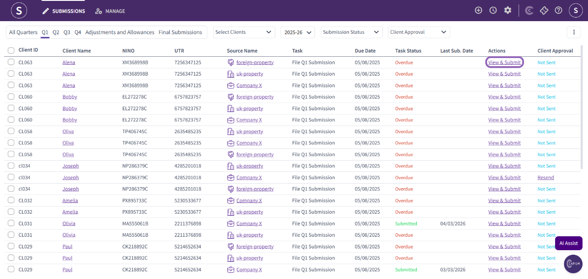
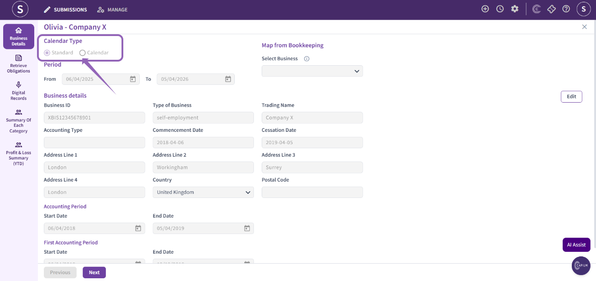
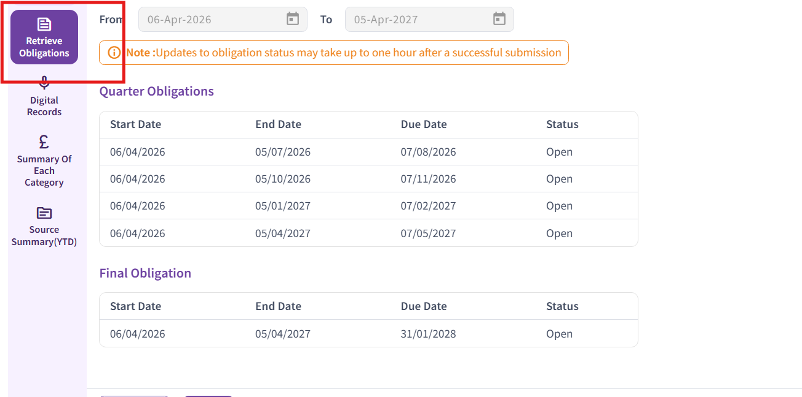

# Calendar and Quarter Types in MTDIT
	 	
			
			Print

- **Category:** MTD IT
- **Folder:** MTD IT
- **Source URL:** [https://capium.freshdesk.com/support/solutions/articles/9000275927-calendar-and-quarter-types-in-mtdit](https://capium.freshdesk.com/support/solutions/articles/9000275927-calendar-and-quarter-types-in-mtdit)
- **Article ID:** 9000275927

## Content

Solution home 
		MTD IT
		MTD IT

### Calendar and Quarter Types in MTDIT

			Print

	Modified on: Thu, 16 Jul, 2026 at  2:34 PM

		Welcome to this quick guide on calendar types in MTD IT. This guide outlines the key differences and will help you choose the correct option. 

Within Capium’s MTDIT module, you can select either a Standard or Calendar option.

 - The Standard period runs from 6 April to 5 April of the following year.
The Calendar period runs from 1 April to 31 March of the following year.

You need to select a type before your first submission

Firstly, navigate to the submission section and click on ‘View & Submit’ next to the client whose calendar type you would like to update.  

Once you are in the client-specific area, navigate to ‘Business Details’ as shown in the picture below, then select and save your preferred calendar type. 

Once you selected the right calendar type, please check the obligations have updated:

If the obligations type do not match the below, based on your selection, you need to contact HMRC

Standard Quarters (Default Position)

By default, quarterly updates must follow the standard tax year quarters, which align with the UK tax year (6 April to 5 April).

The standard quarters are:

6 April to 5 July

6 July to 5 October

6 October to 5 January

6 January to 5 April

These apply automatically unless a business elects otherwise.

### Calendar Quarter Election

Businesses will have the option to elect to report using calendar quarters instead of standard tax year quarters.

The calendar quarters are:

1 April to 30 June

1 July to 30 September

1 October to 31 December

1 January to 31 March

										Did you find it helpful?
								Yes
								No

Send feedback	Sorry we couldn't be helpful. Help us improve this article with your feedback.

## Screenshots & Diagrams (3)

