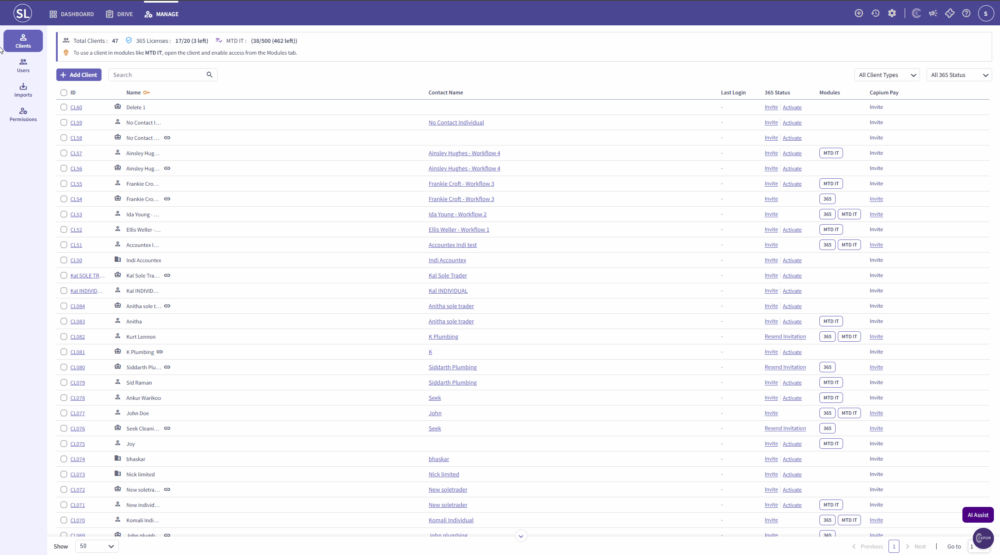
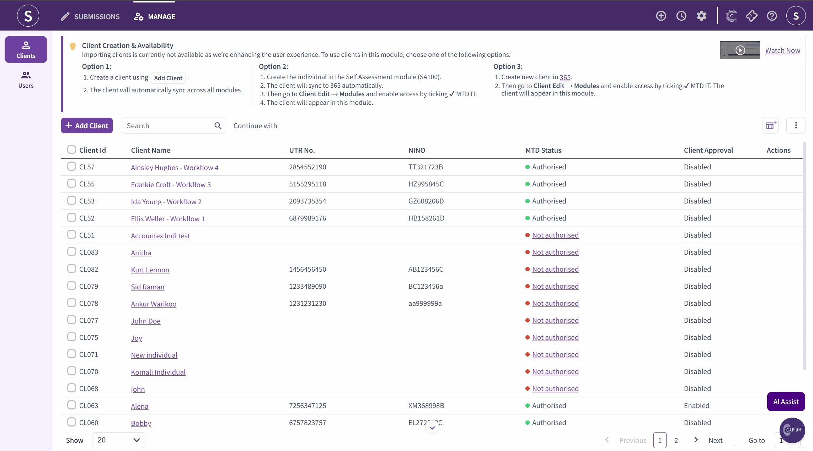
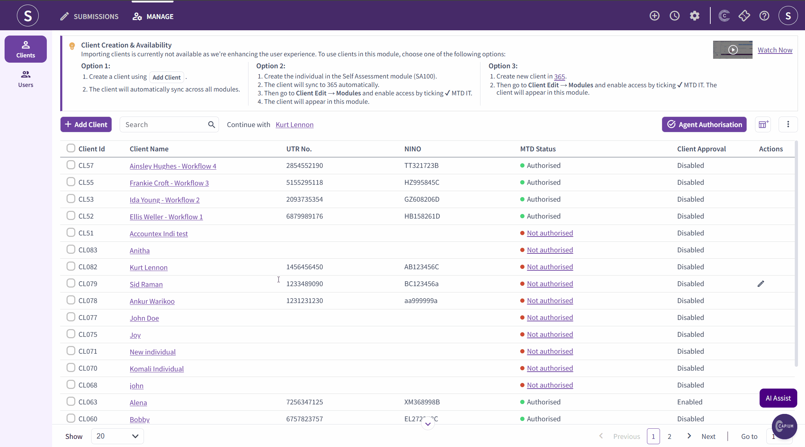
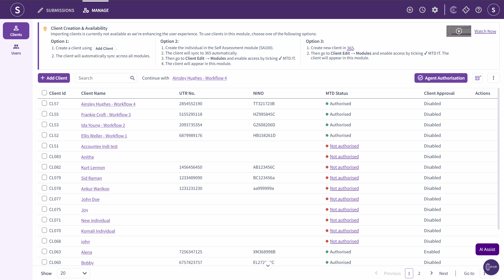
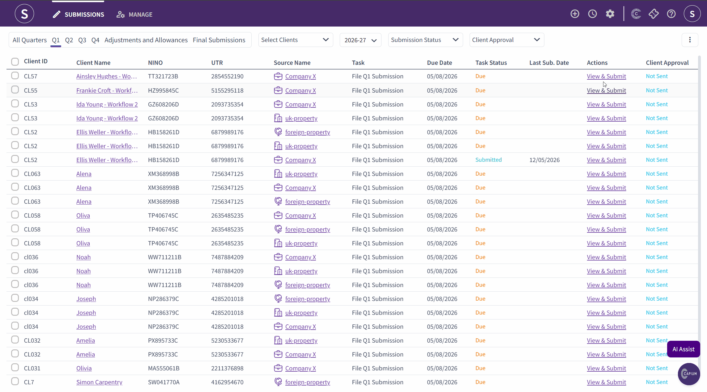
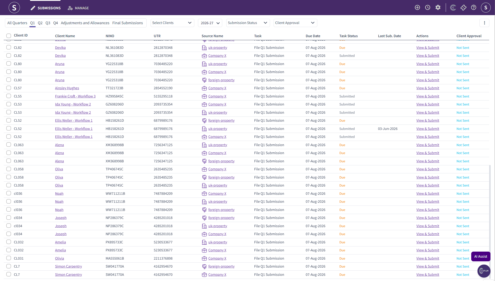
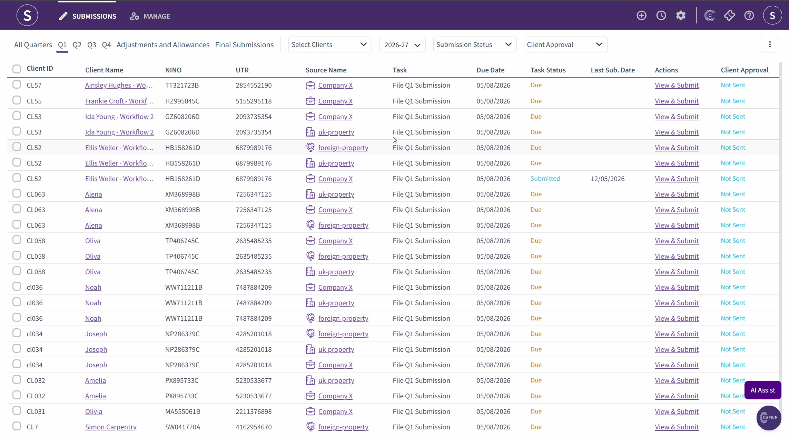

# MTD IT - Bookkeeping Workflow (Workflow 4)
	 	
			
			Print

- **Category:** MTD IT
- **Folder:** MTD IT
- **Source URL:** [https://capium.freshdesk.com/support/solutions/articles/9000276520-mtd-it-bookkeeping-workflow-workflow-4-](https://capium.freshdesk.com/support/solutions/articles/9000276520-mtd-it-bookkeeping-workflow-workflow-4-)
- **Article ID:** 9000276520

## Content

Solution home 
		MTD IT
		MTD IT

### MTD IT - Bookkeeping Workflow (Workflow 4)

			Print

	Modified on: Wed, 5 Aug, 2026 at 10:54 AM

Bookkeeping workflow within the MTD IT module. It is the most common workflow for existing Capium customers who have been using the Bookkeeping module for sole trader clients prior to the introduction of MTD IT.

In this workflow, records continue to be maintained within the Bookkeeping module as normal. When it is time to submit a quarterly return, the accountant imports the relevant transactions directly from the Bookkeeping module into the MTD IT module.

This workflow is only available for sole traders. It is not available for landlords (UK or overseas).

This workflow requires both a sole trader and an individual to be created in the system and linked together.

### 
Step 1: Confirm the Sole Trader Exists in the System

For most existing customers using Workflow 4, the sole trader client will already exist in the Bookkeeping module. Confirm the sole trader record is present before proceeding.

Navigation > Bookkeeping > Client List
If the sole trader does not yet exist, create the client record before continuing.

### 
Step 2: Create the Individual Client (If Not Already in the System)

An individual client must be created and linked to the sole trader. The individual is the entity that will be registered and authorised under MTD IT.

If the individual does not yet exist:

Navigation > Capium 365 Client Portal > Add New Client
Add the client as an individual, completing all required fields.
Save the record.

### 
Step 3: Link the Sole Trader to the Individual via the Capium 365 Client Portal

Capium recommends completing the linking process through the Capium 365 Client Portal.

Navigation > Capium 365 Client Portal
Search for the sole trader client by name.
In the search results, identify the correct record. The briefcase icon next to a name indicates a sole trader. The person icon indicates an individual.
Open the sole trader record.
Locate the Client field within the sole trader profile. This field will be empty if no individual has been linked yet.
Search for the individual's name in the client field.
If the individual exists, select them from the search results.
If the individual does not yet exist, type their name and click Add Individual. This will create the individual and complete the link simultaneously.
Save the changes.
Note: Once linked, only the individual can be given access to the MTD IT module. The sole trader is treated as a source of income for the individual and does not have direct access to the MTD IT module.

### 
Step 4: Grant MTD IT Module Access to the Individual

Navigation > Capium 365 Client Portal
Search for and open the individual client record.
Click on Modules within the client section.
Enable access to the MTD IT module.
Save the changes.

### 
Step 5: Authorise the Individual in the MTD IT Module

Navigation > MTD IT > Manage
Locate the individual client in the list.
Open the client record and click Start Authorisation.
You will be redirected to the HMRC website.
Complete the authorisation process on the HMRC website.
Once complete, return to Capium. The client will now display an authorised status.
Note: Bulk authorisation is available, allowing accountants to authorise multiple clients in a single action. Please refer to the separate bulk authorisation guide for instructions.

### 

### Step 6: Review the Client's Sources of Income

After authorisation is complete, the available sources of income will automatically populate for the client. These may include self-employment (sole trader income), UK property, and foreign property.

If a property source is missing, it can be added manually within the software. If a sole trader source is missing, this must be requested directly from HMRC. Sole trader sources cannot be added by the accountant within Capium.

### 
Step 7: Create a Tax Return for the Individual

Navigation > MTD IT > Manage
Open the individual client record.
Click Add Tax Return.
The system will automatically select all available sources of income.
Select the Consolidated Reporting option if the client's income from a given source is not expected to exceed 90,000 pounds in the year. This threshold applies separately per income stream.
Confirm and save. The system will generate the full quarterly workflow, including Q1 to Q4, adjustments and allowances, and the final submission.

### 
Step 8: Link the Bookkeeping Module to the MTD IT Submission

This step connects the Bookkeeping module to the MTD IT quarterly submissions for the sole trader.

Navigation > MTD IT > Manage > Select Client > Submission Grid
Open the first quarterly period (Q1).
Click Edit.
Select the Sole Trader Workflow option.
Click Save.
Once this link is saved, the Bookkeeping module will feed transactions into the MTD IT module for all future quarterly imports. The accountant can continue using the Bookkeeping module exactly as before.

### 
Step 9: Continue Recording Transactions in the Bookkeeping Module

No changes to the bookkeeping process are required. The accountant continues to record income and expenses within the Bookkeeping module as normal, including:

Sales invoices and credit notes
Purchase invoices
Bank categorisation and reconciliation
Quick entries
Journal entries
All income and expense transactions recorded in the Bookkeeping module will be available to import into the MTD IT module at any point.

### 
Step 10: Select the Accounting Period

The MTD IT module imports transactions based on the accounting period configured for the client. Two period options are available:

Standard HMRC period: 6 April to 5 April
Calendar period: 1 April to 31 March
To review or change the period:

Navigation > MTD IT > Manage > Select Client > Business Details
Review the current period setting.
Update if required and save.

### 

Step 11: Map the Sole Trader from Bookkeeping

Before transactions can be imported, the sole trader must be mapped from the Bookkeeping module. This links the sole trader's bookkeeping records to the self-employment source held against the individual in MTD IT.

Navigation > MTD IT > Manage > Select Client > Business Details
Locate the Map from Bookkeeping section.
Click the Edit button next to Map from Bookkeeping.
Select the sole trader from the drop down list.
Click Save.

### 
Step 12: Import Transactions from Bookkeeping into the MTD IT Module

When ready to complete a quarterly submission:

Navigation > MTD IT > Manage > Select Client > Digital Records
Click Import Data from Bookkeeping.
The system will pull through the income and expense records from the Bookkeeping module for the relevant period.
Review the imported digital records for accuracy.
This import can be run at any point during the quarter. Running it closer to the submission deadline ensures all transactions for the period are included.

### 
Step 13: Review and Submit to HMRC

Once the digital records are confirmed for a given quarter:

Navigation > MTD IT > Manage > Select Client > Submission Grid
Open the relevant quarterly period.
Navigate to the Quarterly Summary and review the figures.
Navigate to the Cumulative Summary page.
Click Submit to HMRC.
Repeat this process for Q2, Q3, and Q4.

Note: The quarterly summary screen can be hidden or shown by navigating to Navigation > MTD IT > Preferences > Hide Quarterly Summary.

### 
Step 14: Locked Transactions After Submission

Once a quarter has been submitted, the transactions are locked and cannot be edited.

If a client wishes to amend a submitted quarter, corrections can be included in the following quarter's submission.
If an immediate correction is required, a support ticket must be raised with the Capium support team. The technical team will re-enable the submission for that period.

### 
Step 15: Year-End Adjustments, Allowances, and Final Submission

The year-end process is the same across all four MTD IT workflows. Once all four quarterly submissions have been completed:

Navigate to the adjustments and allowances section for each income source.
Complete the relevant adjustments per source of income.
For sole trader income, a trial balance import is available from the Bookkeeping module. For UK property and foreign property, only amended values can be entered.
Complete the other income section, including dividends, employment income, other expenses, losses, and deductions.
Complete the year-end approval (this is mandatory).
Submit the final declaration to HMRC.
Note: Quarterly approval is an optional feature. If a client requires quarterly approval, this can be enabled when creating or editing the client record. Navigate to Navigation > MTD IT > Manage > Edit Client > Enable Approval.

### 
Changing Workflow Mid-Year

If a client wishes to change workflow part way through the year, the recommended approach is to complete the current quarter fully before switching. The previous quarter must be finalised in the existing system before starting fresh in a new workflow. Changing workflows mid-period is not recommended. 

Please see the related articles below for step-by-step guidance: 

Linking Sole Traders and Individuals. 

MTD IT - Bulk Authorisation

										Did you find it helpful?
								Yes
								No

Send feedback	Sorry we couldn't be helpful. Help us improve this article with your feedback.

## Screenshots & Diagrams (8)

