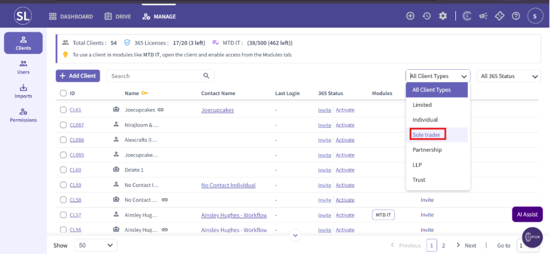
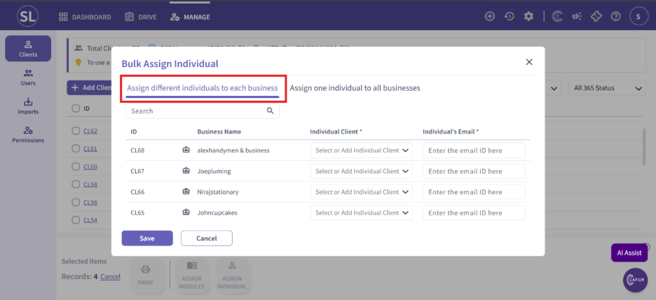
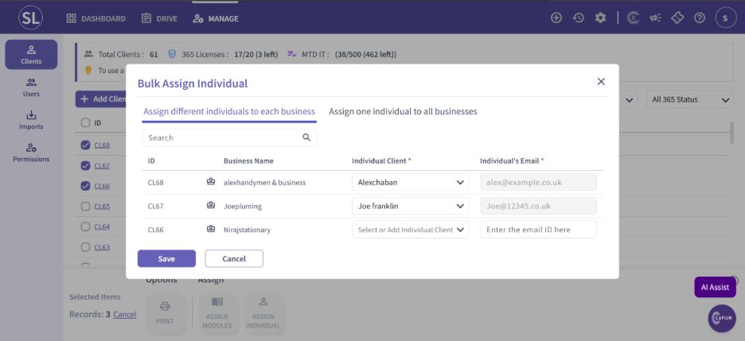
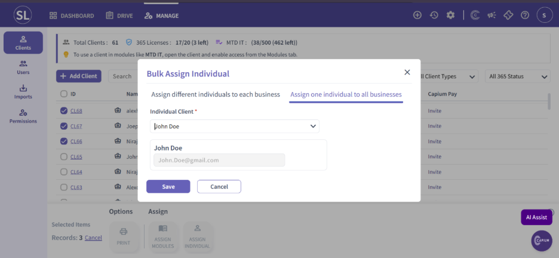

# Capium 365 - Bulk Assign Individual Clients
	 	
			
			Print

- **Category:** MTD IT
- **Folder:** MTD IT
- **Source URL:** [https://capium.freshdesk.com/support/solutions/articles/9000276527-capium-365-bulk-assign-individual-clients](https://capium.freshdesk.com/support/solutions/articles/9000276527-capium-365-bulk-assign-individual-clients)
- **Article ID:** 9000276527

## Content

Solution home 
		MTD IT
		MTD IT

### Capium 365 - Bulk Assign Individual Clients

			Print

	Modified on: Mon, 15 Jun, 2026 at  9:52 AM

		Capium365 - Bulk Assign Individual Clients 

Bulk Assign Individual Clients allows accountants to assign multiple individual clients in a single action, helping save time and streamlining the client assignment process. also the same will reflect on the MTD IT

### Step 1: Open the Clients List 

Navigate to the 365 module and open the Clients page. 
### You will now see the client list available. 

From the All-Types filter, select Sole Trader to display only sole trader clients. 

Step 2: Select Multiple Sole Trader Clients 

Use the checkboxes on the left-hand side to select all the Sole Trader clients you would like to assign. 

Once the clients are selected, you will see the Assign Individual option available at the bottom of the screen.

Step 3: Assign Individuals 

Click on the Assign Individual option. 

You will now see two options available for bulk assigning individuals: 

Option 1: Assign Different Individuals to Each sole trader Business 

This option allows you to assign separate individuals to different sole trader businesses.

Select individuals from the dropdown list, or directly add a new individual client 

Note: The individual email address will automatically populate if it is already available in the system. If not, you can manually enter the email address. 

Option 2: Assign One Individual to All Businesses 

This option allows you to assign a single individual to all selected sole trader businesses in one action.  

Please Note: Once a sole trader and individual record are linked, they share a single licence. You will still see two records across 365, My Admin, and Practice Management — this is expected, as they remain separate legal entities. 

										Did you find it helpful?
								Yes
								No

Send feedback	Sorry we couldn't be helpful. Help us improve this article with your feedback.

## Screenshots & Diagrams (5)

