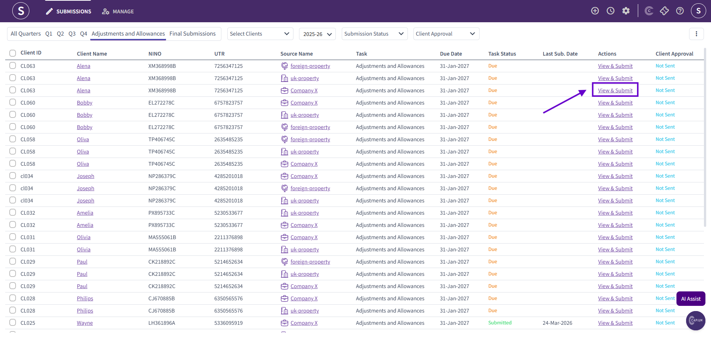
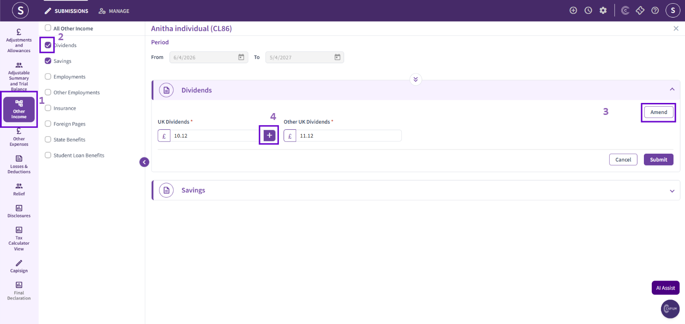
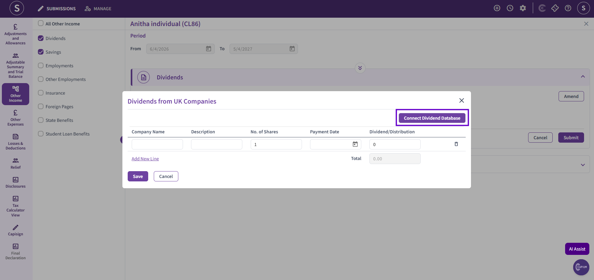
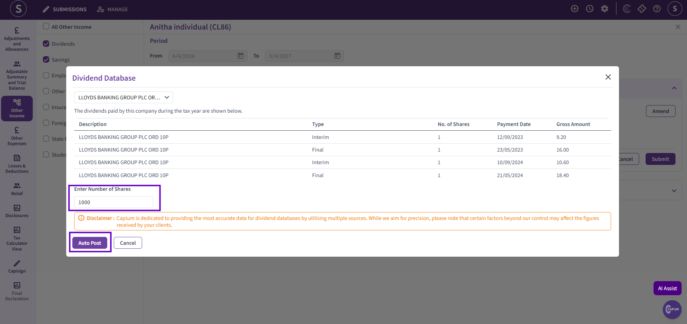
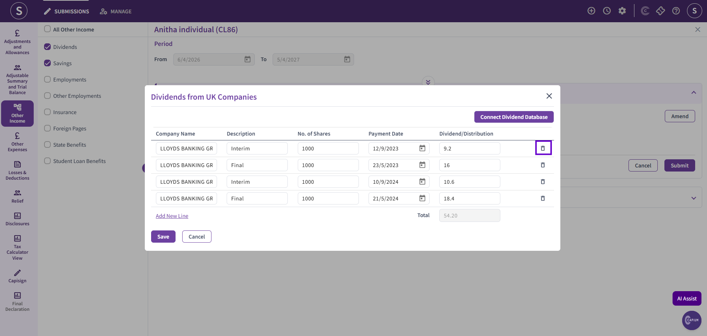

# Using the Dividend Database in MTD IT
	 	
			
			Print

- **Category:** MTD IT
- **Folder:** MTD IT
- **Source URL:** [https://capium.freshdesk.com/support/solutions/articles/9000277044-using-the-dividend-database-in-mtd-it](https://capium.freshdesk.com/support/solutions/articles/9000277044-using-the-dividend-database-in-mtd-it)
- **Article ID:** 9000277044

## Content

Solution home 
		MTD IT
		MTD IT

### Using the Dividend Database in MTD IT

			Print

	Modified on: Thu, 11 Jun, 2026 at  4:23 PM

		Welcome to this quick guide on how to use the Dividend Database in MTDIT. This guide will walk you through the essential steps and best practices to ensure a smooth setup and successful deployment.

MTDIT - Dividend Database

Navigation: MTDIT > Submissions > Adjustments and Allowances or Final Submissions    

To access the dividend database, click 'View & Submit' under either 'Adjustments and Allowances' or 'Final Submissions' next to the relevant client. 

Disclaimer: Access to the dividend database is only available once all quarterly submissions (Q1–Q4) have been completed and submitted for the relevant client. 

Next, navigate to the 'Other Income' section and select the checkbox next to 'Dividends' to add it to the return. Then, click 'Amend' and select the plus (+) icon to open the dividend database. 

Next, click 'Connect Dividend Database'. This will take you to a list of all companies currently available within the Dividend Database.

Search for the relevant company by name. The system will display all dividends associated with that company. Enter the total number of shares held for the company and click 'Auto Post'. The dividend information will then be automatically calculated and posted into the system.

You can review the dividend information and remove any entries that are not required. Once you have deleted the unnecessary information, click 'Save' to apply the changes.

Disclaimer: For companies that pay dividends in foreign currencies (e.g., EUR or USD), please check the applicable exchange rate before posting the transactions. Exchange rates can vary between banks and brokers, and may differ from those used within the Dividend Database.

										Did you find it helpful?
								Yes
								No

Send feedback	Sorry we couldn't be helpful. Help us improve this article with your feedback.

## Screenshots & Diagrams (5)

