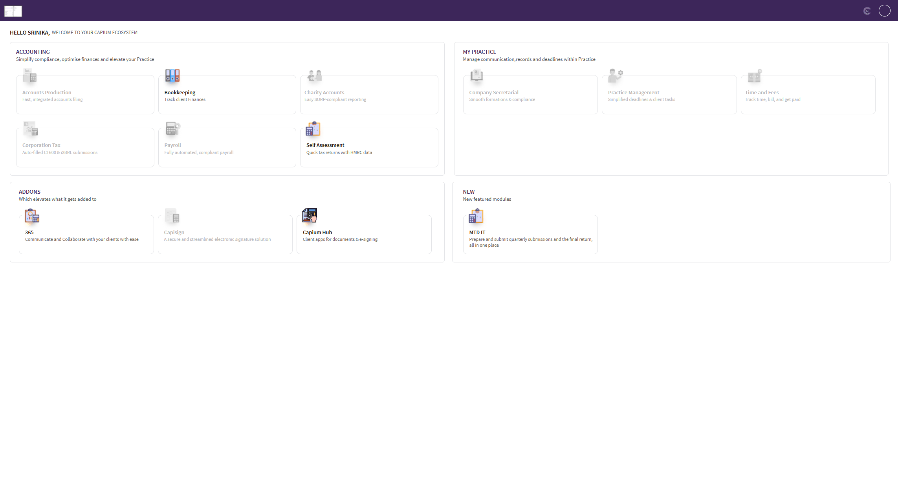

# MTD IT: Sync Sources from HMRC
	 	
			
			Print

- **Category:** MTD IT
- **Folder:** MTD IT
- **Source URL:** [https://capium.freshdesk.com/support/solutions/articles/9000277688-mtd-it-sync-sources-from-hmrc](https://capium.freshdesk.com/support/solutions/articles/9000277688-mtd-it-sync-sources-from-hmrc)
- **Article ID:** 9000277688

## Content

Solution home 
		MTD IT
		MTD IT

### MTD IT: Sync Sources from HMRC

			Print

	Modified on: Fri, 10 Jul, 2026 at 11:35 AM

		Once a client has reached an approved state in MTD IT, their income sources can be synced directly from HMRC. This ensures the sources held in Capium match those registered on HMRC's systems, so quarterly updates and the Final Declaration can be submitted against the correct income streams.

Before you start

The client must be in an approved state before their sources can be synced. If the client has not yet been approved, see MTD IT: Client Approval.

How to sync sources from HMRC

Navigation > MTD IT > Manage
Click into the relevant client.
Navigate to the Sources tab.
Click Sync Sources from HMRC.

This will re-sync the client's income sources with HMRC, pulling through any sources currently held on HMRC's systems (for example self-employment, UK property, or foreign property).

If a source does not appear after syncing

Capium can only display sources that HMRC has recorded against the client. If an expected source is still missing after syncing, the source has not yet been added on HMRC's side. In this case:

The client or agent should contact HMRC directly to confirm the source has been added to their record.
Once HMRC has added the source, return to the Sources tab and click Sync Sources from HMRC again.

For more on how sources are first set up with HMRC, see MTD IT: Checking and Registering your Client with HMRC.

Related articles

MTD IT: Client Approval
MTD IT: Checking and Registering your Client with HMRC

										Did you find it helpful?
								Yes
								No

Send feedback	Sorry we couldn't be helpful. Help us improve this article with your feedback.

## Screenshots & Diagrams (1)

