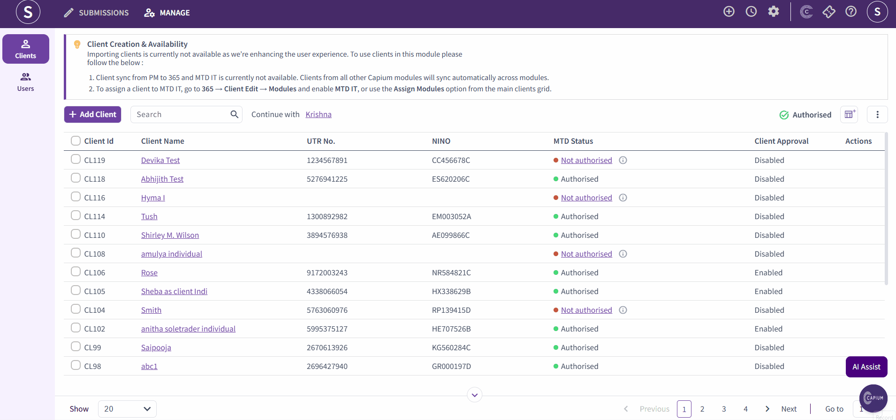
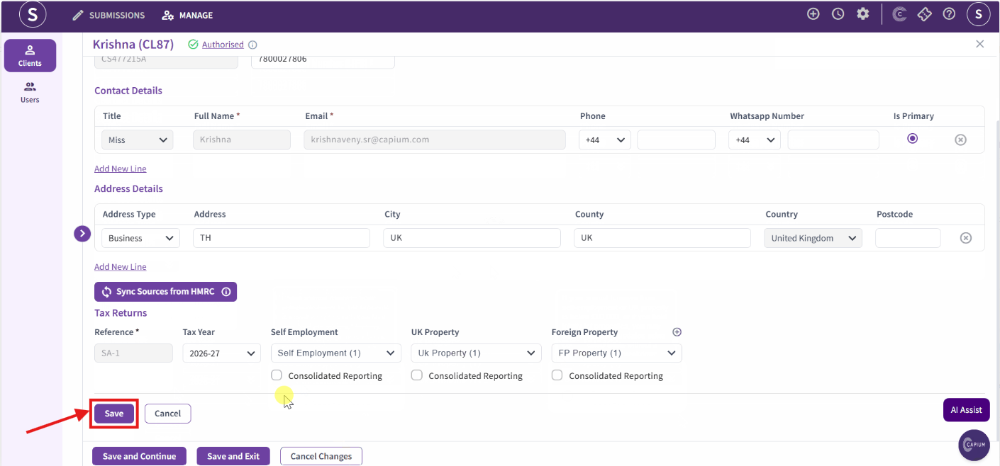

# Importance of Creating a Tax Return in MTD IT
	 	
			
			Print

- **Category:** MTD IT
- **Folder:** MTD IT FAQs
- **Source URL:** [https://capium.freshdesk.com/support/solutions/articles/9000277856-importance-of-creating-a-tax-return-in-mtd-it](https://capium.freshdesk.com/support/solutions/articles/9000277856-importance-of-creating-a-tax-return-in-mtd-it)
- **Article ID:** 9000277856

## Content

Solution home 
		MTD IT
		MTD IT FAQs

### Importance of Creating a Tax Return in MTD IT

			Print

	Modified on: Fri, 17 Jul, 2026 at 11:21 AM

		Welcome to this quick guide on the importance of creating a Tax Return in MTD IT. This guide will walk you through the essential steps.  

Once you have authorised your client using either the bulk authorisation or client-specific authorisation, navigate to the client by clicking on the Client Name.

Within the client area, you will see a new section called Tax Returns. Click the Sync Sources from HMRC button to retrieve all the relevant tax sources for that client from the HMRC database.

*Disclaimer: After validating the information on this page, ensure you click the Save button shown in the picture above to confirm that your tax return has been saved successfully. Failure to click Save may require you to add in your tax return again.

This is one of the most important steps, as it ensures you have the latest HMRC data available before you begin preparing and submitting your quarterly updates.

										Did you find it helpful?
								Yes
								No

Send feedback	Sorry we couldn't be helpful. Help us improve this article with your feedback.

## Screenshots & Diagrams (2)

